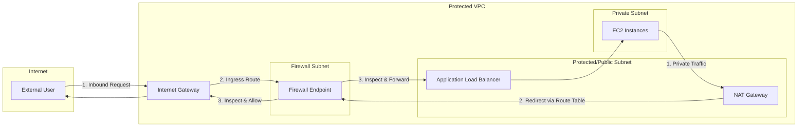
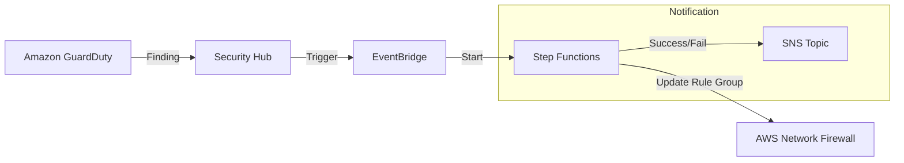

# AWS Network Firewall

## Overview
**AWS Network Firewall** is a managed, highly available, and scalable firewall service that provides Layer 3 through Layer 7 protection for your entire VPC. It allows for fine-grained control over network traffic entering, leaving, or moving between VPCs, as well as traffic over **AWS Direct Connect** and **Site-to-Site VPN**.

## Key Concepts
- **Firewall Endpoint**: A VPC endpoint that resides in a dedicated "firewall subnet" and serves as the entry/exit point for traffic inspection.
- **Firewall Policy**: A collection of stateful and stateless rule groups that define the firewall's behavior.
- **Rule Groups**: 
    - **Stateless**: Processes each packet in isolation (similar to NACLs).
    - **Stateful**: Inspects packets in the context of their flow (similar to Security Groups but more advanced).
- **Intrusion Prevention System (IPS)**: Provides active flow inspection to detect and block malicious patterns.
- **TLS Inspection**: Capability to decrypt, inspect, and re-encrypt encrypted traffic for deep packet inspection (DPI).

## Detailed Notes

### 1. Traffic Filtering Capabilities
- **Layer 3-4**: Filter by IP, port, and protocol (TCP/UDP/ICMP). Supports tens of thousands of IPs.
- **Layer 7 (Application)**: 
    - **Domain Filtering**: Allow or block traffic to specific Fully Qualified Domain Names (FQDNs) (e.g., `*.amazon.com`).
    - **Protocol Inspection**: Identify and block specific protocols like SMB or SSH regardless of the port.
    - **Pattern Matching**: Use Suricata-compatible rules or Regex for advanced payload inspection.

### 2. Implementation & Management
- **Gateway Load Balancer (GWLB)**: Internally, Network Firewall uses GWLB to scale and manage inspection appliances, but this is abstracted from the user.
- **Firewall Manager**: Centrally manage and deploy Network Firewall rules across multiple accounts and VPCs in an AWS Organization.
- **Logging**: Detailed logs for all rule matches can be sent to **Amazon S3**, **CloudWatch Logs**, and **Kinesis Data Firehose**.

### 3. Advanced Features
- **DPI for Encrypted Traffic**: Integrated with **AWS Certificate Manager (ACM)** to decrypt TLS traffic, inspect the payload for malware/leaks, and re-encrypt before sending to the destination.
- **Suricata Rules**: Supports the open-source Suricata rule format for sophisticated threat detection.

## Architecture / Flow

### Inbound & Outbound Inspection Flow

### Automated Threat Blocking Workflow

## Security Relevance
- **VPC-Wide Protection**: Unlike Security Groups (Instance level) or NACLs (Subnet level), Network Firewall provides a perimeter for the entire VPC.
- **Egress Filtering**: Prevents data exfiltration and "calling home" by malware by restricting outbound traffic to approved domains only.
- **Malware Detection**: Active IPS signatures block known vulnerabilities and command-and-control (C2) traffic.

## Operational / Real-World Context
- **Routing is Key**: The firewall's effectiveness depends entirely on VPC Route Tables. You must use "Ingress Routing" on the IGW to force traffic through the firewall endpoint.
- **Availability**: Deploy firewall endpoints in each Availability Zone (AZ) where your workloads reside to ensure high availability.

## Common Pitfalls / Misconfigurations
- **Asymmetric Routing**: If traffic enters via the firewall but exits through a different path, stateful inspection will fail and drop the connection.
- **Logging Omission**: Failing to enable logging makes it difficult to debug why certain traffic is being dropped or to conduct post-incident analysis.
- **Rule Order**: Stateless rules are evaluated before stateful rules. Incorrect ordering can lead to unintended allows or blocks.

## Exam / Review Notes
- **WAF vs. Network Firewall**: Use **WAF** for Layer 7 HTTP/S (SQLi, XSS) on specific services (ALB, CloudFront). Use **Network Firewall** for non-HTTP protocols (SSH, SMB) and VPC-wide perimeter security.
- **Centralized Management**: **AWS Firewall Manager** is the primary tool for deploying Network Firewall at scale.
- **Logging**: Know that logs go to S3/CloudWatch/Kinesis.
- **Deployment**: Requires dedicated subnets for firewall endpoints.

## Summary
AWS Network Firewall provides a robust, managed perimeter for AWS VPCs, offering Layer 3-7 inspection and active intrusion prevention. Its ability to perform domain filtering and TLS inspection makes it a critical component for enterprises requiring high levels of network security and compliance.

## Quick Review Checklist
- [ ] Firewall endpoints deployed in all relevant AZs?
- [ ] Ingress/Egress Route Tables updated to point to Firewall Endpoints?
- [ ] Logging configured to CloudWatch or S3?
- [ ] Stateless and Stateful rule groups defined?
- [ ] TLS Inspection enabled for deep packet analysis if required?
