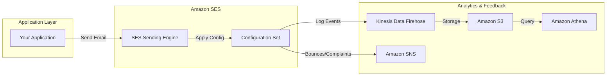

# Amazon Simple Email Service (SES)

## Overview
**Amazon SES** is a cloud-based email sending service designed to help digital marketers and application developers send marketing, notification, and transactional emails. It is a reliable, cost-effective service for businesses of all sizes that use email to keep in contact with their customers.

## Key Concepts
- **Outbound/Inbound Email**: Supports sending bulk/transactional emails and receiving/processing incoming emails.
- **Reputation Dashboard**: A tool to monitor your sender reputation, including bounce rates, complaint rates, and anti-spam feedback.
- **DKIM (DomainKeys Identified Mail)**: An email authentication method that adds a digital signature to emails to verify the sender's domain.
- **SPF (Sender Policy Framework)**: A DNS-based mechanism to specify which mail servers are authorized to send email on behalf of your domain.
- **Configuration Sets**: Rules applied to emails to track events (clicks, opens, bounces) and manage IP pools.

## Detailed Notes

### 1. Sending Methods
- **SES API**: Specialized AWS APIs for sending email, typically used in application code.
- **SMTP Interface**: Standard Simple Mail Transfer Protocol for integrating with existing email clients or servers.

### 2. Configuration Sets & Event Tracking
Configuration sets allow you to capture detailed metrics about your email sending:
- **Event Destinations**:
    - **Amazon Kinesis Data Firehose**: Captures near real-time metrics (sends, deliveries, opens, clicks, bounces, complaints).
    - **Amazon SNS**: Provides immediate notifications for bounces and complaints.
    - **Amazon CloudWatch**: Publishes event data to CloudWatch for monitoring and alerting.

### 3. IP Management & Reputation
To maintain a high delivery rate, SES offers different IP options:
- **Shared IP Pools**: Shared with other AWS customers (default).
- **Dedicated IP Pools**: Reserved for your exclusive use, allowing you to manage your own sender reputation.
- **IP Pool Management**: Use configuration sets to send different types of email (e.g., transactional vs. marketing) from separate IP pools to isolate their reputations.

## Architecture / Flow

### Email Analytics & Monitoring Workflow

## Security Relevance
- **Anti-Spam & Anti-Virus**: SES automatically filters incoming email for spam and viruses.
- **Authentication (DKIM/SPF)**: Essential for preventing email spoofing and ensuring high deliverability.
- **Feedback Loops**: Enables senders to receive notifications when a recipient reports an email as spam, allowing for list cleaning.

## Operational / Real-World Context
- **Sandbox Mode**: New SES accounts start in a "sandbox" environment where they can only send email to verified addresses. You must request a limit increase to move to production.
- **Transactional vs. Marketing**: Always separate these two types of traffic using different configuration sets or IP pools to prevent marketing campaign bounces from affecting critical transactional alerts.

## Common Pitfalls / Misconfigurations
- **High Bounce Rate**: Failing to monitor bounce rates can lead to AWS suspending your SES account to protect their global IP reputation.
- **Missing SPF/DKIM**: Emails without these records are more likely to be flagged as spam by recipient mail servers (Gmail, Outlook).
- **Hard Bounces**: Not removing addresses that result in "Hard Bounces" (invalid emails) from your lists will damage your sender reputation.

## Exam / Review Notes
- **Configuration Sets**: This is the "correct" way to track email events and use specific IP pools.
- **Event Destinations**: Know the difference between SNS (immediate feedback) and Firehose (near real-time analytics/storage).
- **Security Standards**: Understand that **SPF** and **DKIM** are the primary methods for email security in SES.
- **IP Pools**: Used for **reputation isolation**.

## Summary
Amazon SES is a powerful managed service for high-volume email. Its security features, including DKIM/SPF support and sophisticated reputation management via configuration sets, make it a robust choice for secure and reliable email communications.

## Quick Review Checklist
- [ ] DKIM and SPF records configured in DNS?
- [ ] Configuration sets created for event tracking?
- [ ] SNS topics set up for bounce/complaint notifications?
- [ ] IP pools defined for reputation isolation (if using dedicated IPs)?
- [ ] Production access requested from AWS Support?
