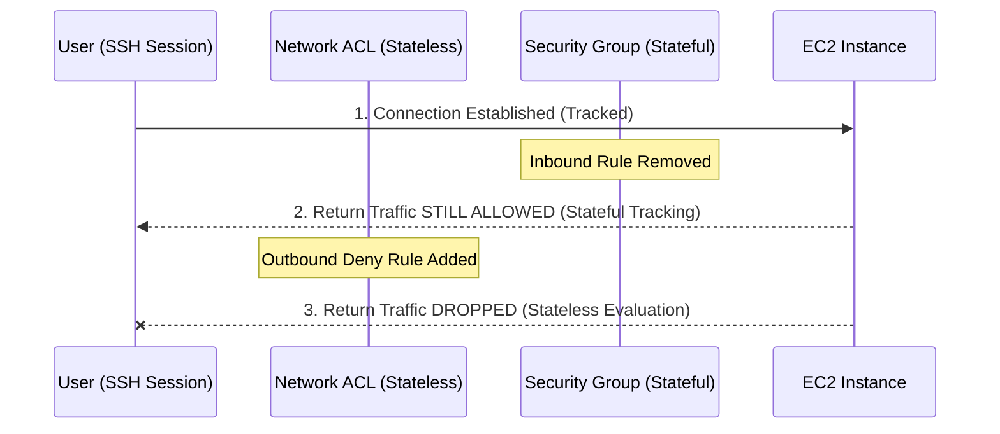
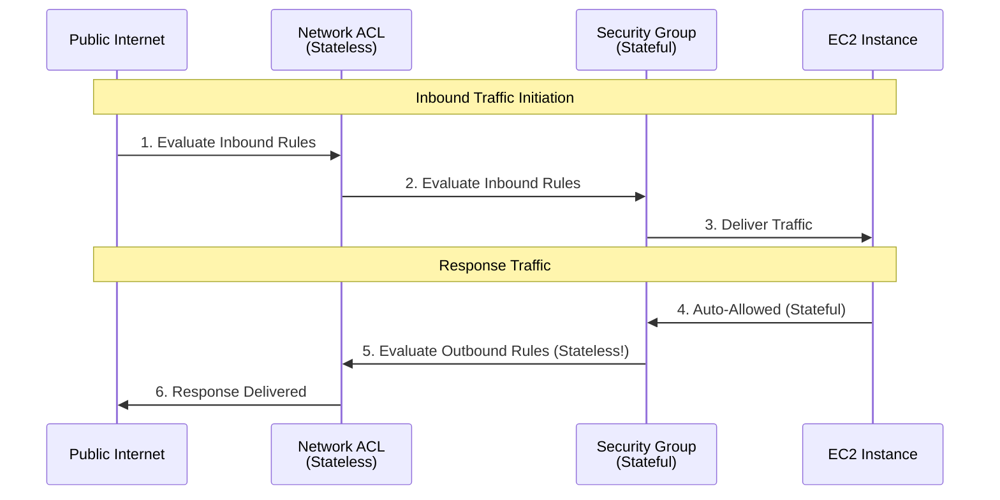

# Security Groups vs. Network ACLs (NACLs)

## Overview
AWS provides two layers of network security to control traffic in a VPC: **Security Groups (SG)** and **Network Access Control Lists (NACLs)**. Security Groups act as a firewall for associated Amazon EC2 instances, while NACLs act as a firewall for associated subnets. Understanding the interaction between these two—specifically their stateful vs. stateless nature—is critical for securing VPC infrastructure.

## Key Concepts
- **Security Group (SG)**: A virtual firewall for EC2 instances to control inbound and outbound traffic.
- **Network ACL (NACL)**: An optional layer of security for your VPC that acts as a firewall for controlling traffic in and out of one or more subnets.
- **Stateful**: If you send a request from your instance, the response traffic for that request is allowed to flow in regardless of inbound security group rules (and vice versa).
- **Stateless**: Response traffic must be explicitly allowed by an outbound rule (for inbound requests) or an inbound rule (for outbound requests).
- **Ephemeral Ports**: Short-lived transport protocol ports used for the client end of a client-server communication.

## Detailed Notes

### 1. Comparison Table
| Feature | Security Group (SG) | Network ACL (NACL) |
|---------|---------------------|--------------------|
| **Level** | Instance Level (ENI) | Subnet Level |
| **Rules** | Supports **Allow** rules only | Supports **Allow** and **Deny** rules |
| **State** | **Stateful**: Return traffic is auto-allowed | **Stateless**: Return traffic must be explicitly allowed |
| **Evaluation** | All rules are evaluated before decision | Rules are evaluated in **order (numbered)** |
| **Precedence** | No order; most permissive wins | Lower rule number = higher priority |
| **Default** | Denies all inbound, allows all outbound | Default NACL allows all; Custom NACL denies all |

### 2. Traffic Evaluation Flow
When traffic enters a VPC destined for an instance:
1. **Inbound**: NACL (Subnet) -> Security Group (Instance) -> Application.
2. **Outbound**: Security Group (Instance) -> NACL (Subnet) -> Destination.

### 3. Ephemeral Ports
Because NACLs are stateless, you must open "ephemeral ports" to allow response traffic to return to the client.
- **Scenario**: A client connects to a web server on port 80. The client opens a random port (e.g., 50105) for the response.
- **NACL Rule**: The web server's NACL must allow **Inbound 80** and **Outbound 1024-65535** (to cover the client's ephemeral range).
- **Ranges**:
    - Linux (Latest): 32768–60999
    - Windows: 49152–65535
    - Elastic Load Balancers / NAT Gateway: 1024–65535

### 4. NACL Rule Priority
- Rules are numbered (e.g., 100, 200, 300).
- If rule 100 says `ALLOW 1.1.1.1` and rule 200 says `DENY 1.1.1.1`, the traffic is **ALLOWED** because 100 has higher precedence.
- **Best Practice**: Use increments of 100 to leave space for future rules.

### 5. Tracked Connections & Connection Termination
Security groups are **stateful**, meaning they track the state of connections.
- **Rule Changes**: If you remove a rule from a security group, existing **tracked connections** are not immediately dropped. They remain open until they time out.
- **Immediate Termination**: To immediately terminate an active connection (e.g., an unauthorized SSH session), you must use a **Network ACL (NACL)**.
- **NACL Behavior**: Because NACLs are **stateless**, every packet is evaluated. Adding a `DENY` rule to a NACL will drop packets for existing sessions instantly.

## Architecture / Flow

### Connection Termination Logic

### Inbound Request Evaluation

## Security Relevance
- **Defense in Depth**: Using both SGs and NACLs provides multiple layers of protection.
- **IP Blocking**: NACLs are the primary tool for blocking specific malicious IP addresses or ranges at the network perimeter.
- **Isolation**: NACLs can prevent traffic between subnets within the same VPC even if Security Groups are overly permissive.

## Operational / Real-World Context
- **Default NACL**: The default NACL for a VPC allows all inbound and outbound traffic. This ensures that connectivity works "out of the box" until you define tighter controls.
- **Custom NACL**: New NACLs deny all traffic by default.
- **Troubleshooting**: If an instance can be pinged but cannot reach the internet to update packages, check the NACL outbound rules for ephemeral port ranges.

## Common Pitfalls / Misconfigurations
- **Stateless Confusion**: Forgetting to add outbound rules to a NACL for return traffic.
- **Ephemeral Port mismatch**: Opening port 80/443 but forgetting to open the high-numbered ports (1024-65535) for responses.
- **Order of Evaluation**: Putting a broad `ALLOW` rule with a low number before a specific `DENY` rule.
- **Security Group Limit**: Relying solely on SGs when you need to block a specific CIDR (SGs only support Allow).

## Exam / Review Notes
- **Stateful vs Stateless**: This is a high-probability exam topic. Remember: **SG = Stateful**, **NACL = Stateless**.
- **Deny Rules**: If you need to **deny** a specific IP, use a **NACL**.
- **Order**: NACL rules are processed in order; first match wins.
- **Ephemeral Ports**: Always consider the return path for NACLs.

## Summary
Security Groups provide flexible, instance-level protection, while NACLs provide a broader, subnet-level firewall. Combining the two ensures that even if an instance-level configuration is flawed, the subnet perimeter remains protected.

## Quick Review Checklist
- [ ] Security Group: Stateful, Instance-level, Allow rules only.
- [ ] NACL: Stateless, Subnet-level, Allow & Deny rules, Numbered.
- [ ] Ephemeral ports (1024-65535) added to NACL outbound for web servers.
- [ ] Specific DENY rules in NACL have lower numbers than broad ALLOW rules.
- [ ] One NACL associated with the subnet (default or custom).
