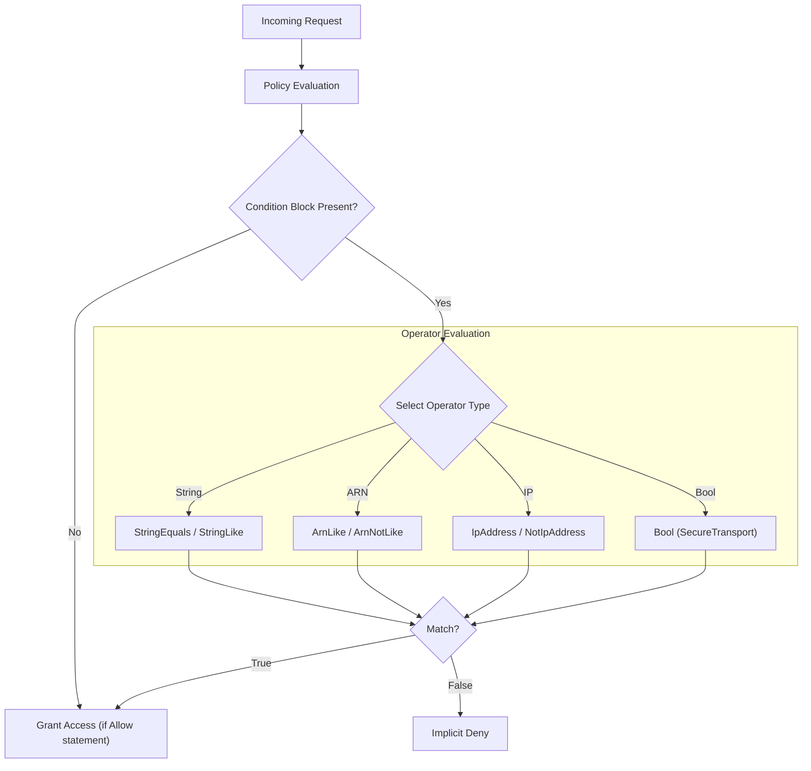

# IAM Condition Operators

## Overview
Condition operators are the logical engines used within the `Condition` block of an IAM policy. They allow for fine-grained access control by evaluating request context (e.g., source IP, MFA status, or tags) against defined values before granting or denying access.

## Key Concepts
- **Matching Type**: Different operators are optimized for different data types (Strings, ARNs, IPs, Booleans).
- **Case Sensitivity**: Some operators (like `StringEquals`) are case-sensitive, while others (like `ArnLike`) are not.
- **Wildcards**: Symbols like `*` (any number of characters) and `?` (single character) used for partial matching.

## Detailed Notes

### 1. String Operators
Used for exact or partial matching of string values like service names or tags.
- **StringEquals / StringNotEquals**: Exact, case-sensitive matching.
- **StringLike / StringNotLike**: Supports multi-character wildcards (`*`) and single-character wildcards (`?`).
    - *Example*: Comparing a `JobCategory` tag to `"IAMUserAdmin"`.

### 2. ARN Operators
Optimized for comparing Amazon Resource Names.
- **ArnLike / ArnNotLike**: Case-insensitive and supports wildcards.
- **Why use it?**: It handles the complexities of ARN structures better than standard string operators.
    - *Exam Tip*: Always prefer `ArnLike` over `StringLike` when comparing ARNs.

### 3. Date & Numeric Operators
- **DateEquals, DateLessThan, DateGreaterThan**: Compares timestamps, such as the `aws:TokenIssueTime`.
- **NumericEquals, NumericLessThan, etc.**: Used for values like instance counts or database sizes.

### 4. Boolean Operators
- **Bool**: Used to evaluate keys that return true or false.
- **Common Usage**: `aws:SecureTransport` (checking for HTTPS).
    - *Logic*: If `"aws:SecureTransport": "false"`, the request is being made via HTTP.

### 5. IP Address Operators
- **IpAddress / NotIpAddress**: Uses CIDR format (e.g., `10.0.0.0/24`).
- **Scope**: Only applies to **public IP addresses**.
- **Constraint**: Does not apply to requests made via **VPC Endpoints** (which use private IPs).

## Architecture / Flow
The following flow shows how a policy evaluation engine processes conditions.

## Security Relevance
- **Context-Aware Security**: Conditions move security beyond just "Who" and "What" to "How" and "From Where."
- **HTTPS Enforcement**: Using `Bool` with `aws:SecureTransport` is a primary method for ensuring data in transit is encrypted.
- **Network Perimeter**: IP address conditions help create a virtual perimeter for administrative actions.

## Operational / Real-World Context
- **S3 Bucket Policies**: Frequently use `aws:SecureTransport` to deny non-SSL traffic.
- **Global Tags**: Using `StringLike` with `aws:PrincipalTag` allows for dynamic permissions based on user attributes (ABAC - Attribute Based Access Control).
- **Wildcard ARNs**: Using `ArnLike` with `*` in the account ID section allows policies to be reused across multiple accounts without modification.

## Common Pitfalls / Misconfigurations
- **Case Sensitivity**: Using `StringEquals` for a value that might have varying capitalization (like a user-defined tag) will lead to unexpected denials.
- **VPC Endpoints**: Attempting to use `IpAddress` conditions for traffic coming through an Interface VPC Endpoint will fail because the request uses a private IP, which IAM cannot see in that context.
- **Wait... MFA?**: Remember that `aws:MultiFactorAuthPresent` is a Boolean check often used with the `Bool` operator.

## Exam / Review Notes
- **ArnLike vs StringLike**: Use `ArnLike` for ARNs.
- **Wildcards**: `*` (multiple) and `?` (single) are valid for `Like` operators.
- **SecureTransport**: `false` means HTTP; `true` means HTTPS.
- **IP Matching**: CIDR notation is required.

## Summary
IAM Condition Operators allow administrators to add "If/Then" logic to security policies. By selecting the right operator for the data type (String, ARN, IP, or Bool), you can enforce sophisticated security requirements like regional access, HTTPS-only traffic, and IP-based whitelisting.

## Quick Review Checklist
- [ ] `StringEquals` is case-sensitive; `StringLike` supports `*` and `?`.
- [ ] Use `ArnLike` for ARN comparisons.
- [ ] `aws:SecureTransport` is a Boolean check for SSL/TLS.
- [ ] `IpAddress` uses CIDR and only tracks public IPs.
- [ ] Conditions can be applied to both Identity-based and Resource-based policies.
