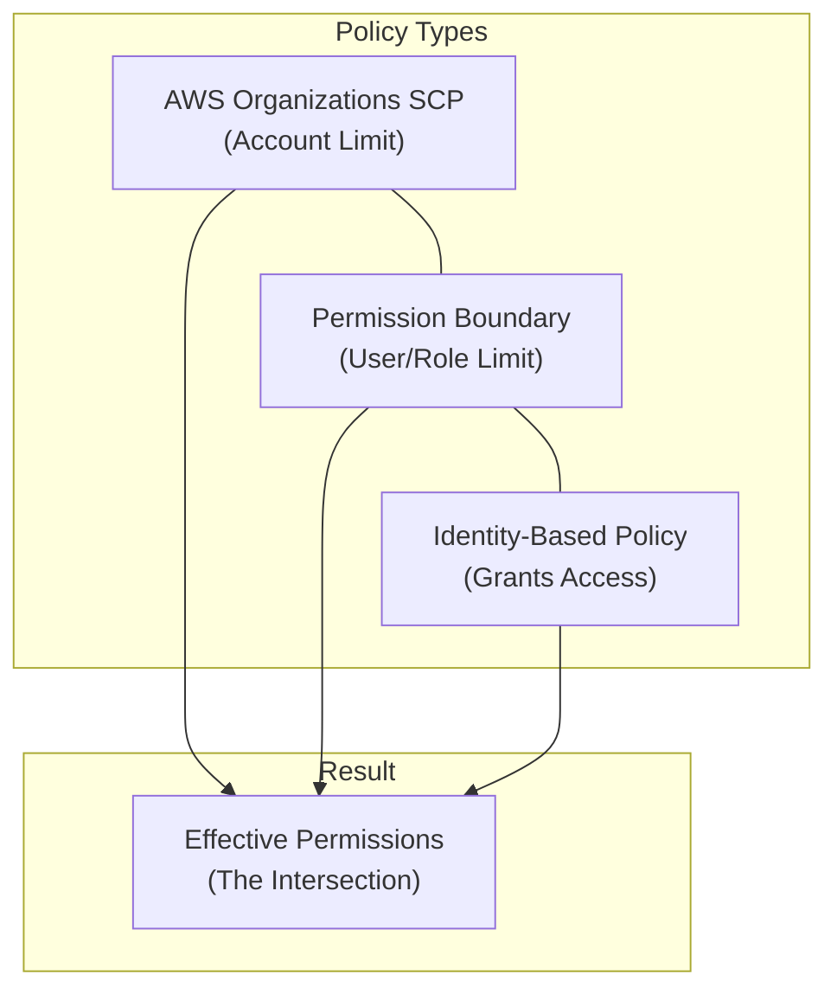

# IAM Permission Boundaries

## Overview
IAM Permission Boundaries are an advanced feature used to set the **maximum permissions** that an identity-based policy can grant to an IAM entity (user or role). They act as a "guardrail" to ensure that even if a user is granted `AdministratorAccess`, their effective permissions cannot exceed the limits defined by the boundary.

## Key Concepts
- **Guardrail Logic**: A permission boundary does not grant permissions on its own; it only defines the "outer limit" of what can be granted.
- **Intersection**: The effective permissions for an entity are the **intersection** of its identity-based policies and its permission boundary.
- **Supported Entities**: Applies only to **IAM Users** and **IAM Roles**.
- **Not Supported**: Does **not** apply to IAM Groups.

## Detailed Notes

### 1. How it Works (The Intersection)
To perform an action, the action must be allowed by **both** the identity-based policy and the permission boundary.

*Example Scenario:*
- **Permission Boundary**: Allows `s3:*`, `cloudwatch:*`, and `ec2:*`.
- **Identity-based Policy**: Allows `iam:CreateUser`.
- **Resulting Permission**: **No Permission**.
    - *Reasoning*: While the identity-based policy allows creating a user, the boundary does not include `iam:*` actions. Therefore, the action is blocked.

### 2. Policy Evaluation Logic
When a permission boundary is present, the evaluation follows this hierarchy:
1. **SCP (AWS Organizations)**: Sets the maximum for the account.
2. **Permission Boundary**: Sets the maximum for the specific user/role.
3. **Identity-based Policy**: Grants the actual permissions.

The effective permission is the overlap of all three.

## Architecture / Flow
The following diagram visualizes how effective permissions are derived from multiple policy types.

## Security Relevance
- **Preventing Privilege Escalation**: Permission boundaries are primarily used to prevent "shadow admins." For example, you can allow a developer to create IAM roles for Lambda functions but use a permission boundary to ensure they cannot create a role with more permissions than they themselves have.
- **Delegated Administration**: Allows non-admins to manage permissions for others without the risk of them granting themselves full administrative access.

## Operational / Real-World Context
- **Developer Self-Service**: Common in large enterprises where developers need to create roles for their applications (e.g., for EC2 or Lambda) without waiting for a central security team. The security team attaches a permission boundary to the developer's IAM user that mandates any role they create must also have that same boundary attached.
- **Granular Guardrails**: Unlike SCPs, which affect everyone in an account, permission boundaries allow for surgical restrictions on specific high-risk roles or users.

## Common Pitfalls / Misconfigurations
- **Implicit Deny**: If a permission boundary is attached, anything *not* explicitly allowed in the boundary is implicitly denied, even if allowed in the identity-based policy.
- **Group Confusion**: A common exam trap is asking if a boundary can be attached to a group. It **cannot**. You must attach it to the individual users within the group or to the roles they assume.
- **Boundary is not an Allow**: Attaching a boundary that allows `s3:*` to a user with no identity-based policies results in **no access**.

## Exam / Review Notes
- **Intersection**: Remember the keyword "Intersection."
- **Users/Roles Only**: Boundaries = Users and Roles. SCPs = Accounts and OUs.
- **Use Case**: Delegating IAM creation/management is the #1 use case.
- **Evaluation**: SCP -> Permission Boundary -> Identity-based Policy. If any of these don't allow the action, it's denied.

## Summary
IAM Permission Boundaries provide a way to delegate the creation of IAM entities safely. By defining the maximum allowable permissions, administrators can empower users to manage their own cloud resources while maintaining a firm ceiling on their total access level.

## Quick Review Checklist
- [ ] Permission boundaries set the maximum permissions (guardrails).
- [ ] Effective permissions = Intersection of ID-based policy + Boundary.
- [ ] Only supported for Users and Roles (NOT Groups).
- [ ] Used for delegated administration and preventing privilege escalation.
- [ ] Does not grant permissions; an identity-based policy is still required.
