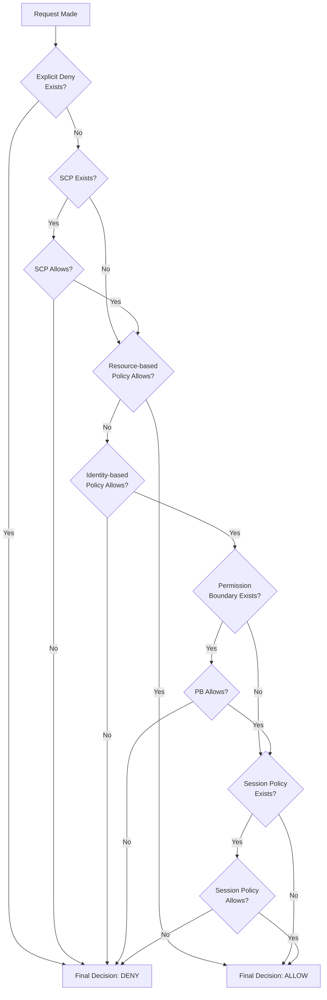

# IAM Policy Evaluation Logic

## Overview
IAM policy evaluation is the process AWS uses to determine whether a request made by a principal is allowed or denied. This logic follows a strict hierarchy, starting with a default deny and moving through multiple layers of policy types (SCPs, resource-based, identity-based, etc.). Understanding the nuances—especially the "Explicit Deny Wins" rule and cross-account requirements—is vital for the SCS-C02 exam.

## Key Concepts
- **Implicit Deny**: The default state for all requests (except for the AWS Root User).
- **Explicit Deny**: A statement with `Effect: Deny`. This overrides any allows, regardless of the policy type.
- **Intersection**: When boundaries (SCPs, Permission Boundaries) are involved, the effective permission is the overlap (intersection) of all allowed actions.
- **Union**: In a single account, an allow in *either* an identity-based policy *or* a resource-based policy is usually sufficient (with some exceptions like KMS).

## Detailed Notes

### 1. The Evaluation Hierarchy
AWS evaluates policies in a specific order to reach a final "Allow" or "Deny" decision.

1. **Check for Explicit Deny**: If any applicable policy contains a `Deny`, the request is immediately denied.
2. **Check SCPs**: If an Organizations SCP exists, it must explicitly allow the action.
3. **Check Resource-based Policies**: If a resource-based policy (e.g., S3 Bucket Policy) allows the action, the request is allowed (even if the identity policy is empty, provided it's in the same account).
4. **Check Identity-based Policies**: If an identity-based policy allows the action, evaluation continues.
5. **Check Permission Boundaries**: If a boundary is present, the action must be allowed by the boundary.
6. **Check Session Policies**: If a session policy (from STS) is present, it must allow the action.

### 2. Same-Account vs. Cross-Account Logic
The rules for authorization change when a principal in Account A tries to access a resource in Account B.

| Scenario | Logic | Requirements |
|----------|-------|--------------|
| **Same-Account** | **Union** | An `Allow` in *either* the Identity-based policy OR the Resource-based policy is sufficient. |
| **Cross-Account** | **Intersection** | An `Allow` is required in **BOTH** the requester's Identity-based policy AND the target's Resource-based policy. |

### 3. The "Explicit Deny Wins" Rule
If a policy has:
- Statement 1: `Allow sqs:DeleteQueue`
- Statement 2: `Deny sqs:*`
The result for `DeleteQueue` is **Deny**. The broad deny statement overrides the specific allow.

## Architecture / Flow

### Detailed Evaluation Logic

## Security Relevance
- **Preventive Guardrails**: Evaluation logic ensures that broad permissions (like `AdministratorAccess`) can be constrained by restrictive boundaries (SCPs or Permission Boundaries).
- **Data Protection**: Cross-account requirements prevent accidental data exposure by ensuring both the source and destination accounts must explicitly agree to the access.

## Operational / Real-World Context
- **VPC Endpoint Constraints**: When accessing S3 through a VPC Endpoint, you often combine an Identity Policy (`Allow *`), a VPCE Policy (restricting actions), and a Bucket Policy (requiring the VPCE ID). The effective permission is the **intersection** of all three.
- **Emergency Access**: The AWS Root User bypasses all identity-based policies but is **still subject to SCPs**.

## Common Pitfalls / Misconfigurations
- **Assuming Resource Policy is Enough (Cross-Account)**: Granting `Allow` in an S3 Bucket Policy to a user in another account will not work unless that user's own IAM policy also allows `s3:GetObject`.
- **Implicit Deny for New Services**: When a new AWS service is released, it is implicitly denied for all existing users until a policy is updated to include it.
- **KMS Exception**: Unlike S3, KMS keys often require an `Allow` in the Key Policy even for same-account users if the Key Policy doesn't explicitly delegate to IAM.

## Exam / Review Notes
- **Explicit Deny > Everything**: If you see a Deny, the answer is Deny.
- **Root User**: Bypasses everything *except* SCPs.
- **Cross-Account**: "Account A allows AND Account B allows."
- **Same-Account**: "Account A user allows OR Account B resource allows."

## Summary
IAM Evaluation Logic is a multi-step process that prioritizes security by defaulting to a deny and allowing explicit denials to override all allows. Authorization for complex scenarios involves finding the intersection of allowed actions across SCPs, boundaries, and session policies.

## Quick Review Checklist
- [ ] Explicit Deny always overrides an Allow.
- [ ] Root user is immune to identity policies but subject to SCPs.
- [ ] Same-account access needs 1 Allow (ID or Resource).
- [ ] Cross-account access needs 2 Allows (ID AND Resource).
- [ ] Permission Boundaries and SCPs define the maximum possible permissions (intersection).
