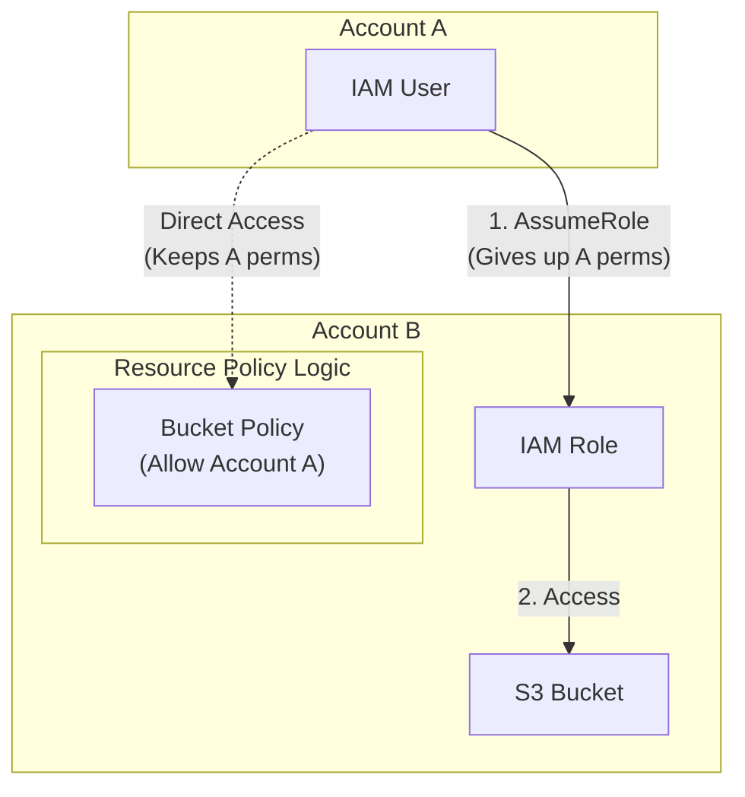

# Identity-Based vs. Resource-Based Policies

## Overview
AWS uses two primary methods to manage authorization: **Identity-based policies** (attached to users, groups, and roles) and **Resource-based policies** (attached directly to resources like S3 buckets or SQS queues). Choosing between them—especially for cross-account access—is a critical architectural decision based on whether you want a principal-centric or a resource-centric security model.

## Key Concepts
- **Identity-Based Policy**: Attached to an IAM identity (User, Group, Role). Defines what that identity can do.
- **Resource-Based Policy**: Attached to a resource (e.g., S3 Bucket Policy, SQS Access Policy). Defines who (principals) can access that resource and what actions they can perform.
- **Cross-Account Access**: Both types can facilitate cross-account access, but the mechanics (and what happens to existing permissions) differ significantly.

## Detailed Notes

### 1. Cross-Account Access Methods

| Feature | Method A: IAM Role (Proxy) | Method B: Resource-Based Policy |
|---------|---------------------------|---------------------------------|
| **Mechanism** | User assumes a role in the target account. | User accesses resource directly via its policy. |
| **Permissions** | User **gives up** original permissions while in the role session. | User **retains** all original permissions. |
| **Duration** | Temporary (Session-based). | Permanent (until policy is changed). |
| **Complexity** | Requires `sts:AssumeRole` configuration. | Simpler for single-action access (e.g., S3 upload). |

#### The "Giving Up Permissions" Nuance
When an IAM user in Account A assumes a role in Account B to access an S3 bucket, they lose access to their Account A resources (like a local DynamoDB table) for the duration of that session. If the task requires scanning a table in Account A and writing to a bucket in Account B simultaneously, a **Resource-Based Policy** is the better choice as the user keeps their local permissions.

### 2. EventBridge Target Permissions
EventBridge uses different authorization models depending on the target service:

- **Resource-Based Policy Targets**:
    - Lambda Functions
    - SNS Topics
    - SQS Queues
    - CloudWatch Logs
    - API Gateway
    - *Mechanism*: The target resource has a policy allowing EventBridge to invoke it.
- **IAM Role Targets**:
    - Kinesis Data Streams
    - Systems Manager (SSM) Run Command
    - ECS Tasks
    - *Mechanism*: EventBridge assumes an IAM role to perform the action on the target.

### 3. Organization-Wide Access (`aws:PrincipalOrgID`)
You can use the `aws:PrincipalOrgID` condition key in a resource-based policy to grant access to all accounts within an AWS Organization automatically.
```json
{
  "Effect": "Allow",
  "Principal": "*",
  "Action": "s3:GetObject",
  "Resource": "arn:aws:s3:::my-org-bucket/*",
  "Condition": {
    "StringEquals": { "aws:PrincipalOrgID": "o-xxxxxxxxxx" }
  }
}
```
> **Operational Insight**: This eliminates the need to manually whitelist individual account IDs as the organization grows.

### 4. Service-to-Service Communication
Resource-based policies often use `aws:SourceArn` or `aws:SourceAccount` to secure service-to-service interactions.
- **Example**: An S3 bucket sending notifications to an SQS queue. The SQS policy allows `sqs:SendMessage` only if the `aws:SourceArn` matches the specific S3 bucket.

## Architecture / Flow

### Role Assumption vs. Resource Policy


## Security Relevance
- **Principal vs. Resource Centric**: Resource-based policies are "Resource Centric"—the data defines its own perimeter. Identity-based policies are "Identity Centric"—the user carries their permissions with them.
- **Blast Radius**: Roles provide a clean break in permissions, which can be useful for limiting the blast radius of a compromised session.

## Operational / Real-World Context
- **S3 Data Lakes**: Often use bucket policies to manage access for hundreds of users across dozens of accounts.
- **Centralized Logging**: CloudWatch Logs and S3 use resource-based policies to allow multiple accounts to push logs to a central security account.

## Common Pitfalls / Misconfigurations
- **Same-Account vs. Cross-Account Requirements**: In the same account, an allow in either policy works. In **cross-account**, the principal **MUST** have an allow in their identity policy AND the resource **MUST** have an allow in its resource policy.
- **Principal Star (`*`)**: Be extremely careful using `"Principal": "*"` without a restrictive `Condition` block (like `PrincipalOrgID` or `SourceVpc`), as this could make the resource public.

## Exam / Review Notes
- **Role Session**: You lose your original permissions when assuming a role.
- **Direct Access**: Use resource-based policies if you need to access resources in two accounts at the same time.
- **PrincipalOrgID**: Best way to allow an entire AWS Organization access to a resource.
- **EventBridge**: Know which targets use Roles vs. Resource Policies (Lambda/SNS/SQS = Resource Policy).

## Summary
Identity-based policies define what a user can do, while resource-based policies define who can access a resource. For cross-account access, roles are best for temporary, broad tasks, while resource-based policies are ideal for specific, concurrent tasks where original permissions must be maintained.

## Quick Review Checklist
- [ ] Role assumption = Temp permissions + Giving up original ones.
- [ ] Resource policy = Access specific resources + Keeping original permissions.
- [ ] Use `aws:PrincipalOrgID` for Org-wide whitelisting.
- [ ] Cross-account access requires ALLOW in both policies.
- [ ] Lambda and SNS targets for EventBridge use resource-based policies.
