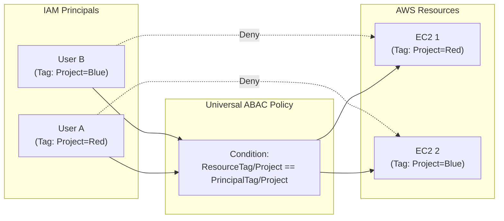

# Attribute-Based Access Control (ABAC)

## Overview
Attribute-Based Access Control (ABAC) is an authorization strategy that defines permissions based on attributes (tags). In AWS, these attributes are attached to IAM principals (users or roles) and to AWS resources. By creating a single IAM policy that requires matching tags between the principal and the resource, permissions can scale dynamically as new users and resources are added without needing to modify existing policies.

## Key Concepts
- **Attributes**: Represented as **Tags** in AWS (key-value pairs).
- **RBAC (Role-Based Access Control)**: Traditional model where permissions are tied to a specific role or job function (e.g., Admin, Developer).
- **ABAC**: Modern model where permissions are tied to matching attributes (e.g., "Allow access if User's Department matches Resource's Department").
- **Dynamic Scaling**: Permissions are granted automatically when a new resource is tagged appropriately.

## Detailed Notes

### 1. How ABAC Works
ABAC leverages IAM policy conditions to compare the tags of the principal making the request with the tags of the resource being accessed.

#### Example Policy Logic
Instead of listing every EC2 instance ARN, an ABAC policy uses variables:
```json
{
  "Effect": "Allow",
  "Action": ["ec2:StartInstances", "ec2:StopInstances"],
  "Resource": "*",
  "Condition": {
    "StringEquals": {
      "aws:ResourceTag/Project": "${aws:PrincipalTag/Project}"
    }
  }
}
```
- **If** User Alice is tagged with `Project: Delta`.
- **And** EC2 Instance 1 is tagged with `Project: Delta`.
- **Then** Alice is allowed to start/stop the instance.
- **If** User Bob is tagged with `Project: Gamma`, he is denied access to Delta's instances.

### 2. ABAC vs. RBAC

| Feature | RBAC (Role-Based) | ABAC (Attribute-Based) |
|---------|-------------------|-------------------------|
| **Management** | Harder to scale; policies grow in size/number. | Easier to scale; uses a few generic policies. |
| **Updates** | Required when adding new resources/users. | Not required; just tag the new items. |
| **Granularity** | Based on role/job function. | Based on specific attributes/metadata. |
| **Policy Count** | High (one per team/project). | Low (one generic policy for all teams). |

### 3. Benefits of ABAC
- **Fewer Policies**: You can use one policy for many users and resources.
- **Reduced Overhead**: Security teams don't need to update IAM policies for every new project.
- **External Integration**: Attributes can be passed from corporate directories (SAML 2.0 or Web IDP) during federation.

## Architecture / Flow

The following diagram shows how a single policy enables multiple teams to access their own resources based on matching tags.



## Security Relevance
- **Least Privilege**: ABAC automatically enforces isolation between projects or departments without manual intervention.
- **Access Reviews**: Shifting the focus from auditing complex JSON policies to auditing tag integrity on users and resources.
- **Preventive Guardrail**: Use IAM policies to restrict who can modify the tags that control access (e.g., prevent users from changing their own `Project` tag).

## Operational / Real-World Context
- **Growing Environments**: In a startup adding a new team every month, ABAC ensures the security team isn't a bottleneck.
- **Federated Identities**: When users log in via Okta or Active Directory, their department attribute is passed as a session tag. AWS then uses that tag to grant access to the appropriate AWS resources instantly.

## Common Pitfalls / Misconfigurations
- **Inconsistent Tagging**: If a resource is missing a tag or has a typo (e.g., `Dept` vs `Department`), access will be denied.
- **Unauthorized Tagging**: If users have `iam:TagUser` or `ec2:CreateTags` permissions without restrictions, they can change tags to escalate their own privileges.
- **Case Sensitivity**: Remember that `StringEquals` is case-sensitive. `project=red` will not match `Project=Red`.

## Exam / Review Notes
- **Scalability**: ABAC is the answer for "How to scale permissions with minimal policy updates."
- **Policy Variables**: Look for `${aws:PrincipalTag/key}` in exam questions.
- **Tags**: ABAC = Tags.
- **RBAC Limit**: RBAC hit policy size limits; ABAC solves this.

## Summary
ABAC is a powerful, tag-based strategy for managing access at scale. By aligning principal attributes with resource attributes, security teams can create dynamic, self-managing permissions that grow with the organization.

## Quick Review Checklist
- [ ] ABAC uses tags on both users/roles and resources.
- [ ] Policies use condition keys like `aws:PrincipalTag` and `aws:ResourceTag`.
- [ ] Benefit: Scales easily without manual policy updates.
- [ ] Requirement: Strict tagging governance (prevent unauthorized tag changes).
- [ ] External IDP attributes can be mapped to session tags for ABAC.
