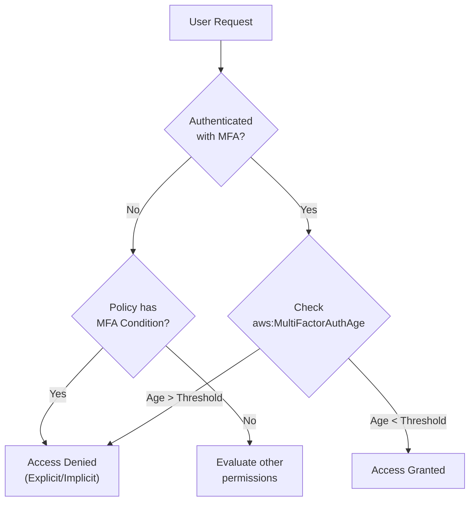

# IAM Multi-Factor Authentication (MFA)

## Overview
Multi-Factor Authentication (MFA) is a critical security layer that requires users to provide both something they **know** (password) and something they **have** (a security device) to access AWS. Implementing MFA is one of the most effective ways to protect the AWS Root User and IAM identities from credential compromise.

## Key Concepts
- **Authentication Factors**: Combines Knowledge (Password) + Possession (MFA Device).
- **Virtual MFA**: Software-based (e.g., Google Authenticator, Authy) on a phone or tablet.
- **Hardware MFA**: Physical devices (e.g., YubiKey, Gemalto tokens).
- **Conditional Access**: Restricting high-risk API calls (like EC2 termination or S3 deletion) to only those authenticated with MFA.

## Detailed Notes

### 1. MFA Device Options
| Type | Example | Characteristics |
|------|---------|-----------------|
| **Virtual MFA** | Google Authenticator, Authy | App-based; supports multiple tokens on one device. |
| **Security Key** | YubiKey | Physical USB/NFC key; supports multiple IAM/Root users. |
| **Hardware Token** | Gemalto (Standard), SurePassID (GovCloud) | Physical key fob that generates time-based codes. |

### 2. S3 MFA Delete
MFA Delete adds an additional layer of protection for Amazon S3 buckets.

- **Required for**:
    - Permanently deleting an object version.
    - Suspending versioning on the bucket.
- **NOT Required for**:
    - Enabling versioning.
    - Listing deleted versions.
- **Constraints**:
    - **Versioning** must be enabled on the bucket first.
    - **Only the Bucket Owner (Root Account)** can enable or disable MFA Delete.
    - Must be configured via the **AWS CLI or API** (not the console).

### 3. IAM Condition Keys for MFA
AWS provides global condition keys to enforce MFA via policies.

- **`aws:MultiFactorAuthPresent`** (Boolean):
    - Checks if the user authenticated using MFA during the current session.
    - *Example*: Deny `ec2:StopInstances` if `aws:MultiFactorAuthPresent` is `false`.
- **`aws:MultiFactorAuthAge`** (Numeric):
    - Measures the time in seconds since the MFA authentication occurred.
    - *Example*: Allow access only if MFA was performed within the last 300 seconds (5 minutes).

### 4. Troubleshooting: The "Ghost" MFA Device
An edge case exists where a user is "Not Authorized" to perform `iam:DeleteVirtualMFADevice` despite having the correct permissions.

- **Cause**: This usually happens if the assignment process for a virtual MFA device was started but canceled before completion (the device exists but isn't fully associated/active).
- **The Fix**: An **Administrator** must use the **AWS CLI or API** to delete the deactivated virtual MFA device to "unstick" the user so they can try again.

## Architecture / Flow

### MFA Enforcement Workflow

## Security Relevance
- **Preventive Control**: MFA is a primary preventive control against unauthorized access resulting from leaked passwords.
- **Destructive Operation Protection**: S3 MFA Delete prevents accidental or malicious data loss by requiring a physical/out-of-band token for deletions.

## Operational / Real-World Context
- **Root Account**: Best practice is to enable a hardware MFA (like a YubiKey) for the Root user and store it in a physical safe.
- **CLI/API Access**: When using the CLI, users must use `sts:GetSessionToken` with their MFA serial number and code to get temporary credentials that include the MFA context.

## Common Pitfalls / Misconfigurations
- **Console-only Users**: Forgetting that CLI access also needs MFA enforcement via policies.
- **Lost Devices**: Not having a recovery plan for lost MFA devices (usually involves contacting AWS Support if it's the Root account).
- **MFA Delete Setup**: Trying to enable MFA Delete as an IAM user instead of the Root account.

## Exam / Review Notes
- **S3 MFA Delete**: Only the **Root Account** can enable/disable it.
- **MFA Delete + Versioning**: Versioning must be ON.
- **MultiFactorAuthPresent**: Use this to force MFA for sensitive actions.
- **MultiFactorAuthAge**: Use this for high-security environments requiring frequent re-authentication.
- **Virtual MFA Delete Issue**: If a user is stuck, the **Admin** must delete the device via **CLI/API**.

## Summary
MFA is the cornerstone of AWS account security. Whether through virtual apps or hardware keys, enforcing MFA via S3 MFA Delete and IAM condition keys ensures that critical infrastructure and data are protected even in the event of credential theft.

## Quick Review Checklist
- [ ] Enable MFA on Root Account (Priority #1).
- [ ] S3 MFA Delete requires Root Account to enable.
- [ ] Use `aws:MultiFactorAuthPresent: false` in a `Deny` statement for guardrails.
- [ ] `aws:MultiFactorAuthAge` defines how long the MFA session is valid.
- [ ] Admin must intervene via CLI if a virtual MFA device is "stuck" (deactivated).
