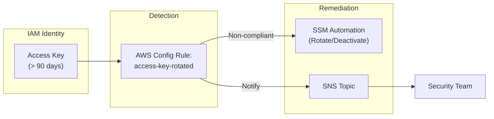

# IAM Credential Report

## Overview
The IAM Credential Report is a service-wide auditing tool that lists all users in an AWS account and the status of their various credentials, including passwords, access keys, and MFA devices. It is a critical resource for security audits and compliance verification.

## Key Concepts
- **Report Format**: A comma-separated values (CSV) file.
- **Data Included**: Password age, last used time, access key rotation status, and MFA enablement.
- **Generation Frequency**: The report can be generated as often as once every **4 hours**.
- **Retrieval**: Accessible via the AWS Management Console, CLI, API, or SDK.

## Detailed Notes

### 1. Report Content
The report provides a snapshot of the following for every IAM user:
- User ARN and creation time.
- Password enabled status, last used, and last changed.
- Access Key 1 & 2 active status, rotation date, and last used.
- MFA device enablement (True/False).

### 2. Retrieval Process
To get the most recent data, you must:
1.  **Generate** the report (if not already generated within the last 4 hours).
2.  **Retrieve** the report content.

### 3. Automated Monitoring (The "Better Way")
While the Credential Report is useful for point-in-time audits, **AWS Config** is preferred for automated compliance and remediation of aged credentials.

| Feature | IAM Credential Report | AWS Config (Recommended) |
|---------|-----------------------|--------------------------|
| **Frequency** | Manual/Scheduled (4hr) | Continuous / Triggered |
| **Format** | CSV File | Resource Timeline / JSON |
| **Automation** | Difficult to automate | Built-in via SSM/EventBridge |
| **Compliance** | Snapshot-based | Rule-based (e.g., `access-key-rotated`) |

## Architecture / Flow

### Automated Key Rotation Workflow (Best Practice)
Instead of manually reviewing a CSV report, use AWS Config for proactive security.

## Security Relevance
- **Credential Hygiene**: Helps identify users with stale passwords or unrotated access keys.
- **MFA Compliance**: Quickly identifies users who have not enabled MFA.
- **Audit Evidence**: Provides the "proof of state" required for many compliance frameworks (SOC2, PCI-DSS).

## Operational / Real-World Context
- **Periodic Audits**: Security teams often download this report monthly to perform a comprehensive user access review.
- **Compliance Reporting**: Used during audits to demonstrate that access keys are being rotated and MFA is enforced across the account.

## Common Pitfalls / Misconfigurations
- **Stale Data**: Assuming the report is real-time; remember it has a 4-hour generation limit.
- **Manual Review Fatigue**: Relying solely on the CSV report for large accounts instead of implementing automated Config rules.

## Exam / Review Notes
- **IAM Credential Report vs. AWS Config**: If the question asks for the best way to **automate** or **alert** on old keys, choose **AWS Config**.
- **Rotation Interval**: The standard recommendation for access key rotation is **90 days**.
- **Report Access**: You must make an API call (`iam:GetCredentialReport`) to retrieve the actual content after it is generated.

## Summary
The IAM Credential Report is a fundamental auditing tool for checking the security posture of all IAM users. However, for active enforcement and automated rotation of credentials, AWS Config provides a more robust and scalable solution.

## Quick Review Checklist
- [ ] Report is in CSV format.
- [ ] Generated maximum once every 4 hours.
- [ ] Contains status for passwords, access keys, and MFA.
- [ ] Use AWS Config `access-key-rotated` for automated 90-day enforcement.
- [ ] Credential report is for auditing; Config is for automation.
