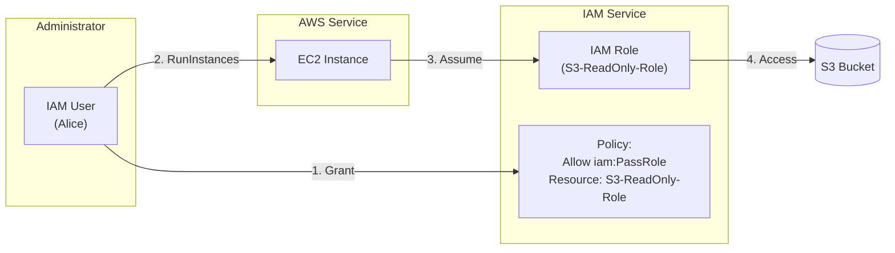

# IAM Roles and PassRole

## Overview
IAM Roles allow AWS services to perform actions on your behalf by assuming temporary security credentials. To ensure security, administrators must control which users are allowed to "hand over" these roles to services. This is managed through the `iam:PassRole` permission, a critical concept for preventing privilege escalation.

## Key Concepts
- **Service Role**: An IAM role that an AWS service assumes to perform actions in your account (e.g., EC2, Lambda, CloudFormation).
- **`iam:PassRole`**: A permission (not a standalone API) that allows a user to assign an IAM role to an AWS service.
- **Trust Policy**: A resource-based policy attached to an IAM role that defines which principals (e.g., `ec2.amazonaws.com`) are allowed to assume it.

## Detailed Notes

### 1. Service Roles in Action
Most AWS services require a role to interact with other resources. Common examples include:
- **EC2 Instance Profile**: Allows an EC2 instance to access S3 or DynamoDB.
- **Lambda Execution Role**: Grants a function permission to write to CloudWatch Logs.
- **CloudFormation Service Role**: Allows CloudFormation to create, update, or delete resources in your account.

### 2. The `iam:PassRole` Permission
When a user configures a service (like launching an EC2 instance with a specific role), they aren't just calling `ec2:RunInstances`; they are also "passing" a role to that instance.

- **Requirement**: To assign a role to a service, the user must have the `iam:PassRole` permission for that specific role ARN.
- **Granular Control**: You should always restrict `iam:PassRole` to specific ARNs or path prefixes to prevent users from passing a high-privilege role (like `AdministratorAccess`) to a resource they control.

### 3. Monitoring `PassRole`
- **CloudTrail Behavior**: There is **no standalone `PassRole` event** in CloudTrail.
- **Verification**: To see who passed a role, you must look at the CloudTrail log for the action that assigned the role, such as:
    - `RunInstances` (EC2)
    - `CreateFunction` (Lambda)
    - `CreateStack` (CloudFormation)

## Architecture / Flow

### The PassRole Workflow

## Security Relevance
- **Privilege Escalation Prevention**: Without `iam:PassRole` restrictions, a user with limited permissions could create an EC2 instance, pass it an `AdministratorAccess` role, and then log into that instance to gain full control of the account.
- **Trust Boundaries**: The combination of `iam:PassRole` (on the user) and the **Trust Policy** (on the role) ensures a two-way handshake for service authorization.

## Operational / Real-World Context
- **CI/CD Pipelines**: Jenkins or GitHub Actions runners often need `iam:PassRole` to deploy Lambda functions or ECS tasks with specific execution roles.
- **Auto Scaling**: When defining a Launch Template for an ASG, the user creating the template must have `iam:PassRole` for the instance profile defined in the template.

## Common Pitfalls / Misconfigurations
- **`iam:PassRole` on `Resource: "*"`**: This is a major security risk. It allows the user to pass **any** role in the account to a service.
- **Missing Trust Policy**: A user may have `iam:PassRole` permission, but if the role's Trust Policy doesn't allow the target service (e.g., `lambda.amazonaws.com`), the service will fail to assume the role.

## Exam / Review Notes
- **`iam:PassRole` is not an API**: It's a permission checked during other service calls (e.g., `RunInstances`).
- **Escalation**: Passing a role with more permissions than you have is a classic privilege escalation path.
- **CloudTrail**: Look for the service-specific creation event to find the `PassRole` caller.

## Summary
`iam:PassRole` is the mechanism that controls which users can delegate permissions to AWS services. By strictly limiting this permission to specific roles, organizations can empower users to deploy infrastructure while preventing them from escalating their own privileges.

## Quick Review Checklist
- [ ] Users need `iam:PassRole` to assign a role to a service.
- [ ] Restrict `Resource` in the `PassRole` policy to specific ARNs (Principle of Least Privilege).
- [ ] No `PassRole` event exists in CloudTrail; check the `Create` or `Run` event instead.
- [ ] Ensure the Role's **Trust Policy** allows the service to assume it.
- [ ] Combining `iam:GetRole` and `iam:PassRole` is common for console users.
