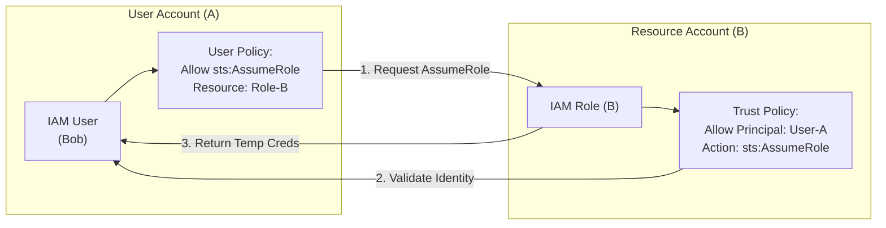

# IAM Trust Policies

## Overview
An IAM Trust Policy is a **resource-based policy** attached to an IAM role that defines which principals (users, roles, accounts, or services) are authorized to assume that role. While a role's identity-based policy defines *what* the role can do, the trust policy defines *who* can become that role.

## Key Concepts
- **Trust Policy**: Defines the "Who" (the Principal). Uses the `sts:AssumeRole` action.
- **Permission Policy**: Defines the "What" (the Actions/Resources).
- **Service Principal**: An AWS service (e.g., `ec2.amazonaws.com`) defined as the principal allowed to assume the role.
- **Two-Way Handshake**: For a principal to assume a role, the principal must have permission to call `sts:AssumeRole`, AND the role's trust policy must explicitly allow that principal.

## Detailed Notes

### 1. Default Trust Policy (Account Level)
When you create a role for another AWS account or for cross-account access, the default trust policy often looks like this:
```json
{
  "Effect": "Allow",
  "Principal": { "AWS": "arn:aws:iam::123456789012:root" },
  "Action": "sts:AssumeRole"
}
```
> **Note**: Specifying the `root` ARN does not mean only the root user can assume the role; it delegates the authority to the account's administrators to grant `sts:AssumeRole` permissions to their own users.

### 2. Service Trust Policies
AWS services that need to perform actions in your account (like EC2 or Lambda) must be listed in the trust policy as a service principal.
- **EC2**: `"Service": "ec2.amazonaws.com"`
- **Lambda**: `"Service": "lambda.amazonaws.com"`
- **CloudFormation**: `"Service": "cloudformation.amazonaws.com"`

### 3. Conditional Trust Policies
You can add `Condition` blocks to trust policies to enforce higher security standards during the role assumption process.

#### MFA Enforcement
*Goal*: Ensure a user has authenticated with MFA before they are allowed to assume a sensitive administrative role.
```json
{
  "Effect": "Allow",
  "Principal": { "AWS": "arn:aws:iam::111122223333:root" },
  "Action": "sts:AssumeRole",
  "Condition": { "Bool": { "aws:MultiFactorAuthPresent": "true" } }
}
```

## Architecture / Flow

### The Trust Handshake
For a successful `AssumeRole` operation, both sides of the relationship must be configured correctly.



## Security Relevance
- **Lateral Movement Protection**: Trust policies prevent unauthorized users from "jumping" into high-privilege roles unless they are explicitly trusted.
- **Service Isolation**: By limiting a trust policy to `lambda.amazonaws.com`, you ensure that an EC2 instance cannot assume that specific role, even if it has broad `sts:*` permissions.

## Operational / Real-World Context
- **Instance Profiles**: When you attach a role to an EC2 instance, you are creating an "Instance Profile." The role's trust policy **must** include `ec2.amazonaws.com`.
- **Cross-Account Auditing**: Security teams often use a central account to assume "Audit" roles in member accounts. Each member account's Audit role must trust the central security account's ARN.

## Common Pitfalls / Misconfigurations
- **Missing Service Principal**: If you create a role for Lambda but forget to add `lambda.amazonaws.com` to the trust policy, the function will fail to execute with a "Permission Denied" error during startup.
- **Overly Broad Principals**: Using `"Principal": { "AWS": "*" }` without a condition makes the role assumable by **anyone in the world** who knows the ARN, which is a critical security vulnerability.
- **Forgotten Handshake**: A common exam scenario involves a user who has `sts:AssumeRole` permission but still gets "Access Denied." The missing piece is almost always the **Trust Policy** on the target role.

## Exam / Review Notes
- **sts:AssumeRole**: This is the only action used in trust policies.
- **Resource-Based**: Trust policies are resource-based policies attached to IAM Roles.
- **Service Principal**: Know the format (e.g., `service_name.amazonaws.com`).
- **MFA Condition**: Common requirement for assuming administrative roles.

## Summary
Trust policies are the gatekeepers of IAM roles. By defining exactly who is allowed to call `sts:AssumeRole`, they provide a robust mechanism for service-to-service communication, cross-account access, and enforcing security requirements like MFA.

## Quick Review Checklist
- [ ] Trust policy defines WHO can assume the role.
- [ ] Permission policy defines WHAT the role can do.
- [ ] Trust policies are resource-based policies.
- [ ] Action is always `sts:AssumeRole`.
- [ ] Use `Condition` (like MFA) to harden role assumption.
- [ ] Ensure the correct Service Principal is used for AWS services.
