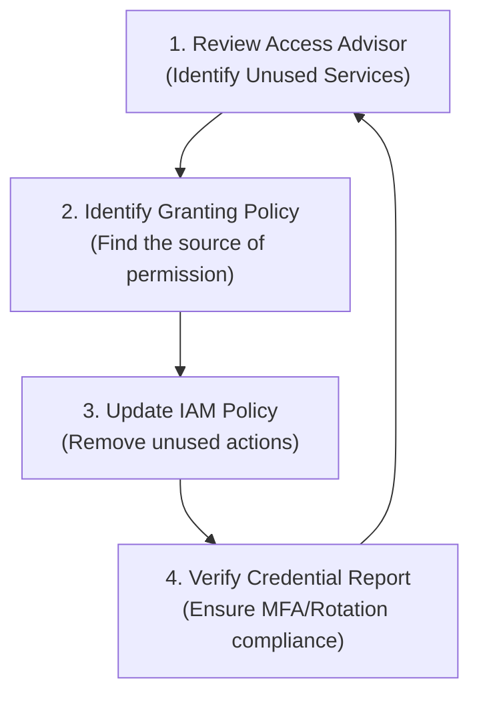

# IAM Security Tools

## Overview
AWS provides specialized tools within Identity and Access Management (IAM) to audit security posture and enforce the **Principle of Least Privilege (PoLP)**. These tools—the **Credential Report** and **Access Advisor**—allow administrators to identify credential risks and prune unnecessary permissions based on actual usage data.

## Key Concepts
- **Credential Report**: An account-level audit of all users and their credential status (passwords, access keys, MFA).
- **Access Advisor**: A user/role-level tool that tracks when services were last accessed to help identify unused permissions.
- **Principle of Least Privilege (PoLP)**: The practice of granting only the minimum permissions required to perform a task.

## Detailed Notes

### 1. IAM Credential Report (Account Level)
The Credential Report provides a comprehensive snapshot of every IAM user in the account.

- **Format**: Downloadable CSV file.
- **Scope**: Entire AWS account.
- **Frequency**: Can be generated every 4 hours.
- **Audit Points**:
    - **Password Status**: Enabled, age, last used, last changed.
    - **MFA Status**: Whether MFA is active for the user.
    - **Access Keys**: Rotation date, last used, and activity status.
- **Usage**: Identifying "stale" users who haven't logged in recently or users who haven't enabled MFA.

### 2. IAM Access Advisor (User/Role Level)
Access Advisor helps administrators refine permissions by showing which services an identity actually uses.

- **Scope**: Individual IAM User, Group, or Role.
- **Data Points**:
    - **Services Accessed**: A list of all services allowed by policies.
    - **Last Accessed Time**: Exactly when the service was last used by that principal.
    - **Granting Policy**: Identifies which specific policy (e.g., `AdministratorAccess`) granted the permission.
- **Usage**: If a user has access to 100 services but only uses 5, Access Advisor makes it easy to see the other 95 that should be removed to achieve Least Privilege.

## Architecture / Flow

### The Least Privilege Remediation Loop

## Security Relevance
- **Credential Hygiene**: The Credential Report ensures that passwords are rotated and MFA is enforced, reducing the risk of account takeover.
- **Attack Surface Reduction**: Access Advisor allows for the reduction of a principal's "blast radius." By removing unused permissions, you ensure that if a set of credentials is leaked, the attacker has access to fewer services.

## Operational / Real-World Context
- **Compliance Audits**: During a SOC2 or PCI-DSS audit, the **Credential Report** is often used as evidence that the organization is monitoring user access and enforcing MFA.
- **Permission Cleanup**: Before a user leaves a team or changes roles, administrators use **Access Advisor** to see what they were actually doing and transition their access properly.

## Common Pitfalls / Misconfigurations
- **Ignoring the Root User**: The Credential Report often highlights that the Root user lacks MFA—this should be the #1 priority for remediation.
- **Confusing the Two Tools**: Remember that **Credential Report** is for "Can they log in safely?" and **Access Advisor** is for "What are they actually doing?"
- **Over-Reliance on the UI**: While the Console is great for one-off checks, for large-scale automation of credential rotation, **AWS Config** is the preferred tool (as noted in the Credential Report detailed notes).

## Exam / Review Notes
- **Least Privilege**: If an exam question mentions the "Principle of Least Privilege," think **Access Advisor**.
- **Account-wide Audit**: If you need to see MFA status for **all** users, use the **Credential Report**.
- **ASFF Compatibility**: Note that these tools provide the data that often feeds into Security Hub findings.

## Summary
IAM security tools provide the visibility needed to maintain a secure identity environment. The Credential Report monitors "Identity Hygiene," while Access Advisor monitors "Permission Usage," together enabling a secure, least-privileged infrastructure.

## Quick Review Checklist
- [ ] **Credential Report**: CSV format, Account-wide, MFA/Password/Key status.
- [ ] **Access Advisor**: User/Role level, Last accessed time, helps enforce Least Privilege.
- [ ] Use **Access Advisor** to find which policy granted a specific permission.
- [ ] Use **Credential Report** to identify users without MFA.
