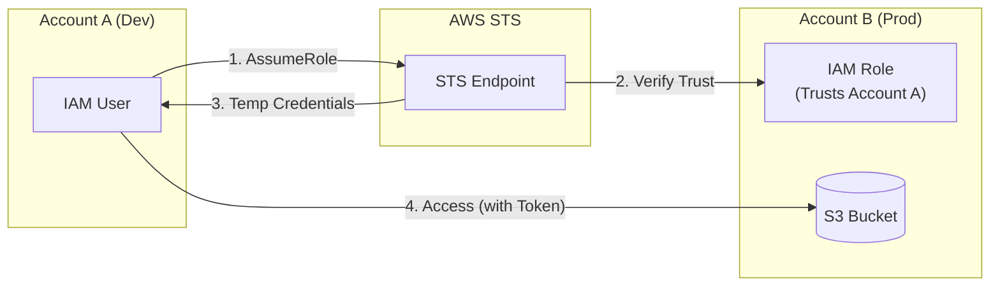
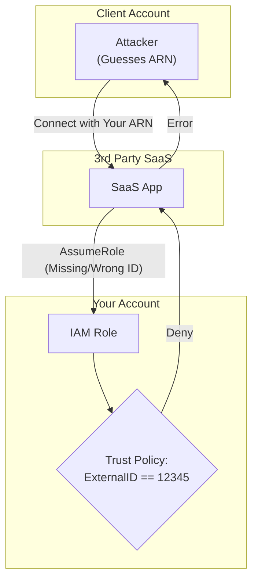

# AWS Security Token Service (STS)

## Overview
AWS STS is a web service that enables you to request temporary, limited-privilege credentials for IAM users or for users you authenticate (federated users). These credentials are short-lived (ranging from minutes to hours) and are the backbone of cross-account access, federation, and service-to-service communication.

## Key Concepts
- **Temporary Credentials**: Consist of an Access Key ID, a Secret Access Key, and a **Session Token**.
- **AssumeRole**: The primary API used to obtain temporary credentials by impersonating an IAM Role.
- **Token Validity**: Credentials automatically expire after a set duration (default is 1 hour, but can be configured up to 12 hours).
- **Federation**: Using external identities (SAML, OIDC, Social Login) to access AWS.

## Detailed Notes

### 1. Primary STS API Calls
| API Call | Use Case |
|----------|----------|
| **`AssumeRole`** | Standard role assumption (Same-account or Cross-account). |
| **`AssumeRoleWithSAML`** | Federation for enterprise users logged into a SAML 2.0 IdP. |
| **`AssumeRoleWithWebIdentity`** | Mobile/Web apps using OIDC providers (Google, Facebook). *Recommendation: Use Cognito instead.* |
| **`GetSessionToken`** | Used by IAM users for MFA-protected API access. |
| **`GetCallerIdentity`** | Returns details about the current IAM entity (Account, ARN, User ID). |

### 2. STS Versions: Global (v1) vs. Regional (v2)
- **Global Endpoint (v1)**: `https://sts.amazonaws.com`.
    - Supports only regions enabled by default.
    - Issues "Version 1" tokens which are not compatible with some newer regions (e.g., `me-south-1`).
- **Regional Endpoints (v2)**: `https://sts.<region>.amazonaws.com`.
    - Recommended for all modern workloads.
    - **Benefits**: Reduced latency, built-in redundancy, and supports session tokens for all regions.
    - **Note**: Tokens obtained from a regional endpoint are valid globally.

### 3. STS External ID (Confused Deputy Problem)
The **External ID** is a security best practice used when a 3rd party (the "Deputy") needs to access your account.
- **Problem**: An attacker could trick a 3rd-party service into accessing your resources if they know your Role ARN.
- **Solution**: The 3rd party provides a unique External ID. You add this ID to your Role's **Trust Policy** condition.
- **Logic**: The role can *only* be assumed if the `AssumeRole` call includes the matching `ExternalID`.

### 4. Revoking Temporary Credentials
If temporary credentials are leaked, you cannot "delete" them because they are stateless. Instead, you must **revoke** them by denying access based on time.
- **Mechanism**: Attach an inline policy to the role using the `AWSRevokeOlderSessions` managed policy template.
- **Condition Key**: `aws:TokenIssueTime`.
- **Logic**: Uses `DateLessThan` to explicitly deny any request where the token was issued *before* a specific timestamp.
- **Effect**: Attackers with existing tokens are immediately blocked; new sessions created after the revocation are unaffected.

## Architecture / Flow

### Cross-Account Access Flow

### External ID Security (Confused Deputy)

## Security Relevance
- **Statelessness**: Temporary credentials don't require an IAM user to exist permanently.
- **Credential Rotation**: Automatically handles the rotation problem by making keys expire.
- **Enforcement**: Revocation via `TokenIssueTime` is the only way to kill an active session.

## Operational / Real-World Context
- **Infrastructure as Code**: Terraform/CloudFormation often uses cross-account roles to deploy resources into target accounts.
- **Mobile Apps**: Users log in via Amazon/Google, get a Web Identity token, and exchange it via STS to upload photos directly to S3.
- **Emergency Remediation**: If a laptop with active CLI sessions is stolen, the admin revokes all sessions for that user's role immediately.

## Common Pitfalls / Misconfigurations
- **Region Incompatibility**: Using the Global STS endpoint for a workload in a new region like Cape Town (`af-south-1`) will fail unless "All Regions" is enabled or a Regional endpoint is used.
- **External ID Omission**: Failing to require an External ID when allowing 3rd party SaaS access leaves the account vulnerable to the Confused Deputy attack.
- **Policy Bloat**: The `AWSRevokeOlderSessions` policy is an **Explicit Deny**. If you forget it's there, you might wonder why new users can't perform actions (though it usually only affects old tokens).

## Exam / Review Notes
- **AssumeRole**: Always results in temporary credentials.
- **External ID**: The answer for "3rd party" or "Confused Deputy" questions.
- **Revocation**: Uses `aws:TokenIssueTime` with `DateLessThan`.
- **STS v2**: Better for latency and required for newer regions.

## Summary
AWS STS is the engine behind dynamic, secure access in AWS. It enables complex scenarios like cross-account access and federation while ensuring that credentials are never permanent and can be revoked in case of an emergency.

## Quick Review Checklist
- [ ] STS provides temporary Access Key, Secret Key, and Session Token.
- [ ] Use Regional STS endpoints for lower latency and new region support.
- [ ] External ID solves the Confused Deputy problem for 3rd party access.
- [ ] Revoke leaked sessions using `aws:TokenIssueTime` in an explicit Deny policy.
- [ ] `AssumeRoleWithSAML` is for enterprise federation; `AssumeRoleWithWebIdentity` is for web/mobile (but prefer Cognito).
