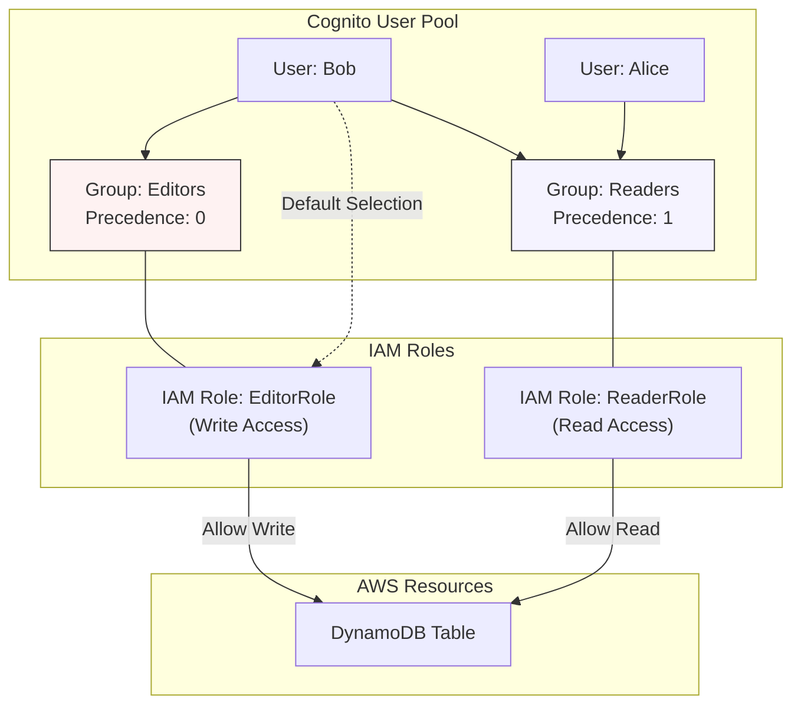

# Cognito User Pool Groups

## Overview
**Cognito User Pool Groups** are a logical way to organize users within a User Pool. They allow administrators to manage permissions for collections of users rather than on an individual basis, similar to how IAM Groups function for IAM Users.

## Key Concepts
- **User Group**: A named collection of users within a single Cognito User Pool.
- **IAM Role Attachment**: An IAM role can be associated with a group to define the permissions that its members will assume.
- **Precedence**: A numerical value assigned to a group to determine which IAM role is used when a user belongs to multiple groups.
- **Multiple Group Membership**: A user can be a member of up to 128 groups (soft limit).

## Detailed Notes

### 1. Group-Based Permissions
Groups simplify permission management by allowing you to map a set of users to an IAM role. 
- **Example 1 (Readers)**: A "Readers" group is created with an IAM role that has `dynamodb:GetItem` and `dynamodb:Query` permissions.
- **Example 2 (Editors)**: An "Editors" group is created with an IAM role that has `dynamodb:PutItem` and `dynamodb:UpdateItem` permissions.

When a user in one of these groups authenticates and gets credentials through **Cognito Identity Pools (Federated Identities)**, they can assume the role associated with their group to access AWS resources directly.

### 2. Precedence and Role Selection
Since a user can belong to multiple groups, Cognito needs a way to decide which IAM role to apply.
- **Precedence Value**: A non-negative integer assigned to each group.
- **Logic**: The group with the **lowest numerical precedence value** (e.g., 0 is higher precedence than 10) takes priority.
- **Default Behavior**: If a user is in multiple groups, the IAM role of the group with the lowest precedence is chosen by default.
- **Manual Selection**: Applications can still programmatically choose a different IAM role from the user's groups by specifying the role ARN during the `GetCredentialsForIdentity` or `AssumeRoleWithWebIdentity` call, provided the user belongs to that group.

### 3. Limitations
- **No Nested Groups**: Unlike some LDAP or Active Directory implementations, Cognito does not support "groups of groups."
- **Pool-Specific**: Groups are local to the User Pool in which they are created.

## Architecture / Flow
The following diagram shows how groups map to IAM roles for resource access.

## Security Relevance
- **Preventive Control**: By assigning roles to groups, you enforce the **Principle of Least Privilege** based on functional job roles (RBAC - Role-Based Access Control).
- **Simplified Auditing**: It is easier to audit permissions for a few groups than for thousands of individual users.
- **Token Claims**: Group membership is included in the **ID Token** as the `cognito:groups` claim, allowing backend applications to perform custom authorization logic.

## Operational / Real-World Context
- **SaaS Multi-tenancy**: Use groups to separate users by their subscription tier (e.g., "Free", "Premium", "Admin").
- **External Integration**: When syncing with an external OIDC or SAML provider, you can map external groups/claims to Cognito User Pool groups.

## Common Pitfalls / Misconfigurations
- **Precedence Collision**: If two groups have the same precedence, the result is non-deterministic. Always ensure unique precedence values for groups with different roles.
- **Role Trust Policy**: The IAM role attached to a group must have a trust policy that allows `cognito-identity.amazonaws.com` to assume it.
- **Confusion with IAM Groups**: Cognito groups are **not** IAM groups. They exist entirely within the Cognito service.

## Exam / Review Notes
- **Precedence**: Remember **Lowest Number = Highest Priority**.
- **Role Assignment**: Groups provide a way to map users to roles without needing complex mapping rules in Cognito Identity Pools.
- **Nesting**: Cognito **does not** support nested groups.
- **ID Token**: The `cognito:groups` claim is the standard way to check group membership in a JWT.

## Summary
Cognito User Pool Groups provide a scalable way to manage user permissions by mapping logical collections of users to IAM roles. By using precedence values, administrators can control which role is assumed by default when users have overlapping memberships.

## Quick Review Checklist
- [ ] Groups are logical collections of users in a User Pool.
- [ ] Groups can be mapped to IAM roles for resource access.
- [ ] **Lowest precedence number** wins the default role assignment.
- [ ] Nested groups are **not** supported.
- [ ] Users can belong to multiple groups (up to 128).
- [ ] Membership is visible in the `cognito:groups` claim of the ID Token.
