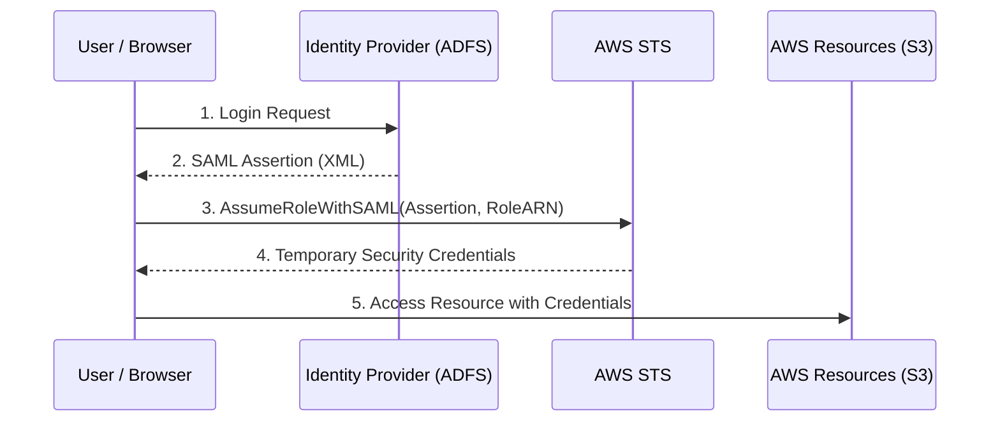
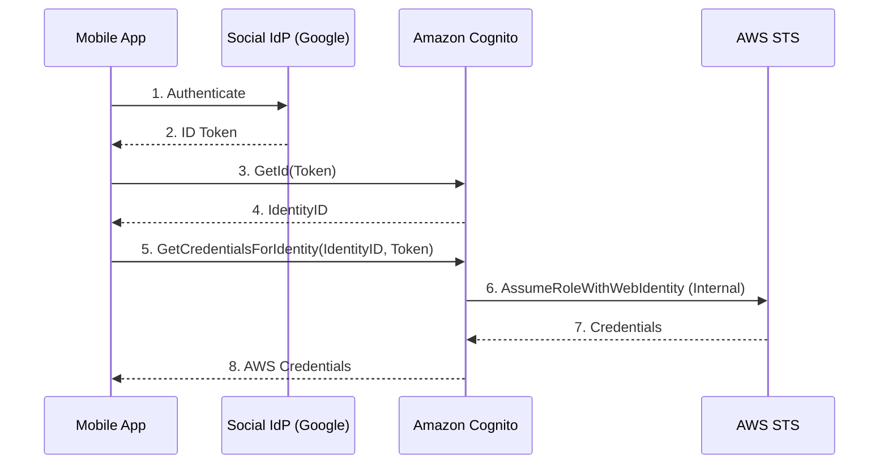

# Identity Federation & Cognito

## Overview
**Identity Federation** allows users from outside AWS (e.g., corporate directories or social media) to access AWS resources without requiring individual IAM users. By establishing a trust relationship between AWS and an external **Identity Provider (IdP)**, organizations can centralize user management and provide temporary security credentials to external identities.

## Key Concepts
- **Identity Provider (IdP)**: The external system that manages user identities (e.g., AD, Google, Facebook).
- **Relying Party**: The service that trusts the IdP (in this case, AWS).
- **Trust Relationship**: A configuration in IAM (Identity Provider object) that establishes trust with an external metadata document or OIDC endpoint.
- **STS (Security Token Service)**: The AWS service that issues temporary, limited-privilege credentials.
- **SAML 2.0**: Security Assertion Markup Language, an XML-based standard for exchanging authentication and authorization data.
- **OIDC (OpenID Connect)**: An identity layer on top of the OAuth 2.0 protocol.

## Detailed Notes

### 1. SAML 2.0 Federation (Classic/Enterprise)
Used primarily with corporate directories like **Active Directory Federation Services (ADFS)**.
- **Flow**: User authenticates with IdP -> IdP returns SAML Assertion -> User calls STS `AssumeRoleWithSAML` -> STS returns temporary credentials.
- **Console Access**: Uses a specific sign-in endpoint (`https://signin.aws.amazon.com/saml`) to redirect users to the AWS Management Console after authentication.
- **Identity Center (SSO)**: While SAML 2.0 is the underlying protocol, AWS IAM Identity Center is now the recommended managed service for enterprise federation.

### 2. Custom Identity Broker
Used when the corporate IdP is **not** SAML 2.0 compatible.
- **Broker Role**: A custom-built application that authenticates the user and then calls STS `AssumeRole` or `GetFederationToken` on their behalf.
- **Responsibility**: The broker must determine the correct IAM role for the user and handle the distribution of credentials.

### 3. Web Identity Federation (B2C)
Used for mobile or web apps where users sign in via social providers (Amazon, Google, Facebook) or OIDC-compatible providers.

#### A. Without Cognito (Legacy/Not Recommended)
- **Flow**: App authenticates with social IdP -> App gets Web Identity Token -> App calls STS `AssumeRoleWithWebIdentity` -> STS returns credentials.
- **Drawback**: Harder to manage at scale; lacks support for anonymous users or sophisticated role-mapping.

#### B. With Cognito (Preferred)
- **Cognito Identity Pools**: Acts as a "Token Vending Machine."
- **Flow**: App authenticates with IdP -> App gets IdP Token -> App exchanges IdP Token for a Cognito Identity ID -> App calls Cognito to get AWS credentials.
- **Advantages**: Supports anonymous users, MFA, and data synchronization across devices.

### 4. IAM Policy Variables for Federation
To implement fine-grained access control (FGAC) for federated users, you can use dynamic variables in IAM policies:
- `${cognito-identity.amazonaws.com:sub}`: The unique identity ID for the user in Cognito.
- `${amazon.com:user_id}`: The user ID from Amazon.
- `${saml:sub}`: The subject claim from a SAML assertion.

**Example: S3 Prefix Restriction**
```json
{
  "Version": "2012-10-17",
  "Statement": [
    {
      "Effect": "Allow",
      "Action": ["s3:GetObject", "s3:PutObject"],
      "Resource": ["arn:aws:s3:::my-app-bucket/${cognito-identity.amazonaws.com:sub}/*"]
    }
  ]
}
```

## Architecture / Flow

### SAML 2.0 Federation Flow


### Web Identity Federation with Cognito


## Security Relevance
- **Preventive**: Eliminates the need for long-term IAM Access Keys, reducing the risk of credential leakage.
- **Least Privilege**: Policy variables ensure that even if thousands of users share the same IAM role, they can only access their own "folders" in S3 or rows in DynamoDB.
- **Administrative**: Centralizes user lifecycle management (joiners/movers/leavers) in the source directory.

## Operational / Real-World Context
- **ADFS Integration**: Common in hybrid cloud environments to allow on-premises users to use their Windows login for AWS.
- **Mobile Apps**: Cognito is the standard for serverless mobile backends to handle authentication.

## Common Pitfalls / Misconfigurations
- **Trust Policy Errors**: Forgetting to add the IdP as a `Principal` in the IAM Role's trust policy.
- **Clock Skew**: SAML assertions have a validity period; if the on-premises server clock is out of sync with AWS, authentication will fail.
- **Hardcoded ARNs**: Avoid hardcoding User IDs in policies; always use `${...:sub}` variables.

## Exam / Review Notes
- **AssumeRoleWithSAML**: Key API for enterprise federation.
- **AssumeRoleWithWebIdentity**: Key API for social federation (Cognito uses this under the hood).
- **Token Vending Machine**: Conceptually what Cognito Identity Pools do.
- **Identity Center (SSO)**: The "new way" for managing multiple accounts and SAML federation.
- **Custom Broker**: Use only when SAML 2.0 is NOT supported.

## Summary
Identity Federation bridges external identity stores with AWS IAM. SAML 2.0 is the standard for corporate integration, while Cognito (Web Identity Federation) is the standard for modern consumer-facing applications. Both rely on STS to exchange external proofs of identity for temporary AWS credentials.

## Quick Review Checklist
- [ ] Trust relationship established between IdP and AWS?
- [ ] Correct STS API chosen (`AssumeRoleWithSAML` vs `AssumeRoleWithWebIdentity`)?
- [ ] IAM Role Trust Policy allows the IdP?
- [ ] Policy variables used for fine-grained access?
- [ ] Cognito Identity Pools used for social/anonymous federation?
