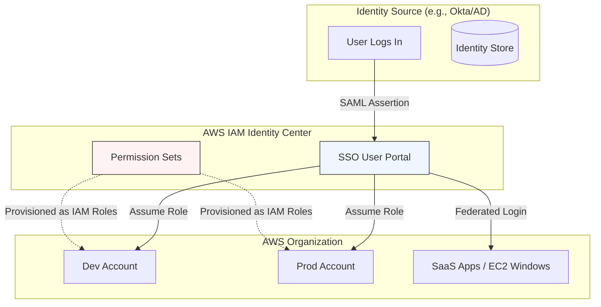

# AWS IAM Identity Center (Successor to AWS SSO)

## Overview
**AWS IAM Identity Center** is the recommended service for managing single sign-on (SSO) access to multiple AWS accounts and business applications. It centralizes the management of users and their permissions across an **AWS Organization**, providing a unified portal for users to access their assigned accounts and applications (e.g., Salesforce, Microsoft 365) using a single set of credentials.

## Key Concepts
- **Identity Store**: Where users and groups are defined. Can be the built-in Identity Center store, an external Identity Provider (IdP) via SAML 2.0, or AWS Managed/On-premises Active Directory.
- **Permission Sets**: A template that defines a collection of IAM policies (AWS Managed, Customer Managed, or Inline) that specify the level of access users have to an AWS account.
- **Assignments**: The association of a user or group with a permission set in a specific AWS account.
- **Delegated Administration**: The ability to manage Identity Center from a member account rather than the Management account.
- **ABAC (Attribute-Based Access Control)**: Using user attributes (e.g., cost center, department) to define permissions dynamically.

## Detailed Notes

### 1. Permission Sets & Policies
Permission sets define what a user can do once they sign into an account. They can contain:
- **AWS Managed Policies**: E.g., `AdministratorAccess`. Available in all accounts automatically.
- **Inline Policies**: JSON policies written directly into the permission set.
- **Customer Managed Policies**: IAM policies that must pre-exist in the target accounts.
    - > **Exam Tip**: If using Customer Managed Policies in a permission set, the policy with the *exact same name* must be created in every target account where the permission set is assigned. Use **CloudFormation StackSets** to ensure consistency.

### 2. Delegated Administration
To follow security best practices, you can delegate Identity Center management to a member account (e.g., a Security or Tooling account).
- **Capabilities**: Delegated admins can create/manage permission sets and assignments for all member accounts.
- **Restrictions**: They **cannot** delete the Identity Center configuration, manage permission sets in the Management account, or add/remove member accounts from the Organization.
- **Purpose**: Prevents privilege escalation and reduces the burden on the Management account.

### 3. Attribute-Based Access Control (ABAC)
ABAC allows for fine-grained permissions based on user attributes stored in the Identity Store.
- **Implementation**: Map attributes from your IdP (e.g., `Department`) to Identity Center attributes.
- **Benefit**: You define the IAM policy once using `${aws:PrincipalTag/Department}`, and access is automatically granted or revoked based on the user's metadata in the identity store.

### 4. Integration & Attribute Mapping
When connecting an external IdP (like Okta or AD):
- **Authentication**: Happens at the IdP level. Password policies and MFA are enforced by the IdP, not AWS.
- **Attribute Mapping**: You must map source fields (e.g., `userprincipalname`) to Identity Center fields (e.g., `username`) so the federation broker can correctly identify and authorize the user.
- **Supported Services**: Many services support "one-click" integration with Identity Center, including Amazon Q, Redshift, OpenSearch, SageMaker, and Workspaces.

## Architecture / Flow

### SSO Access Flow

## Security Relevance
- **Preventive**: Centralizes authentication and removes the need for long-lived IAM user credentials.
- **Detective**: All SSO logins and role assumptions are logged in **AWS CloudTrail**, providing a clear audit trail of who accessed which account and when.
- **Least Privilege**: Permission sets allow for granular control over what federated users can do in different environments (e.g., Admin in Dev, Read-Only in Prod).

## Operational / Real-World Context
- **Multi-Account Strategy**: Essential for organizations with more than a few accounts to avoid "credential sprawl."
- **Employee Lifecycle**: When an employee leaves, disabling their account in the central IdP (e.g., AD) immediately revokes their access to all AWS accounts and integrated SaaS apps.

## Common Pitfalls / Misconfigurations
- **Customer Managed Policy Name Mismatch**: The permission set will fail to provision if the referenced policy is missing from the target account.
- **Management Account Risk**: Using the Management account for daily tasks. Identity Center should be used to provide administrative access to the Management account only when necessary.
- **Attribute Mapping Failures**: Incorrectly mapping the `Subject` or `Email` can lead to users being unable to log in or being assigned the wrong permissions.

## Exam / Review Notes
- **Successor to AWS SSO**: If you see "AWS SSO" in old questions, it refers to IAM Identity Center.
- **One Login**: Central portal for AWS accounts, SaaS apps, and EC2 Windows instances.
- **Permission Sets**: These are not IAM Roles themselves but are used by Identity Center to *create* IAM Roles in target accounts.
- **AD Integration**: Requires AWS Directory Service or AD Connector.
- **Password Policies**: Managed at the source (AD/IdP), not in Identity Center.

## Summary
AWS IAM Identity Center is the "front door" for human identities in AWS. It simplifies multi-account management by linking a central identity store to permission sets, ensuring that users have a seamless single sign-on experience while maintaining strict security boundaries across the AWS Organization.

## Quick Review Checklist
- [ ] Identity Center enabled in the Management account (or delegated)?
- [ ] Identity source configured (Built-in, AD, or SAML IdP)?
- [ ] Permission sets defined with appropriate managed/inline/customer policies?
- [ ] Attributes mapped correctly for ABAC if used?
- [ ] Multi-factor authentication (MFA) enabled (at IdP or Identity Center)?
