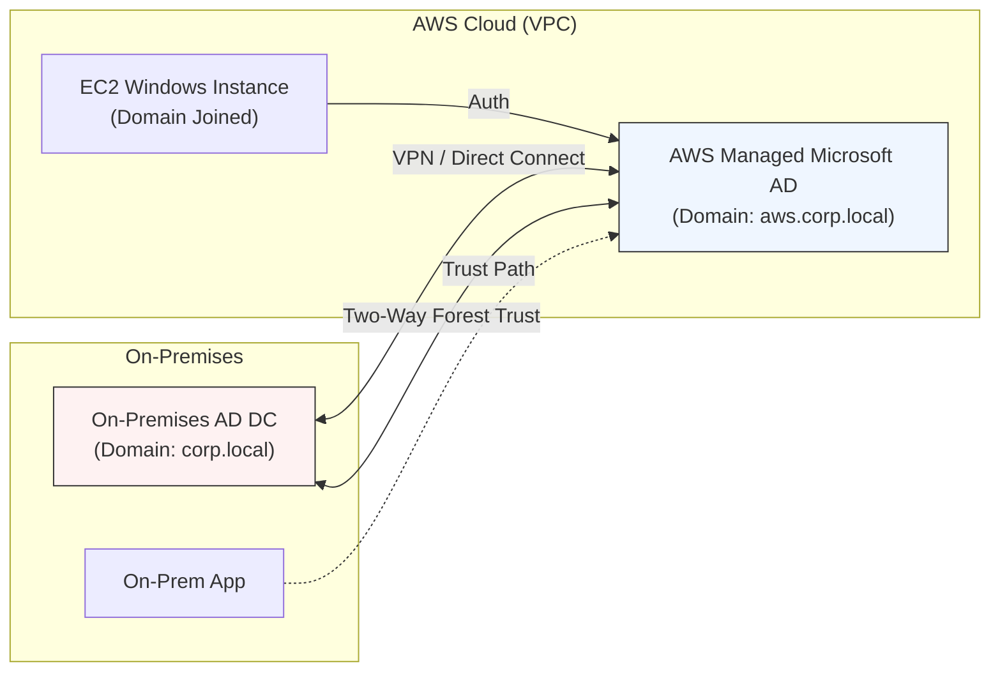

# AWS Directory Services

## Overview
**AWS Directory Service** is a managed service that provides several ways to use Microsoft Active Directory (AD) with other AWS services. It allows organizations to bridge their on-premises identity infrastructure with the AWS Cloud, enabling features like Single Sign-On (SSO), seamless domain join for EC2 instances, and integration with RDS for SQL Server.

## Key Concepts
- **Active Directory (AD)**: A Microsoft service used for centralized security management of users, computers, and other objects in a Windows environment.
- **Domain Controller (DC)**: A server that responds to security authentication requests (logging in, checking permissions) within a Windows domain.
- **Forest & Tree**: A logical hierarchy of AD objects. A group of trees forms a forest.
- **Forest Trust**: A logical link between two AD forests that allows users in one forest to be authenticated by domain controllers in another.
- **Samba 4**: An open-source suite that provides AD-compatible API services (used in Simple AD).

## Directory Service Flavors

| Feature | AWS Managed Microsoft AD | AD Connector | Simple AD |
|---------|--------------------------|--------------|-----------|
| **Core Technology** | Actual Windows Server AD | Gateway / Proxy | Samba 4 (AD-Compatible) |
| **User Management** | Local (in AWS) or On-Prem (via Trust) | On-Premises only | Local (in AWS) only |
| **Trust Support** | Yes (Forest Trust) | No | No |
| **MFA Support** | Yes | Yes | No |
| **RDS SQL Server Integration** | Yes | No | No |
| **Seamless Domain Join** | Yes | Yes (limited) | Yes |
| **Scaling** | Multi-AZ, Multi-Region | Multi-AZ Proxy | Multi-AZ |
| **Cost** | High | Low | Lowest |

---

## Detailed Notes

### 1. AWS Managed Microsoft AD
This is a fully managed Microsoft Active Directory running on Windows Server in the AWS Cloud.
- **Deployment**: Deployed in a VPC across at least two Availability Zones (AZs).
- **Integrations**: The only flavor that supports **RDS for SQL Server** and **Multi-Region replication**.
- **Management**: AWS handles patches, backups, and software updates. You manage users, groups, and Group Policy Objects (GPOs).
- **Trust Relationships**: 
    - You can establish a **One-way** or **Two-way Forest Trust** with your on-premises AD.
    - **Note**: Trust is **NOT** synchronization/replication. Users exist in their respective directories, but the DCs "vouch" for users across the trust boundary.

### 2. AD Connector
A directory gateway (proxy) that redirects directory requests to your on-premises Microsoft AD.
- **No Local Storage**: It does not store or cache user credentials in AWS.
- **Flow**: User logs in -> AD Connector proxies request to On-Prem DC via VPN/Direct Connect -> On-Prem DC validates -> AD Connector retrieves STS credentials.
- **Dependency**: If the connection to on-premises (VPN/DX) goes down, authentication fails.

### 3. Simple AD
A standalone, managed directory powered by Samba 4.
- **Use Case**: Small environments (500-5000 users) needing basic AD features (LDAP, domain join) without the cost or complexity of a full Microsoft AD.
- **Limitations**: No trust support, no MFA, no RDS SQL Server integration.

## Architecture / Flow

### Managed Microsoft AD with Two-Way Trust

## Security Relevance
- **Preventive**: Centralizes identity management, allowing for immediate revocation of access across both on-premises and AWS resources when an employee leaves.
- **MFA Enforcement**: Managed AD and AD Connector support MFA via existing RADIUS infrastructure, providing a critical second layer of defense.
- **Principle of Least Privilege**: Enables the use of AD Groups to assign IAM Roles via IAM Identity Center or Cognito.

## Operational / Real-World Context
- **Seamless Domain Join**: EC2 instances can be automatically joined to the domain at launch using the `aws:domainJoin` SSM Document.
- **Disaster Recovery**: For Managed Microsoft AD, you can deploy additional Domain Controllers across regions to ensure identity services remain available if a region fails.

## Common Pitfalls / Misconfigurations
- **Trust vs. Replication**: Candidates often confuse Forest Trust with Replication. AWS Managed AD does not replicate your on-prem database; it redirects queries.
- **Clock Skew**: Kerberos authentication (used by AD) is highly sensitive to time. Ensure time synchronization between on-premises and AWS.
- **Security Group Rules**: AD requires specific ports (TCP/UDP 53, 88, 135, 389, 445, etc.) to be open between the AD Connector/Managed AD and the on-premises environment.

## Exam / Review Notes
- **RDS SQL Server**: If a question mentions RDS SQL Server Windows Authentication, the answer is almost always **AWS Managed Microsoft AD**.
- **Proxy/Gateway**: If the requirement is to keep all user management strictly on-premises with no cloud footprint, use **AD Connector**.
- **Cheapest/Samba**: If the requirement is "Basic AD features" and "Lowest cost," choose **Simple AD**.
- **Direct Connect / VPN**: Always required for Managed AD (with Trust) and AD Connector.

## Summary
AWS Directory Service offers a spectrum of solutions: **Managed Microsoft AD** for full-featured enterprise integration, **AD Connector** for lightweight proxying of on-premises identities, and **Simple AD** for cost-effective, standalone AD-compatible needs.

## Quick Review Checklist
- [ ] Managed Microsoft AD = Actual Windows Server AD, RDS SQL support, Trust support.
- [ ] AD Connector = Proxy, no local users, requires VPN/DX.
- [ ] Simple AD = Samba 4, no Trust, no MFA.
- [ ] Forest Trust = Logical link, NOT replication.
- [ ] MFA requires a RADIUS server.
