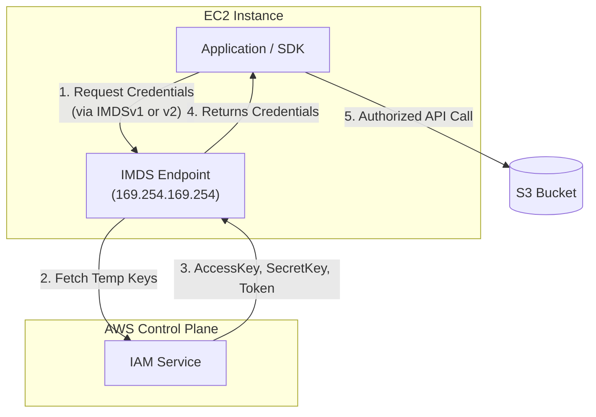

# EC2 Instance Metadata Service (IMDS)

## Overview
The EC2 Instance Metadata Service (IMDS) is an on-instance HTTP service used by applications and the AWS SDK to retrieve information about the running instance. This includes networking details, instance IDs, and—most importantly for security—temporary security credentials provided by the attached IAM role.

## Key Concepts
- **IMDS Endpoint**: The link-local IP address `169.254.169.254` accessible only from within the instance.
- **Instance Metadata**: Data about the instance (e.g., AMI ID, hostname, security groups, IAM role credentials).
- **User Data**: Script or data provided at launch to configure the instance (accessible via `/latest/user-data`).
- **IMDSv1**: A request-response model using simple HTTP GET requests.
- **IMDSv2**: A session-oriented model requiring a session token (more secure).

## Detailed Notes

### 1. Metadata Retrieval
Commonly accessed data includes:
- **Networking**: `local-ipv4`, `public-ipv4`, `hostname`, `mac`.
- **Identity**: `iam/info`, `iam/security-credentials/<role-name>`.
- **Placement**: `availability-zone`, `region`, `placement-group-name`.
- **System**: `ami-id`, `instance-id`, `instance-type`.

### 2. IMDSv1 vs. IMDSv2
AWS strongly recommends IMDSv2 to protect against SSRF (Server-Side Request Forgery) and other vulnerabilities.

| Feature | IMDSv1 | IMDSv2 |
|---------|--------|--------|
| **Access Method** | Direct `GET` requests. | Two-step: `PUT` for token, then `GET` with header. |
| **Authentication** | None (Direct access). | Session token required in `x-aws-ec2-metadata-token` header. |
| **Security** | Vulnerable to open proxies/SSRF. | Protects against SSRF via headers and hop-limit. |
| **Metric** | `MetadataNoToken` > 0 | `MetadataNoToken` = 0 |

#### IMDSv2 Two-Step Process:
1.  **Get Token**: `PUT "http://169.254.169.254/latest/api/token"` with header `X-aws-ec2-metadata-token-ttl-seconds: 21600`.
2.  **Use Token**: `GET "http://169.254.169.254/latest/meta-data/..."` with header `X-aws-ec2-metadata-token: <TOKEN_VALUE>`.

### 3. Enforcing IMDSv2
You can mandate the use of IMDSv2 at several levels:
- **Instance Launch**: Set `MetadataOptions` with `HttpTokens="required"`.
- **Existing Instances**: Use `ModifyInstanceMetadataOptions` API to require tokens.
- **AMI Registration**: Set `ImdsSupport="v2"`.
- **IAM Policy/SCP**: Use the `ec2:RoleDelivery` condition key.
    - `1.0` = Credentials delivered via IMDSv1 or v2.
    - `2.0` = Credentials delivered **only** via IMDSv2.

### 4. Restricting IMDS Access
- **Disable Service**: Set `HttpEndpoint="disabled"` to turn off IMDS entirely.
- **Local Firewall**: Use `iptables` (Linux) or `ipfw` (FreeBSD) to reject traffic to `169.254.169.254`.
- **Hop Limit**: Restrict the HTTP response hop limit (default is 1 for IMDSv2) to prevent metadata from crossing network boundaries (like containers or proxies).

## Architecture / Flow

### Credential Retrieval Flow
How an application on EC2 gets IAM permissions without hardcoded keys.

## Security Relevance
- **SSRF Mitigation**: IMDSv2's requirement for a `PUT` request and a custom header makes it significantly harder for an attacker to exploit SSRF vulnerabilities in web applications to steal instance credentials.
- **Credential Protection**: Since the SDK automatically fetches keys from IMDS, developers never need to store long-term secrets on the instance.
- **Visibility**: The `MetadataNoToken` CloudWatch metric provides an audit trail of legacy IMDSv1 usage.

## Operational / Real-World Context
- **Automation**: User Data scripts frequently query IMDS to get the instance's own IP or Region for self-configuration during boot.
- **Governance**: Security teams often use SCPs to deny the launch of any instance that doesn't have `HttpTokens` set to `required`.
- **Transitioning**: When moving to IMDSv2, ensure your applications and monitoring agents (like the CloudWatch Agent) are updated to support the token-based handshake.

## Common Pitfalls / Misconfigurations
- **Allowing IMDSv1**: Leaving IMDSv1 enabled on public-facing web servers increases the risk of credential theft via SSRF.
- **VPC Endpoints**: IP address conditions (`aws:SourceIp`) in IAM policies do **not** work for requests made via VPC Endpoints, but IMDS credentials still work as they represent the instance identity.
- **Hop Limit Issues**: Setting the hop limit to 1 (default for IMDSv2) may break metadata access for applications running inside Docker containers on the instance.

## Exam / Review Notes
- **IMDS Endpoint**: `169.254.169.254`.
- **Enforcing v2**: `HttpTokens=required`.
- **IAM Condition**: `ec2:RoleDelivery` set to `2.0` forces IMDSv2.
- **SSRF**: IMDSv2 is the primary defense against this attack vector.
- **Disabling Access**: `HttpEndpoint=disabled`.

## Summary
The EC2 Instance Metadata Service is the heartbeat of instance-based identity in AWS. While IMDSv1 provided easy access, IMDSv2 introduces a mandatory token-based session that significantly hardens the security of the instance against external web-based attacks.

## Quick Review Checklist
- [ ] IMDSv2 uses a session token (PUT then GET).
- [ ] IMDSv1 is vulnerable to SSRF; use `MetadataNoToken` to monitor.
- [ ] Use `ec2:RoleDelivery: 2.0` in policies to mandate IMDSv2.
- [ ] `HttpTokens=required` forces v2 at the instance level.
- [ ] `HttpEndpoint=disabled` shuts down the metadata service.
- [ ] User Data is accessed via the same IP at `/latest/user-data`.
