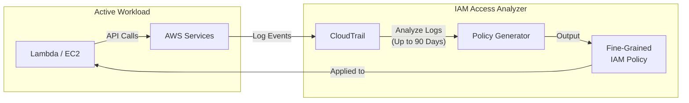

# IAM Access Analyzer

## Overview
IAM Access Analyzer is a powerful security tool designed to help administrators identify resources in their environment that are shared with an external entity. By defining a "Zone of Trust," it flags any resource accessible from outside that zone as a finding. Additionally, it provides advanced capabilities for policy validation and automated policy generation based on actual usage data.

## Key Concepts
- **Zone of Trust**: The boundary within which access is considered internal (either a specific **AWS Account** or an **AWS Organization**).
- **External Access Findings**: Reports on resources accessible by principals outside the Zone of Trust.
- **Policy Validation**: Analyzes IAM policies for grammar, security risks, and best practices.
- **Policy Generation**: Creates a fine-grained IAM policy by analyzing up to 90 days of API history in **CloudTrail**.

## Detailed Notes

### 1. External Access Monitoring
Access Analyzer identifies resources shared with external accounts, IAM users, roles, federated users, or even anonymous users.

**Supported Resources**:
- S3 Buckets
- IAM Roles
- KMS Keys
- Lambda Functions and Layers
- SQS Queues
- Secrets Manager Secrets

> **Exam Tip**: Access Analyzer is the primary tool for detecting unintended cross-account access or public exposure of sensitive resources like S3 buckets and KMS keys.

### 2. Policy Validation
When creating or editing policies in the IAM console, Access Analyzer automatically performs over 100 checks to provide:
- **Security Warnings**: Identifying overly broad permissions (e.g., `*` in the `Action` or `Resource` element).
- **Errors**: Identifying invalid policy grammar.
- **General Warnings**: Non-critical issues like unused statements.
- **Suggestions**: Best practice recommendations to improve policy quality.

### 3. Policy Generation (Least Privilege)
Access Analyzer can generate a specific IAM policy for a user or role by looking at its historical activity.
- **Source**: Analyzes **CloudTrail** logs.
- **Timeframe**: Up to **90 days** of historical API calls.
- **Result**: A JSON policy document tailored exactly to the actions the principal actually performed, significantly reducing the manual effort required to achieve **Least Privilege**.

## Architecture / Flow

### Policy Generation Workflow
The following diagram shows how Access Analyzer uses CloudTrail logs to generate a least-privileged policy.

## Security Relevance
- **Data Leakage Prevention**: By flagging S3 buckets or Secrets Manager secrets shared with external IPs or accounts, it prevents accidental data exposure.
- **Automated Remediation**: Findings can be sent to **EventBridge**, enabling automated responses (e.g., notifying security teams or reverting public bucket permissions).
- **Compliance**: Provides a continuous audit trail of external sharing for compliance frameworks (e.g., PCI-DSS, SOC2).

## Operational / Real-World Context
- **Post-Development Cleanup**: After a new application is deployed, use **Policy Generation** to replace broad "developer-friendly" policies with restricted, production-ready versions.
- **Centralized Security**: In an AWS Organization, the management account can designate a **Delegated Administrator** to manage Access Analyzer across all member accounts.

## Common Pitfalls / Misconfigurations
- **Ignoring Findings**: Findings stay "Active" until archived or the access is removed. Ignoring them can lead to "finding fatigue."
- **Incomplete CloudTrail**: If CloudTrail is not properly configured or if the logs are missing for certain regions, the policy generation feature will be incomplete.
- **Zone of Trust Misalignment**: Defining the Zone of Trust at the Account level instead of the Organization level may lead to false positives (e.g., flagging access from a sister account as "External").

## Exam / Review Notes
- **External Access**: Access Analyzer = "Who can access my stuff from the outside?"
- **Policy Generation**: Uses **CloudTrail** to create a policy based on the last **90 days**.
- **Supported Resources**: Know that it covers S3, IAM, KMS, Lambda, SQS, and Secrets Manager.
- **Zone of Trust**: Can be an Account or an Organization.

## Summary
IAM Access Analyzer is an essential tool for maintaining a secure and least-privileged environment. It provides visibility into external sharing risks and automates the complex task of writing fine-grained IAM policies by leveraging historical activity data.

## Quick Review Checklist
- [ ] Defines a Zone of Trust (Account or Org).
- [ ] Analyzes S3, KMS, IAM, Lambda, SQS, and Secrets Manager for external sharing.
- [ ] Validates policies for grammar and security best practices.
- [ ] Generates policies based on 90 days of CloudTrail history.
- [ ] Helps achieve the Principle of Least Privilege automatically.
