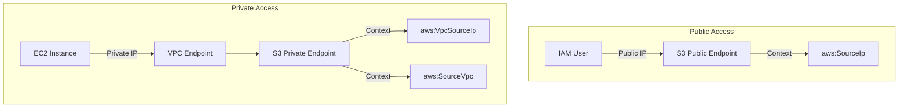
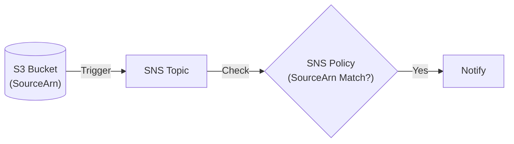

# IAM Global Condition Context Keys

## Overview
Global condition context keys are predefined keys provided by AWS that can be used in the `Condition` element of an IAM policy. Unlike service-specific keys, these are available across most AWS services and provide metadata about the request, the principal, and the network origin.

## Key Concepts
- **Contextual Awareness**: Policies can make decisions based on *where* a request comes from, *how* it was made (via another service), and *which* region it targets.
- **Service-to-Service**: Certain keys (like `SourceArn`) are specifically designed for interactions between AWS services.
- **Network Perimeter**: Differentiating between public IP origins and VPC-internal origins.

## Detailed Notes

### 1. Regional Keys (`aws:RequestedRegion`)
- **Purpose**: Restricts actions to specific AWS regions.
- **The "Global Service" Exception**: Global services (IAM, Route53, CloudFront, Support) always operate in `us-east-1`.
- **Logic**: To deny actions outside specific regions while allowing global services, use a `Deny` + `NotAction` pattern.
    - *Example*: Deny everything except `eu-west-1` but exclude `iam:*` from the deny.

### 2. ARN-Based Keys (`PrincipalArn` vs `SourceArn`)
| Key | Context | Description |
|-----|---------|-------------|
| **`aws:PrincipalArn`** | User/Role identity | The ARN of the entity making the call (User, Role, or Root). For assumed roles, it is the Role ARN, not the session ARN. |
| **`aws:SourceArn`** | Service-to-Service | The ARN of the resource triggering the request. Commonly used when S3 triggers SNS or Lambda. |

### 3. `aws:CalledVia`
- **Purpose**: Identifies the service that made the request on behalf of the principal.
- **Chain of Trust**: Useful for ensuring a user can only access data if they are using a specific service (e.g., "User can only access S3 *via* Athena").
- **Supported Services**: 
    - Athena
    - CloudFormation
    - DynamoDB
    - KMS

### 4. Network Keys (IP & VPC)
- **`aws:SourceIp`**: The public IP of the requester. **Not present** if the request is made via a VPC Endpoint.
- **`aws:VpcSourceIp`**: The private IP of the requester when using a VPC Endpoint.
- **`aws:SourceVpce`**: The ID of the specific VPC Endpoint (vpce-12345) the request passed through.
- **`aws:SourceVpc`**: The ID of the VPC (vpc-12345) where the request originated.

### 5. Tag-Based Keys
- **`aws:ResourceTag/${TagKey}`**: Compares the value of a tag on the **target resource** (e.g., an EC2 instance).
- **`aws:PrincipalTag/${TagKey}`**: Compares the value of a tag on the **IAM identity** making the request (e.g., the User or Role).
- **Service-Specific**: You may see prefixes like `ec2:ResourceTag` for service-scoped checks.

## Architecture / Flow

### Public vs. Private Access Flow

### Service-to-Service Flow

## Security Relevance
- **Data Perimeter**: `aws:SourceVpce` and `aws:SourceVpc` are essential for building a "Data Perimeter" around sensitive S3 buckets, ensuring they can only be accessed from within the corporate network.
- **Encryption Enforcement**: `CalledVia` can ensure that KMS keys are only used when invoked by specific authorized services like CloudFormation.

## Operational / Real-World Context
- **Compliance**: `aws:RequestedRegion` is heavily used in regulated industries (Finance, Healthcare) to ensure data residency compliance by blocking all other regions.
- **Identity-Based Access Control (IBAC)**: Using `PrincipalTag` allows for scaling permissions without updating policies; simply tag the user with `Department: Data` to grant access to all resources tagged `Department: Data`.

## Common Pitfalls / Misconfigurations
- **Breaking Global Services**: A common mistake is a regional `Deny` that doesn't exclude global services, preventing account administrators from using the IAM console.
- **Private IP Confusion**: Attempting to use `aws:SourceIp` to whitelist a corporate office when users are connecting via a VPC Endpoint (the policy will fail because `SourceIp` is null).
- **PrincipalArn for Roles**: Remember that for roles, `PrincipalArn` refers to the IAM Role ARN, while the `sts:AssumedRole` context would contain the session information.

## Exam / Review Notes
- **SourceArn**: Always think "Service-to-Service" (S3 -> SNS).
- **CalledVia**: Limited to Athena, CloudFormation, DynamoDB, and KMS.
- **IP Keys**: `SourceIp` is for Public IPs; `VpcSourceIp` is for Private IPs via Endpoints.
- **Regional Deny**: Must use `NotAction` to exclude IAM, Route53, and CloudFront.

## Summary
Global condition keys provide the "who, where, and how" of an AWS request. By differentiating between identity tags and resource tags, or public IPs and VPC identifiers, security professionals can create highly resilient and context-aware security policies.

## Quick Review Checklist
- [ ] Use `aws:RequestedRegion` for geo-fencing.
- [ ] Use `aws:SourceArn` to authorize service-to-service triggers.
- [ ] Use `aws:SourceVpc` to restrict access to internal networks.
- [ ] `CalledVia` supports only 4 specific services (Athena, Cfn, DDB, KMS).
- [ ] `PrincipalTag` is the foundation of ABAC (Attribute-Based Access Control).
