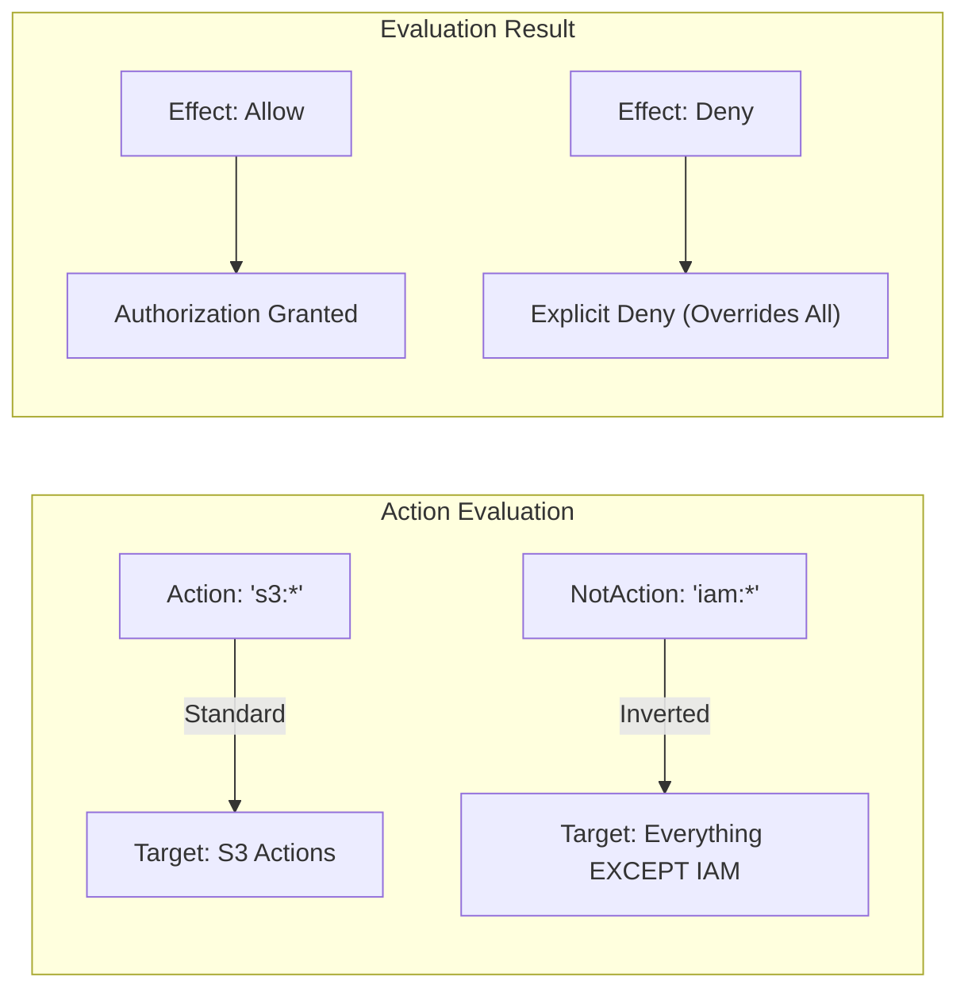

# Domain 4: Identity and Access Management

## IAM Policy Structure & NotAction

## Overview
IAM policies are JSON documents that define permissions by specifying what actions are allowed or denied on which resources. Understanding the granular structure and advanced logic—specifically **NotAction**—is critical for implementing the Principle of Least Privilege and enforcing security guardrails like MFA or regional restrictions.

## Key Concepts
- **Statement (Sid)**: An optional identifier for the policy statement.
- **Effect**: Specifies whether the statement results in an `Allow` or a `Deny`.
- **Principal**: The entity (user, role, account, or service) that is allowed or denied access.
- **Action**: The specific API operations (e.g., `s3:ListBucket`) to be allowed or denied.
- **NotAction**: Matches every action *except* those specified.
- **Resource**: The AWS objects the actions apply to.
- **Condition**: Optional logic to further restrict when the policy is in effect (e.g., `aws:MultiFactorAuthPresent`).

## Detailed Notes

### 1. IAM Policy Elements
A standard IAM policy follows this structure:
- **Version**: Always use `"2012-10-17"`.
- **Id**: Optional policy identifier.
- **Statement**: One or more blocks containing:
    - **Sid**: Statement ID (optional).
    - **Effect**: `Allow` or `Deny`.
    - **Principal**: Used in resource-based policies (e.g., S3 bucket policies).
    - **Action / NotAction**: The operations.
    - **Resource / NotResource**: The targets.
    - **Condition**: Logic for evaluation.

### 2. Understanding NotAction
**NotAction** is used to simplify policies by allowing or denying "everything else."

#### A. Allow with NotAction
*Goal*: Grant access to all services except a specific one.
```json
{
  "Effect": "Allow",
  "NotAction": "iam:*",
  "Resource": "*"
}
```
> **Note**: This allows S3, DynamoDB, etc., but **does not** explicitly allow IAM. It is not an explicit deny of IAM; it simply doesn't grant it.

#### B. Deny with NotAction (MFA Enforcement)
*Goal*: Deny access to everything except IAM if the user hasn't authenticated with MFA.
```json
{
  "Effect": "Deny",
  "NotAction": "iam:*",
  "Resource": "*",
  "Condition": { "BoolIfExists": { "aws:MultiFactorAuthPresent": "false" } }
}
```
> **Operational Insight**: We exclude `iam:*` from the deny so that users can still access the IAM console to set up their MFA device even when they don't have one yet.

#### C. Regional Restriction
*Goal*: Deny any action outside a specific region (e.g., `eu-central-1`), while exempting global services.
```json
{
  "Effect": "Deny",
  "NotAction": ["cloudfront:*", "iam:*", "route53:*", "support:*"],
  "Resource": "*",
  "Condition": {
    "StringNotEquals": { "aws:RequestedRegion": "eu-central-1" }
  }
}
```
> **Caution**: Global services like IAM and Route53 must be in the `NotAction` list because they operate in `us-east-1`. Denying them based on region would break account management.

### 3. Principal Options
| Principal Type | Syntax Example |
|----------------|----------------|
| **AWS Account/Root** | `"AWS": "arn:aws:iam::123456789012:root"` |
| **IAM User** | `"AWS": "arn:aws:iam::123456789012:user/Alice"` |
| **IAM Role** | `"AWS": "arn:aws:iam::123456789012:role/ReadOnly"` |
| **Role Session** | `"AWS": "arn:aws:sts::123456789012:assumed-role/RoleName/Session"` |
| **AWS Service** | `"Service": "ec2.amazonaws.com"` |
| **Federated User** | `"Federated": "cognito-identity.amazonaws.com"` |
| **Wildcard** | `"Principal": "*"` or `"AWS": "*"` |

## Architecture / Flow
The following diagram illustrates how **NotAction** shifts the scope of a policy statement.



## Security Relevance
- **Preventive Control**: IAM policies are the primary preventive control in AWS.
- **Least Privilege**: Using `NotAction` with `Deny` helps create "inverse guardrails" that ensure no actions can be taken unless specific criteria (like MFA or Region) are met.
- **Blast Radius**: Granular `Resource` definitions combined with `NotAction` limit what an identity can do even if a service-wide permission is granted.

## Operational / Real-World Context
In large enterprises, **Service Control Policies (SCPs)** often use `Deny` + `NotAction` to enforce:
1. **Regional Compliance**: Ensuring data doesn't leave specific jurisdictions.
2. **MFA Compliance**: Forcing users to use hardware or virtual MFA for all management console access.
3. **Global Service Access**: Specifically exempting `iam`, `cloudfront`, and `route53` from regional denylists.

## Common Pitfalls / Misconfigurations
- **Confusing Deny NotAction**: Denying "Not IAM" does not mean you have "Allowed IAM." You still need an explicit `Allow` statement to grant the permissions you didn't deny.
- **Forgetting Global Services**: Creating a regional `Deny` without excluding `iam:*` in the `NotAction` block will prevent anyone from logging in or changing settings, potentially locking out the account.
- **NotAction: "*"**: Never use a wildcard in a `NotAction` block as it effectively targets nothing.

## Exam / Review Notes
- **Explicit Deny > Explicit Allow**: An explicit deny always wins, regardless of where it is (Identity policy, Resource policy, or SCP).
- **Default Deny**: If no policy allows an action, it is implicitly denied.
- **MFA Login Logic**: To enforce MFA, use `Effect: Deny` with `NotAction: iam:*` and a condition checking for the absence of MFA.
- **Global Services**: Remember that IAM, Route53, CloudFront, and Support are global and typically tied to `us-east-1`.

## Summary
IAM policies use `Action` and `Resource` to grant permissions, but `NotAction` provides a powerful way to define exceptions. Whether allowing "everything but IAM" or denying "everything except global services in a specific region," mastering this logic is key to AWS security.

## Quick Review Checklist
- [ ] Policy Version is `2012-10-17`.
- [ ] `NotAction` + `Allow` = Grant access to everything *except* listed actions.
- [ ] `NotAction` + `Deny` = Block access to everything *except* listed actions.
- [ ] Regional Deny policies must exclude global services (IAM, Route53, etc.).
- [ ] An explicit `Deny` overrides any `Allow`.
- [ ] Principals can be Users, Roles, Accounts, or Services.
