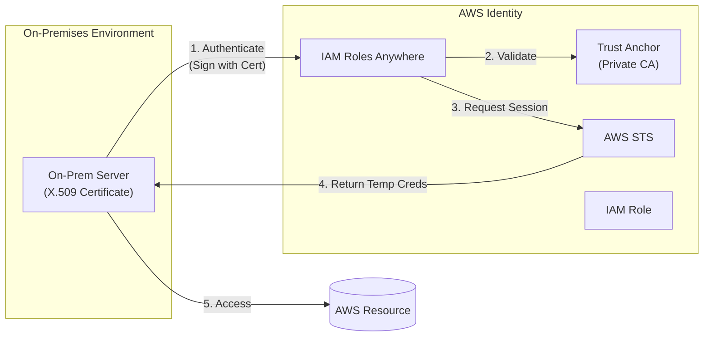

# Domain 4: Identity and Access Management

## IAM Roles Anywhere

## Overview
IAM Roles Anywhere allows workloads running outside of AWS (on-premises servers, containers, or other cloud providers) to obtain temporary security credentials to access AWS resources. This eliminates the need for managing long-term AWS Access Keys on non-AWS hardware, significantly improving the security posture of hybrid and multi-cloud environments.

## Key Concepts
- **Trust Anchor**: A reference to a Certificate Authority (CA) that IAM Roles Anywhere trusts to authenticate requests. This is typically an **AWS Private CA**.
- **Profile**: Defines which IAM roles a workload can assume and specifies the maximum session duration for the temporary credentials.
- **X.509 Certificate**: The digital "identity proof" issued by the Private CA and installed on the on-premises workload.
- **Temporary Credentials**: Short-lived access keys (Access Key ID, Secret Access Key, and Session Token) returned by AWS STS after successful authentication.

## Detailed Notes

### 1. How it Works
The authentication flow relies on Public Key Infrastructure (PKI) to establish identity without hardcoded secrets.

1.  **Setup**: Establish a trust between IAM Roles Anywhere and an **AWS Private CA** (the Trust Anchor).
2.  **Issuance**: The Private CA issues a unique X.509 certificate to each on-premises workload.
3.  **Authentication**: The workload uses its certificate and private key to sign a request to the IAM Roles Anywhere endpoint.
4.  **Authorization**: IAM Roles Anywhere validates the certificate against the Trust Anchor and checks the associated **Profile**.
5.  **Credential Exchange**: If valid, AWS STS returns temporary credentials for the specified **IAM Role**.
6.  **Access**: The workload uses the temporary credentials to access AWS resources (e.g., S3, DynamoDB).

### 2. IAM Users vs. IAM Roles Anywhere

| Feature | IAM Users (Legacy Approach) | IAM Roles Anywhere (Modern) |
|---------|-----------------------------|-----------------------------|
| **Credential Type** | Long-term Access Keys | Temporary STS Credentials |
| **Expiration** | None (unless manually rotated) | Automatic (per session) |
| **Security Risk** | High (keys in logs, backups, or GitHub) | Low (no static keys to leak) |
| **Identity Proof** | Password/Access Key | X.509 Certificate |
| **Rotation** | Manual and painful | Automatic via certificate renewal |
| **Auditability** | Difficult to track usage | Integrated with CloudTrail and STS |

### 3. Separation of Identities
For maximum security, each on-premises workload should have its own unique certificate. This ensures that:
- Server A cannot assume the role intended for Server B.
- If Server A's certificate is compromised, only its access is affected.
- Revocation can be handled at the certificate level within the Private CA.

## Architecture / Flow

The following diagram illustrates the hybrid authentication workflow.

## Security Relevance
- **Credential Hardening**: Eliminates the "Access Key in a config file" anti-pattern.
- **Automated Revocation**: Certificates can be revoked through the CA or the IAM Roles Anywhere console, instantly stopping access.
- **Short-Lived Sessions**: Even if session tokens are intercepted, they expire quickly, limiting the attacker's window of opportunity.

## Operational / Real-World Context
- **Hybrid Data Migration**: On-premises servers running ETL jobs can securely upload data to S3 without persistent credentials.
- **Multi-Cloud Management**: Tools running in Azure or GCP can manage AWS resources (e.g., updating Route53 records) using the same IAM roles as internal AWS workloads.
- **Certificate Renewal**: Integration with tools like `cert-manager` or custom scripts can automate the renewal of certificates on the servers, ensuring zero-downtime access.

## Common Pitfalls / Misconfigurations
- **Reusing Certificates**: Using one certificate for an entire fleet of servers breaks the principle of least privilege and non-repudiation.
- **Ignoring Certificate Expiration**: If the certificate expires, the server loses all access to AWS until a new one is issued.
- **Weak Private CA Security**: If the Root CA or Private CA is compromised, an attacker can issue certificates to impersonate any server.

## Exam / Review Notes
- **X.509**: This is the standard for identity in Roles Anywhere.
- **Temporary Credentials**: This is the primary value proposition (moving away from static keys).
- **Private CA**: Roles Anywhere requires a trust relationship with a CA.
- **Profile**: This is where you map the cert-based identity to an actual IAM Role.

## Summary
IAM Roles Anywhere brings the security of IAM roles to the on-premises world. By using X.509 certificates and temporary STS credentials, it provides a scalable and secure way to manage non-AWS identities without the operational burden and risk of long-term access keys.

## Quick Review Checklist
- [ ] No more long-term access keys on-premises.
- [ ] Identity is proven via X.509 certificates.
- [ ] Uses Trust Anchors (Private CA) and Profiles.
- [ ] Provides short-lived, temporary STS credentials.
- [ ] Better for auditing and compliance than IAM users.
