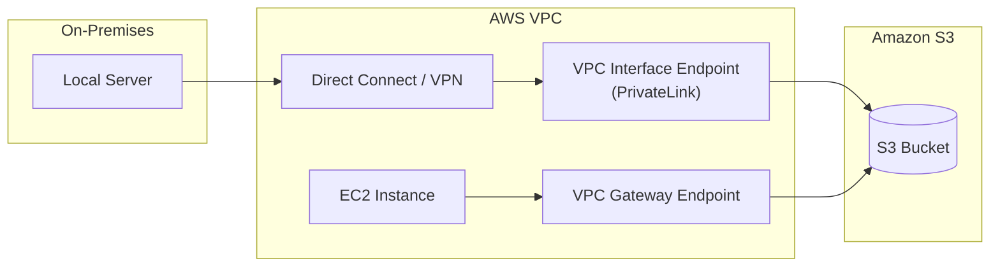

# Domain 4: Identity and Access Management

## S3 Access Strategies: Cross-Account, VPC Endpoints, and Access Points

## Overview
Securing **Amazon S3** at scale requires more than basic bucket policies. Advanced strategies include managing cross-account access through IAM roles or resource policies, securing traffic via **VPC Endpoints**, and simplifying complex permissions using **S3 Access Points**.

## Key Concepts
- **Cross-Account Access**: Methods to allow principals in Account A to access data in Account B.
- **VPC Gateway Endpoint**: A free, highly available routing table entry for S3 traffic within a VPC.
- **VPC Interface Endpoint (PrivateLink)**: A paid, ENI-based endpoint that allows access to S3 from on-premises or peered networks.
- **S3 Access Points**: Named network endpoints with dedicated policies to simplify access for large, shared datasets.
- **Multi-Region Access Points**: Global endpoints that route traffic to the closest regional bucket.

## Detailed Notes

### 1. Cross-Account Access Methods
1.  **IAM Policy + Bucket Policy**: Most common. The requester's IAM policy allows the action, and the bucket policy allows the cross-account principal.
2.  **Cross-Account IAM Role**: The requester assumes a role in the target account. Useful for broad access but requires "giving up" local permissions during the session.
3.  **ACLs (Legacy)**: Uses "Canned ACLs" like `bucket-owner-full-control` during upload. (Not recommended).

### 2. VPC Endpoint Strategies
| Feature | Gateway Endpoint | Interface Endpoint (PrivateLink) |
|---------|------------------|----------------------------------|
| **Cost** | Free | Paid (~$0.01/hr/AZ + data processing) |
| **Connectivity** | VPC Only | VPC, On-Prem (VPN/DX), Peered VPCs |
| **Setup** | Route Table entry | ENI + Security Group |
| **DNS** | Public S3 DNS | Public S3 DNS (resolves to private IP) |

> **Operational Insight**: Use Gateway Endpoints for standard EC2-to-S3 traffic to save costs. Use Interface Endpoints for hybrid cloud scenarios.

### 3. S3 Access Points
Instead of one massive, unmanageable bucket policy, create **Access Points** for specific applications or teams (e.g., `finance-ap`, `sales-ap`).
- **Access Point Policy**: Each AP has its own policy defining permissions for its users.
- **VPC Origin**: Can restrict an Access Point to only accept traffic from a specific VPC.
- **Delegation**: The main bucket policy can be updated to delegate all control to Access Points.

### 4. Multi-Region Access Points (MRAP)
- **Global Endpoint**: Provides a single alias (DNS name) for buckets in multiple regions.
- **Routing**: Automatically routes requests to the bucket with the lowest latency.
- **Failover**: Supports active-passive or active-active configurations.
- **Replication**: Requires bidirectional replication to keep data synchronized.

## Architecture / Flow

### VPC Endpoint Access Flow

## Security Relevance
- **Data Perimeter**: **VPC Endpoints** ensure that sensitive data never traverses the public internet.
- **IAM Condition Keys**:
    - `aws:SourceVpc`: Restrict access to a specific VPC ID.
    - `aws:SourceVpce`: Restrict access to a specific VPC Endpoint ID.
    - `aws:VpcSourceIp`: Filter based on private IP addresses within the VPC.

## Operational / Real-World Context
- **Centralized Shared Services**: Use a central VPC with an Interface Endpoint and Transit Gateway to provide S3 access to dozens of member VPCs and on-premises data centers.
- **Large Data Lakes**: Use **Access Points** to separate "Read-Only Analytics" users from "Read-Write ETL" jobs on the same bucket.

## Common Pitfalls / Misconfigurations
- **Gateway Endpoint Limitation**: You cannot access a Gateway Endpoint from on-premises or over a VPC Peering connection.
- **Interface Endpoint Costs**: Be mindful of data processing charges for large-scale data transfers through PrivateLink.
- **Bucket Policy Lockout**: When using `aws:SourceVpce` in a `Deny` statement, ensure you don't lock out the Root user or the console if needed.

## Exam / Review Notes
- **Gateway vs Interface**: Interface = On-Prem/Peered VPCs. Gateway = Local VPC (Free).
- **Access Points**: Use for "Large Bucket Policy" or "Team-based isolation" scenarios.
- **MRAP**: Use for "Global Latency" and "Failover" requirements.
- **SourceVpce**: The key to enforcing that a bucket is *only* accessed via a specific endpoint.

## Summary
S3 access can be optimized for cost (Gateway Endpoints), connectivity (Interface Endpoints), or management simplicity (Access Points). Choosing the right combination of these features allows for a secure, high-performance data architecture.

## Quick Review Checklist
- [ ] Gateway Endpoints are free but limited to the local VPC.
- [ ] Interface Endpoints (PrivateLink) allow on-prem access to S3.
- [ ] Access Points provide dedicated DNS names and policies.
- [ ] Multi-Region Access Points use a global alias for lowest latency routing.
- [ ] Use `aws:SourceVpce` to build a network perimeter around S3.
