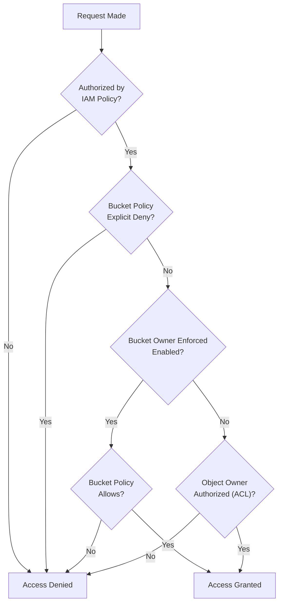

# Domain 4: Identity and Access Management

## Amazon S3 Authorization & Ownership

## Overview
Authorization in **Amazon S3** is a multi-layered process that evaluates **IAM policies**, **S3 Bucket Policies**, and **Access Control Lists (ACLs)**. Understanding the evaluation logic and the transition toward **Bucket Owner Enforced** ownership is critical for securing data and preventing accidental exposure or lockouts.

## Key Concepts
- **User Context**: Evaluation of the requester's IAM permissions.
- **Bucket Context**: Evaluation of the bucket-level policies and ownership.
- **Object Context**: Evaluation of individual object permissions, potentially owned by a different account than the bucket.
- **Bucket Owner Enforced**: A setting that disables ACLs and ensures the bucket owner owns all objects in the bucket.
- **Block Public Access**: A high-level safety net at the account or bucket level to prevent public data exposure.

## Detailed Notes

### 1. Authorization Evaluation Flow
S3 follows a specific order when a principal makes a request:
1.  **IAM Evaluation**: Is the principal authorized by their parent account? (Identity-based policy).
2.  **Bucket Evaluation**: Does the bucket policy explicitly deny the action? Is it explicitly allowed?
3.  **Object Evaluation**: If the bucket owner is NOT the object owner, the object ACL is checked.

> **Note**: If an **Explicit Deny** exists at any level, the request is denied immediately.

### 2. Object Ownership & ACLs
Historically, the account that uploaded an object owned it, even if they didn't own the bucket. This led to complex "Access Control Lists" (ACLs).
- **The Problem**: Bucket owners couldn't access objects uploaded by other accounts unless granted permission via ACLs.
- **The Modern Solution**: **S3 Object Ownership - Bucket Owner Enforced**.
    - Disables ACLs entirely.
    - The bucket owner automatically owns every object uploaded to the bucket.
    - Access is managed exclusively through **IAM** and **Bucket Policies**.

### 3. Regaining Access to Locked Buckets
If a bucket policy is misconfigured with a broad `Deny` (e.g., `Deny s3:* to Principal: *`), all users—including admins—are locked out.
- **The Solution**: Only the **AWS Account Root User** can bypass a bucket policy `Deny`. 
- **Action**: Log in as the Root user to delete the restrictive bucket policy.

### 4. S3 Block Public Access
This is a centralized control mechanism to ensure buckets are never accidentally made public.
- **Account Level**: Applies to every bucket in the account.
- **Bucket Level**: Applies only to the specific bucket.
- **Function**: It overrides any bucket policy or ACL that attempts to grant public access.

## Architecture / Flow

### S3 Authorization Logic

## Security Relevance
- **Preventive Guardrails**: **Block Public Access** and **Bucket Owner Enforced** are the primary preventive controls for data protection in S3.
- **Least Privilege**: Distinguishing between bucket-level permissions (`s3:ListBucket`) and object-level permissions (`s3:GetObject`) is essential for PoLP.

## Operational / Real-World Context
- **Legacy Migrations**: Older buckets may still rely on ACLs. Transitioning them to "Bucket Owner Enforced" is a common security hardening task.
- **Root User**: Accessing the Root user is a "break-glass" procedure used only for emergencies like bucket lockouts.

## Common Pitfalls / Misconfigurations
- **Confusing ARNs**: Applying object permissions (`s3:GetObject`) to the bucket ARN (`arn:aws:s3:::my-bucket`) instead of the object pattern (`arn:aws:s3:::my-bucket/*`).
- **ACL Reliance**: Assuming a bucket policy is enough for cross-account uploads when ACLs are still enabled.

## Exam / Review Notes
- **Bucket Level vs Object Level**: 
    - `arn:aws:s3:::bucket` -> `ListBucket`, `GetBucketLocation`.
    - `arn:aws:s3:::bucket/*` -> `GetObject`, `PutObject`, `DeleteObject`.
- **Lockout**: Only **Root User** can fix a "Deny All" bucket policy.
- **ACLs**: Deprecated but still present. Use **Bucket Owner Enforced** to simplify security.
- **Public Access**: **Block Public Access** settings override all policies.

## Summary
S3 authorization combines identity-based and resource-based logic. Modern best practices dictate disabling ACLs via **Object Ownership** settings and using **Block Public Access** to enforce a strong security perimeter.

## Quick Review Checklist
- [ ] Root User can delete any bucket policy.
- [ ] Bucket Owner Enforced = No ACLs.
- [ ] Explicit Deny always wins.
- [ ] Object permissions need `/*` at the end of the ARN.
- [ ] Block Public Access can be set at the account level.
