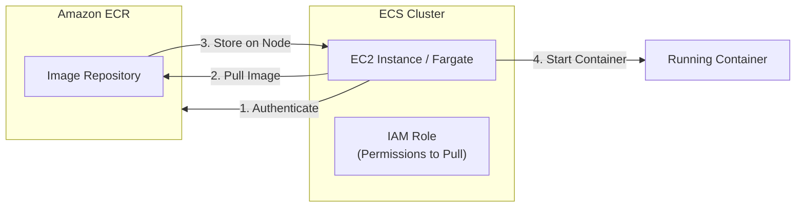
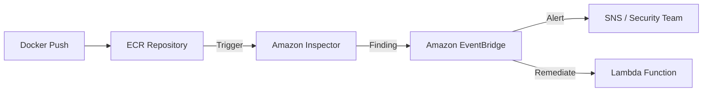

# Amazon Elastic Container Registry (ECR)

## Overview
**Amazon Elastic Container Registry (ECR)** is a fully managed Docker container registry that makes it easy for developers to store, manage, and deploy Docker container images. It eliminates the need to operate your own container repositories or worry about scaling the underlying infrastructure. ECR is integrated with **Amazon ECS**, **EKS**, and **AWS Lambda**, providing a streamlined workflow from development to production.

## Key Concepts
- **Repository**: A collection of Docker images, versioned by tags.
- **Private vs. Public**: 
    - **Private**: Accessible only within your AWS account or specified accounts.
    - **Public**: Images are published to the **Amazon ECR Public Gallery** for anyone to pull.
- **Image Tags**: Labels used to identify specific versions of an image (e.g., `latest`, `v1.2`).
- **Lifecycle Policies**: Rules to automatically clean up old or untagged images to manage storage costs.

## Detailed Notes

### 1. Infrastructure & Integration
- **S3 Backend**: Behind the scenes, ECR stores your container images in **Amazon S3** for high availability and durability.
- **ECS/EKS Integration**: Instances or tasks in an ECS cluster pull images from ECR. This requires an **IAM Role** attached to the EC2 instance or Task Execution Role with permissions to call `ecr:GetAuthorizationToken`, `ecr:BatchCheckLayerAvailability`, `ecr:GetDownloadUrlForLayer`, and `ecr:BatchGetImage`.

### 2. Image Scanning
ECR provides two tiers of vulnerability scanning:
- **Basic Scanning**:
    - Uses the open-source **Clair** project.
    - Scans for **CVEs** (Common Vulnerabilities and Exposures).
    - Can be configured for **Scan on Push** or manual triggers.
- **Advanced Scanning**:
    - Integrated with **Amazon Inspector**.
    - **Continuous Scanning**: Automatically re-scans images when new vulnerabilities are discovered.
    - **Deep Inspection**: Scans both the Operating System (OS) and programming language package vulnerabilities.
    - **Automation**: Findings are sent to **Amazon EventBridge**, enabling automated remediation via Lambda or SNS.
- **Scan Filters**: Allow you to specify which repositories are scanned (e.g., `*prod*` will match any repository with "prod" in the name). Scanning is automatically enabled for repositories that match the filter.

## Architecture / Flow

### ECS Image Pull Flow

### Advanced Scanning Pipeline

## Security Relevance

### 1. Encryption at Rest
- **KMS Support**: Repositories can be encrypted using **AWS KMS** (Customer Managed Keys).
- **Envelope Encryption**: Uses a Data Encryption Key (DEK) protected by a KMS CMK.
- **Creation Only**: KMS encryption can **only be enabled during repository creation**. To encrypt an existing repo, you must create a new one and migrate images.
- **KMS Grants**: ECR uses **KMS Grants** to interact with KMS on your behalf. These grants require permissions for `DescribeKey`, `Decrypt`, `GenerateDataKey`, and `RetireGrant` (used when deleting the repository).

### 2. Access Control
- **IAM Policies**: Control who can create repos or delete images.
- **Repository Policies (Resource-based)**: Used for **Cross-Account Access**. Allows a different AWS account to pull or push images without assuming a role in your account.

## Operational / Real-World Context
- **Authentication**: To interact with ECR, you must obtain an authentication token using `aws ecr get-login-password`.
- **Token Expiration**: The Docker login token is valid for **12 hours**. Automation scripts must handle token refreshing.
- **Cross-Account Login**: When logging in from Account B to access Account A, use the URL of Account A's ECR registry.

## Common Pitfalls / Misconfigurations
- **Region Mismatch**: A common cause of `403 Forbidden` errors is attempting to use a login token generated for one region (e.g., `us-east-1`) in a different region (e.g., `eu-west-1`).
- **KMS Permissions**: Ensure the principal pushing/pulling images has permissions to use the KMS key, or ECR will fail to decrypt the image layers.
- **Public vs. Private Confusion**: Accidental push to a public gallery when the image contains sensitive configuration or secrets.

## Exam / Review Notes
- **ECR = Docker Image Storage**.
- **KMS Encryption**: Only at creation time.
- **Inspector**: Required for "Advanced/Continuous" scanning.
- **Repository Policies**: The mechanism for cross-account access.
- **Troubleshooting**: `403 Forbidden` usually means expired token (12h), wrong region, or missing IAM permissions.

## Summary
Amazon ECR is the foundational service for container security in AWS. By combining IAM, Repository Policies, KMS encryption, and Inspector-driven scanning, it provides a "Secure Supply Chain" for containerized workloads.

## Quick Review Checklist
- [ ] KMS encryption enabled at creation?
- [ ] Repository policy configured for cross-account access?
- [ ] Inspector enabled for continuous scanning?
- [ ] IAM Roles have `ecr:GetAuthorizationToken` and pull permissions?
- [ ] Login tokens refreshed every 12 hours?
