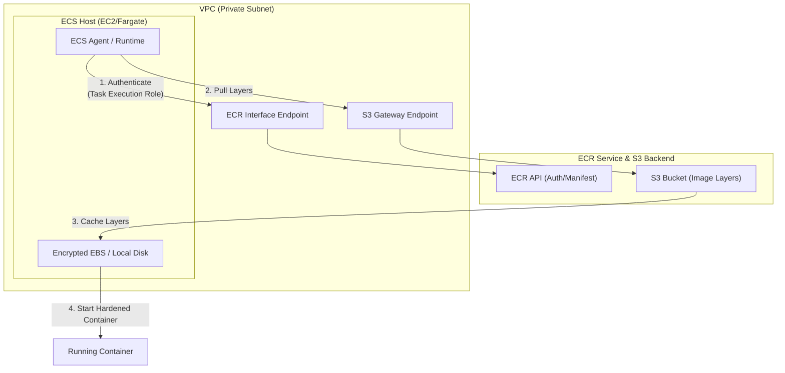
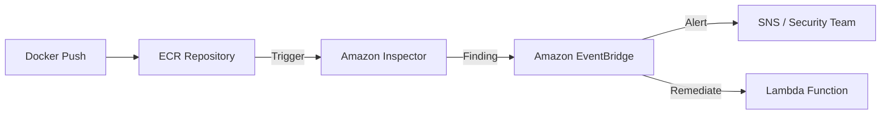
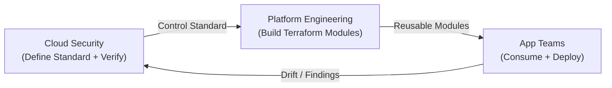
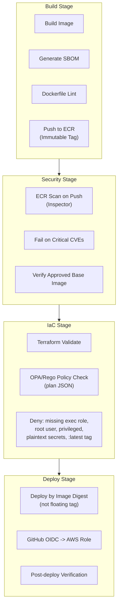
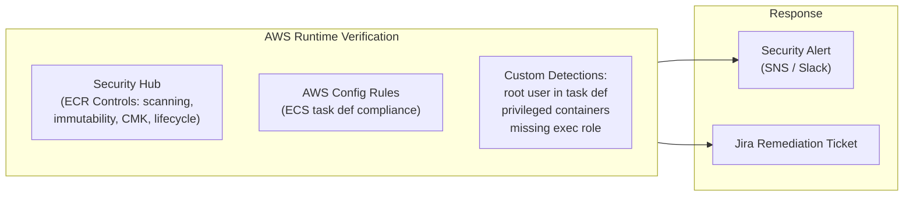
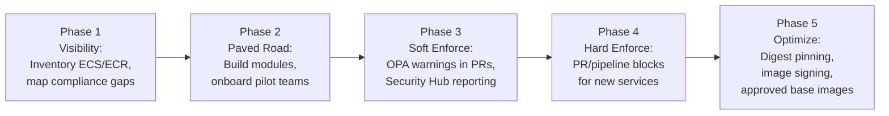

# Amazon Elastic Container Registry (ECR)

## Overview
**Amazon Elastic Container Registry (ECR)** is a fully managed Docker container registry that makes it easy for developers to store, manage, and deploy Docker container images. It eliminates the need to operate your own container repositories or worry about scaling the underlying infrastructure. ECR is integrated with **Amazon ECS**, **EKS**, and **AWS Lambda**, providing a streamlined workflow from development to production.

## Key Concepts
- **Repository**: A collection of Docker images, versioned by tags.
- **Private vs. Public**: 
    - **Private**: Accessible only within your AWS account or specified accounts.
    - **Public**: Images are published to the **Amazon ECR Public Gallery** for anyone to pull.
- **Image Tags**: Labels used to identify specific versions of an image (e.g., `latest`, `v1.2`).
- **Lifecycle Policies**: Rules to automatically clean up old or untagged images to manage storage costs.
- **Immutable Tags**: Prevent image tags from being overwritten. This ensures that a specific tag (e.g., `prod-v1`) always points to the same image digest, preventing "tag-switching" attacks.

## Detailed Notes

### 1. Infrastructure & Integration
- **S3 Backend**: Behind the scenes, ECR stores your container images in **Amazon S3** for high availability and durability.
- **ECS/EKS Integration**: For private ECR pulls, use the **ECS Task Execution Role** with the `AmazonECSTaskExecutionRolePolicy` (or a custom least-privilege equivalent). Do not confuse this with the *Task Role*, which is for the application's own permissions.
- **Network Path**: For tasks in private subnets, use **ECR Interface VPC Endpoints** (for auth/manifests) **plus an S3 Gateway Endpoint** (for the actual image layers). This keeps traffic off the public network and avoids NAT Gateway costs.
- **Image Scanning**: ECR provides two tiers of vulnerability scanning:
    - **Basic Scanning**:
        - Uses the open-source **Clair** project.
        - Scans for **CVEs** (Common Vulnerabilities and Exposures).
        - Can be configured for **Scan on Push** or manual triggers.
    - **Advanced Scanning**:
        - Integrated with **Amazon Inspector**.
        - **Continuous Scanning**: Automatically re-scans images when new vulnerabilities are discovered.
        - **Deep Inspection**: Scans both the Operating System (OS) and programming language package vulnerabilities.
        - **Automation**: Findings are sent to **Amazon EventBridge**, enabling automated remediation via Lambda or SNS.
- **Scan Filters**: Allow you to specify which repositories are scanned (e.g., `*prod*` will match any repository with "prod" in the name). Scanning is automatically enabled for repositories that match the filter.

## Architecture / Flow

### ECS Image Pull Flow

#### Detailed Analysis: ECS Image Pull Flow
1. **Authenticate**: 
    - **Why**: ECR is a private registry. The ECS agent must obtain a temporary authorization token to verify its identity before access is granted.
    - **Security Best Practice**: Use the **ECS Task Execution Role** with `AmazonECSTaskExecutionRolePolicy` or a custom least-privilege equivalent for private ECR pulls.
2. **Pull Image**:
    - **Why**: The container runtime downloads image layers from S3.
    - **Security Best Practice**: For private subnet deployments, use **ECR Interface VPC Endpoints plus an S3 Gateway Endpoint** so image pulls stay on the AWS network and do not require NAT for ECR/S3 access.
3. **Store on Node**:
    - **Why**: Images are cached locally on the host.
    - **Security Best Practice**: Ensure **EBS Encryption** is enabled for the EC2 instance's storage volumes to protect cached layers at rest.
4. **Start Container**:
    - **Why**: The host runtime instantiates the application.
    - **Security Best Practice**: Set `readonlyRootFilesystem: true`, run as a **non-root** user, avoid **privileged** containers, and drop unnecessary Linux capabilities.

### Advanced Scanning Pipeline

## Security Relevance

### 1. Encryption at Rest
- **Baseline**: ECR encrypts images at rest by default using AWS-managed keys.
- **KMS Support**: For strict compliance (and Security Hub alignment), use **Customer Managed Keys (CMK)** via AWS KMS.
- **Envelope Encryption**: Uses a Data Encryption Key (DEK) protected by a KMS CMK.
- **Creation Only**: KMS encryption can **only be enabled during repository creation**. To encrypt an existing repo, you must create a new one and migrate images.
- **KMS Grants**: ECR uses **KMS Grants** to interact with KMS on your behalf. These grants require permissions for `DescribeKey`, `Decrypt`, `GenerateDataKey`, and `RetireGrant` (used when deleting the repository).

### 2. Access Control
- **IAM Policies**: Control who can create repos or delete images.
- **Repository Policies (Resource-based)**: Used for **Cross-Account Access**. Allows a different AWS account to pull or push images without assuming a role in your account.

## Operational / Real-World Context
- **Authentication**: To interact with ECR, you must obtain an authentication token using `aws ecr get-login-password`.
- **Token Expiration**: The Docker login token is valid for **12 hours**. Automation scripts must handle token refreshing.
- **Cross-Account Login**: When logging in from Account B to access Account A, use the URL of Account A's ECR registry.

## Common Pitfalls / Misconfigurations
- **Missing S3 Gateway Endpoint**: Image pulls fail in private subnets because the task can reach ECR (via interface endpoint) but cannot reach S3 to download the actual layers.
- **Region Mismatch**: A common cause of `403 Forbidden` errors is attempting to use a login token generated for one region (e.g., `us-east-1`) in a different region (e.g., `eu-west-1`).
- **KMS Permissions**: Ensure the principal pushing/pulling images has permissions to use the KMS key, or ECR will fail to decrypt the image layers.
- **Public vs. Private Confusion**: Accidental push to a public gallery.

## Exam / Review Notes
- **ECR = Docker Image Storage**.
- **KMS Encryption**: Only at creation time. Use **CMK** for high-security baselines.
- **S3 Gateway + ECR Interface**: Both are required for private subnet image pulls.
- **Immutable Tags**: Crucial for ensuring deployment consistency and security.
- **Task Execution Role**: The specific role used by the ECS agent to pull images.
- **Troubleshooting**: `403 Forbidden` usually means expired token (12h), wrong region, or missing IAM/KMS permissions.

## Enterprise Implementation Pattern

In a real enterprise, a cloud security engineer does **not** configure ECR/ECS security service by service. The goal is a **paved-road pattern**: a set of reusable, opinionated modules and enforced guardrails that platform and application teams consume by default.

### Ownership Model

| Owner | Responsibility |
|---|---|
| **Cloud Security** | Define controls, exception process, continuous verification |
| **Platform Engineering** | Build and maintain reusable Terraform modules |
| **App Teams** | Provide app-specific inputs; deploy via approved pipelines |

---

### Secure-by-Default Module Defaults

The goal is that security decisions are **baked into the module**, not left to each app team.

**ECR Module Defaults**
- Private repository
- Image scanning enabled (`scan-on-push` + continuous via Inspector)
- Tag immutability enabled
- Lifecycle policy present
- CMK encryption for high-security environments

**ECS Module Defaults**
- `executionRoleArn` present; task role and execution role are **separate**
- `readonlyRootFilesystem = true` (with documented exception path)
- Non-root container user
- No privileged mode
- `awsvpc` networking
- CloudWatch Logs enabled by default
- Secrets via Secrets Manager / Parameter Store; no plaintext env vars

**Network Module Defaults**
- Private subnets for tasks
- ECR Interface Endpoints + S3 Gateway Endpoint (no NAT required for image pulls)
- Restrictive security groups and endpoint policies

---

### CI/CD Security Gate Flow

**Key OPA/Rego enforcements in the IaC stage:**
- Deny if `executionRoleArn` is missing
- Deny if container user is root or unset
- Deny if `readonlyRootFilesystem = false` without approved exception
- Deny if `privileged = true`
- Deny if plaintext secrets or sensitive values are in env vars
- Warn/deny if image tag is mutable (`:latest`)
- Deny if ECR repo lacks scanning, immutability, or lifecycle policy

---

### Continuous Verification in AWS

CI/CD alone cannot catch out-of-band changes. Cloud security must also verify the runtime state.

---

### Exception Model

`readonlyRootFilesystem` and non-root can break legacy apps. The enterprise pattern must support a controlled exception path rather than silently allowing deviations.

| Control | Default | Exception Path |
|---|---|---|
| `readonlyRootFilesystem` | Required | Approved writable mount + Jira + expiry date |
| Non-root user | Required | Security review + compensating controls |
| Privileged mode | Denied | Hard deny; no exception |
| Mutable image tag | Denied | Dev/staging only |

---

### Phased Rollout

> **Key Insight**: The cloud security engineer's deliverable is not a deployed ECS service. It is the **standard**, the **module**, the **policy check**, and the **detection** — so that every team that deploys ECS is automatically compliant without needing a security review for each one.

## Summary
Amazon ECR is the foundational service for container security in AWS. By combining IAM, Repository Policies, KMS encryption, and Inspector-driven scanning, it provides a "Secure Supply Chain" for containerized workloads.

## Quick Review Checklist
- [ ] KMS CMK encryption enabled at creation?
- [ ] S3 Gateway + ECR Interface endpoints configured in VPC?
- [ ] Immutable tags enabled for production repositories?
- [ ] Non-root user and `readonlyRootFilesystem` set in Task Definition?
- [ ] Task Execution Role has correct pull and KMS permissions?
- [ ] Inspector enabled for continuous scanning?
