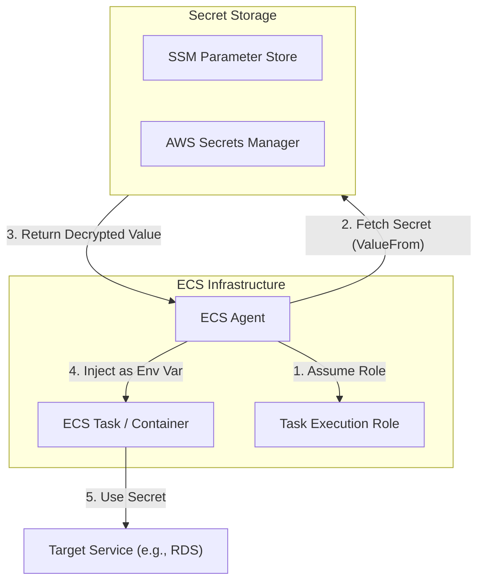

# ECS Secrets Management

## Overview
**Amazon ECS** allows you to inject sensitive data into your containers as environment variables. This integration with **AWS Systems Manager (SSM) Parameter Store** and **AWS Secrets Manager** ensures that secrets like database passwords or API keys are not hardcoded in your application code or stored in your Docker images.

## Key Concepts
- **SSM Parameter Store**: Used for hierarchical storage of configuration data and secrets.
- **AWS Secrets Manager**: Specialized service for managing, rotating, and retrieving secrets.
- **Container Definition**: The part of an ECS Task Definition where you specify which secrets to inject.
- **Task Execution Role**: The IAM role that the ECS agent uses to pull secrets from SSM or Secrets Manager on your behalf.

## Detailed Notes

### 1. Secret Injection Mechanism
ECS retrieves secrets at **task boot time** and injects them as environment variables into the container.
- **Reference**: In the `containerDefinitions` section of the task definition, use the `secrets` parameter.
- **ValueFrom**: Provide the ARN of the SSM Parameter or Secrets Manager secret.

### 2. IAM Permissions (Task Execution Role)
For the injection to succeed, the **Task Execution Role** (not the Task Role) must have the following permissions:
- **Secrets Manager**: `secretsmanager:GetSecretValue`
- **SSM Parameter Store**: `ssm:GetParameters`
- **KMS**: `kms:Decrypt` (if the secrets are encrypted with a Customer Managed Key).

### 3. Comparison of Sources
| Feature | SSM Parameter Store | AWS Secrets Manager |
|---------|---------------------|---------------------|
| **Primary Use** | General config & secrets | Highly sensitive secrets |
| **Rotation** | Manual / Custom Lambda | Built-in rotation support |
| **Cost** | Standard is free | Paid per secret/API call |
| **ECS Integration** | Supported | Supported |

## Architecture / Flow

### ECS Secret Injection Flow

#### Detailed Analysis: ECS Secret Injection Flow
1. **Assume Role**:
    - **Why**: The ECS agent is the component responsible for bootstrapping the task. Before it can retrieve any secret, it must assume the **Task Execution Role** to prove it has the authority to access those resources. This happens before the container process starts.
    - **Security Best Practice**: Scope the Task Execution Role to the **minimum required permissions** and restrict it to the specific secret ARNs the task needs — not a wildcard. Use a resource-level IAM condition like `Resource: "arn:aws:secretsmanager:region:account:secret:my-app/*"` to prevent one task's execution role from reading another app's secrets.
2. **Fetch Secret (`ValueFrom`)**:
    - **Why**: The ECS agent reads the `secrets` block in the task definition, which contains the ARN of the SSM Parameter or Secrets Manager secret. It uses the assumed role's credentials to call `ssm:GetParameters` or `secretsmanager:GetSecretValue`.
    - **Security Best Practice**: Always reference secrets by **full ARN**, not by name. Using ARNs scopes the permission more precisely and prevents name-collision attacks where a new secret with the same name could be inadvertently accessed. For SSM, always use **SecureString** type to ensure the value is encrypted at rest with KMS.
3. **Return Decrypted Value**:
    - **Why**: Secrets Manager and SSM return the secret value over TLS. If the secret is encrypted with a **Customer Managed Key (CMK)**, the ECS agent must also hold `kms:Decrypt` permission on that key to receive the plaintext value.
    - **Security Best Practice**: Use a **CMK** rather than the AWS-managed default key for high-sensitivity secrets. This gives you explicit key policy control and an independent audit trail in CloudTrail for every `Decrypt` call. Ensure the KMS key policy grants access to the Task Execution Role, not to a broad principal like the AWS account root.
4. **Inject as Environment Variable**:
    - **Why**: Once retrieved, the ECS agent passes the plaintext value into the container's environment at startup. From the container's perspective, the secret appears as a standard environment variable — no SDK or special library required.
    - **Security Best Practice**: Be aware that environment variables are **visible in plaintext** to any process running inside the container, and may be exposed in ECS task metadata or `docker inspect` output. For very high-sensitivity values (e.g., private keys), consider fetching secrets inside the application at runtime via SDK rather than relying on environment variable injection, which limits exposure to the process that explicitly requests it.
5. **Use Secret**:
    - **Why**: The running application uses the injected environment variable to authenticate with a downstream service such as RDS or a third-party API.
    - **Security Best Practice**: Secrets are **not refreshed** in a running container. If a secret is rotated in Secrets Manager, the container continues to use the old value until the ECS task is restarted. Build your deployment pipeline to treat secret rotation as a trigger for a task restart, or use the Secrets Manager SDK inside the application for dynamic refresh of short-lived credentials.

## Security Relevance
- **Reduced Surface Area**: Secrets are never stored on disk or within the image.
- **Separation of Concerns**: Security teams can manage secrets in Secrets Manager while developers manage task definitions.
- **Auditability**: Access to secrets is logged in **AWS CloudTrail**, allowing you to see which task execution role retrieved which secret.

## Operational / Real-World Context
- **Runtime Updates**: If a secret is updated in Secrets Manager, the running container **will not** see the change. You must restart the ECS task to trigger a new injection at boot time.
- **Versioning**: You can reference specific versions of a secret or parameter using the ARN suffix (e.g., `:1` for SSM or the version ID for Secrets Manager).

## Common Pitfalls / Misconfigurations
- **Wrong IAM Role**: Assigning permissions to the *Task Role* instead of the *Task Execution Role*.
- **KMS Access**: Forgetting to grant `kms:Decrypt` when using CMKs.
- **Hardcoding**: Developers mistakenly using the `environment` parameter (plaintext) instead of `secrets`.

## Exam / Review Notes
- **Task Execution Role**: Always responsible for pulling secrets *before* the container starts.
- **Environment Variables**: This is the primary method ECS uses to deliver secrets to the application.
- **At Rest Encryption**: Both SSM and Secrets Manager use KMS for encryption.

## Summary
ECS integration with SSM and Secrets Manager provides a secure, managed way to handle application secrets. By referencing ARNs in task definitions and using IAM roles for access control, organizations can ensure sensitive data is handled according to security best practices.

## Quick Review Checklist
- [ ] Secrets referenced in `containerDefinitions`?
- [ ] Task Execution Role has `ssm:GetParameters` or `secretsmanager:GetSecretValue`?
- [ ] `kms:Decrypt` permission granted if using CMKs?
- [ ] Tasks restarted after secret updates?
