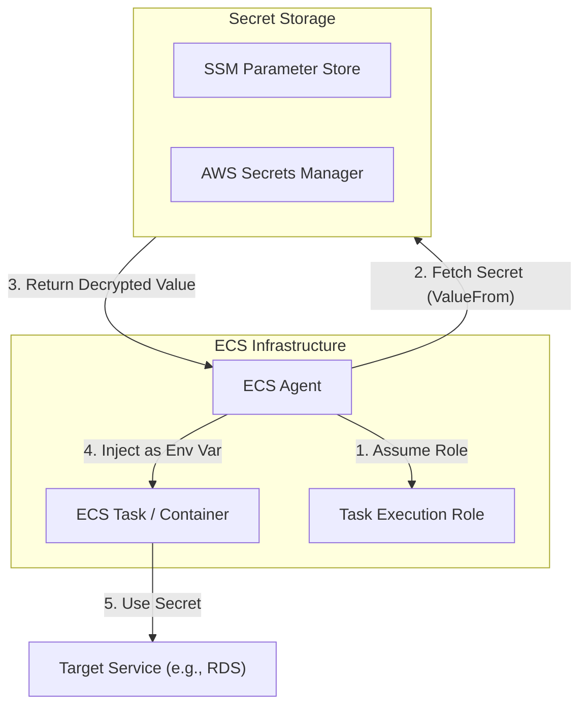

# ECS Secrets Management

## Overview
**Amazon ECS** allows you to inject sensitive data into your containers as environment variables. This integration with **AWS Systems Manager (SSM) Parameter Store** and **AWS Secrets Manager** ensures that secrets like database passwords or API keys are not hardcoded in your application code or stored in your Docker images.

## Key Concepts
- **SSM Parameter Store**: Used for hierarchical storage of configuration data and secrets.
- **AWS Secrets Manager**: Specialized service for managing, rotating, and retrieving secrets.
- **Container Definition**: The part of an ECS Task Definition where you specify which secrets to inject.
- **Task Execution Role**: The IAM role that the ECS agent uses to pull secrets from SSM or Secrets Manager on your behalf.

## Detailed Notes

### 1. Secret Injection Mechanism
ECS retrieves secrets at **task boot time** and injects them as environment variables into the container.
- **Reference**: In the `containerDefinitions` section of the task definition, use the `secrets` parameter.
- **ValueFrom**: Provide the ARN of the SSM Parameter or Secrets Manager secret.

### 2. IAM Permissions (Task Execution Role)
For the injection to succeed, the **Task Execution Role** (not the Task Role) must have the following permissions:
- **Secrets Manager**: `secretsmanager:GetSecretValue`
- **SSM Parameter Store**: `ssm:GetParameters`
- **KMS**: `kms:Decrypt` (if the secrets are encrypted with a Customer Managed Key).

### 3. Comparison of Sources
| Feature | SSM Parameter Store | AWS Secrets Manager |
|---------|---------------------|---------------------|
| **Primary Use** | General config & secrets | Highly sensitive secrets |
| **Rotation** | Manual / Custom Lambda | Built-in rotation support |
| **Cost** | Standard is free | Paid per secret/API call |
| **ECS Integration** | Supported | Supported |

## Architecture / Flow

### ECS Secret Injection Flow

## Security Relevance
- **Reduced Surface Area**: Secrets are never stored on disk or within the image.
- **Separation of Concerns**: Security teams can manage secrets in Secrets Manager while developers manage task definitions.
- **Auditability**: Access to secrets is logged in **AWS CloudTrail**, allowing you to see which task execution role retrieved which secret.

## Operational / Real-World Context
- **Runtime Updates**: If a secret is updated in Secrets Manager, the running container **will not** see the change. You must restart the ECS task to trigger a new injection at boot time.
- **Versioning**: You can reference specific versions of a secret or parameter using the ARN suffix (e.g., `:1` for SSM or the version ID for Secrets Manager).

## Common Pitfalls / Misconfigurations
- **Wrong IAM Role**: Assigning permissions to the *Task Role* instead of the *Task Execution Role*.
- **KMS Access**: Forgetting to grant `kms:Decrypt` when using CMKs.
- **Hardcoding**: Developers mistakenly using the `environment` parameter (plaintext) instead of `secrets`.

## Exam / Review Notes
- **Task Execution Role**: Always responsible for pulling secrets *before* the container starts.
- **Environment Variables**: This is the primary method ECS uses to deliver secrets to the application.
- **At Rest Encryption**: Both SSM and Secrets Manager use KMS for encryption.

## Summary
ECS integration with SSM and Secrets Manager provides a secure, managed way to handle application secrets. By referencing ARNs in task definitions and using IAM roles for access control, organizations can ensure sensitive data is handled according to security best practices.

## Quick Review Checklist
- [ ] Secrets referenced in `containerDefinitions`?
- [ ] Task Execution Role has `ssm:GetParameters` or `secretsmanager:GetSecretValue`?
- [ ] `kms:Decrypt` permission granted if using CMKs?
- [ ] Tasks restarted after secret updates?
