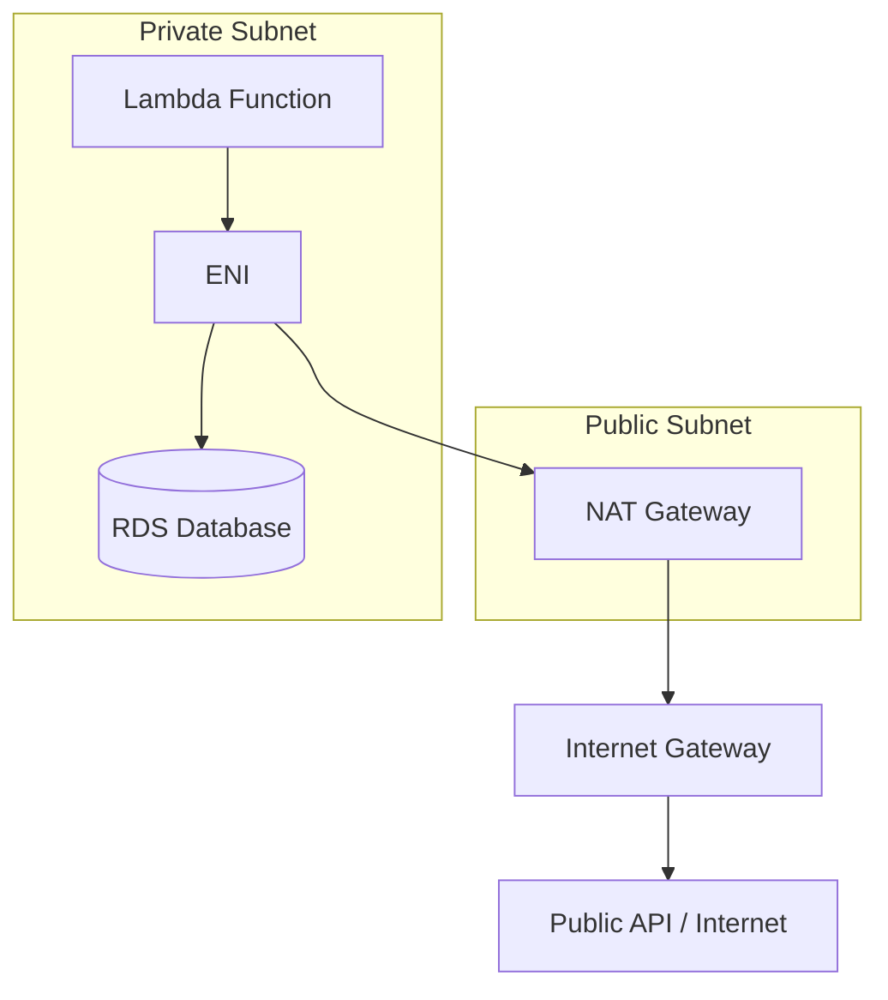
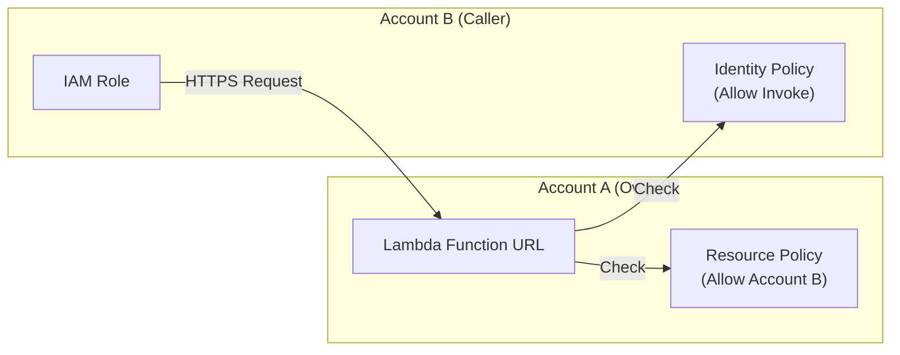

# AWS Lambda Security

## Overview
**AWS Lambda** is a serverless compute service that runs code in response to events. Security in Lambda is managed through a combination of **Execution Roles** (what the function can do) and **Resource-based Policies** (who can invoke the function). For networking, Lambda can be deployed inside a **VPC** to access private resources, which introduces specific networking and security configuration requirements.

## Key Concepts
- **Execution Role**: An IAM role attached to the function that grants it permission to access AWS services (e.g., S3, DynamoDB, CloudWatch).
- **Resource-based Policy**: A policy attached to the function that allows other services (e.g., S3, API Gateway) or AWS accounts to invoke the function.
- **ENI (Elastic Network Interface)**: Used by Lambda to connect to a VPC.
- **Function URL**: A dedicated HTTP(S) endpoint for a Lambda function.

## Detailed Notes

### 1. Lambda Execution Role
Every Lambda function must have an execution role.
- **Managed Policies**:
    - `AWSLambdaBasicExecutionRole`: Grants permission to upload logs to **CloudWatch**.
    - `AWSLambdaVPCAccessExecutionRole`: Required for functions connected to a **VPC** to manage ENIs.
    - `AWSLambdaKinesisExecutionRole`: For reading from Kinesis streams.
- **Logging Permissions**: To send logs, the role needs:
    - `logs:CreateLogGroup`
    - `logs:CreateLogStream`
    - `logs:PutLogEvents`
- **Best Practice**: Use **one execution role per function** to maintain the Principle of Least Privilege (PoLP).

### 2. Lambda in VPC
By default, Lambda runs in a system-managed VPC with internet access but no access to your private resources (RDS, ElastiCache).
- **VPC Configuration**: Requires a VPC ID, Subnets, and Security Groups.
- **ENI Creation**: Lambda creates an ENI in your subnets to facilitate communication. This requires the `ec2:CreateNetworkInterface` permissions.
- **Internet Access**:
    - Deploying in a **public subnet does NOT grant internet access** or a public IP.
    - To access the internet from a VPC-connected Lambda, you must use a **NAT Gateway** in a public subnet and route traffic from the Lambda's private subnet to it.
- **DynamoDB/S3 Access**: Can be achieved via NAT Gateway or **VPC Endpoints** (Interface or Gateway).

### 3. Lambda Function URLs
Exposes a Lambda function as an HTTP(S) endpoint without needing API Gateway.
- **Authentication Types**:
    - `NONE`: Public access. Requires a resource-based policy allowing `lambda:InvokeFunctionUrl` for principal `*`.
    - `AWS_IAM`: Uses IAM to authorize requests. Evaluations check both identity-based and resource-based policies.
- **Cross-Account**: For `AWS_IAM` auth, both the calling account (identity policy) and the Lambda account (resource policy) must allow the invocation.
- **CORS**: Configurable for cross-origin requests (e.g., a frontend on `example.com` calling a Lambda URL on `api.example.com`).

## Architecture / Flow

### Lambda VPC Networking

### Function URL Auth (AWS_IAM)

## Security Relevance
- **Detective/Corrective**: Use Lambda to automate remediation (e.g., Revoking IAM keys or isolating EC2 instances) triggered by EventBridge.
- **Data Perimeter**: Use VPC-connected Lambda with VPC Endpoints to ensure sensitive data processing stays within the AWS network.

## Operational / Real-World Context
- **Cold Starts**: VPC-enabled Lambda functions used to have longer cold starts due to ENI provisioning, but "AWS Hyperplane" has significantly improved this.
- **Throttling**: Use **Reserved Concurrency** to prevent a single function from consuming all account-level concurrency.

## Common Pitfalls / Misconfigurations
- **Public Subnet Misconception**: Thinking a Lambda in a public subnet can reach the internet directly.
- **Circular Permissions**: Forgetting to add the service principal (e.g., `s3.amazonaws.com`) to the resource-based policy when setting up triggers.
- **Logging Failures**: Forgetting `logs:CreateLogGroup` in the execution role, resulting in no logs in CloudWatch.

## Exam / Review Notes
- **Execution Role vs Resource Policy**: 
    - Execution Role = What Lambda can touch.
    - Resource Policy = Who can touch Lambda.
- **VPC Internet**: NAT Gateway is mandatory for internet access inside a VPC.
- **IAM Auth**: Cross-account requires "Double Allow" (Identity + Resource).

## Summary
Lambda security relies on precise IAM roles and resource policies. When networking is involved, understanding the ENI lifecycle and the requirement for NAT Gateways for internet egress is critical for both security and functionality.

## Quick Review Checklist
- [ ] Execution role has `logs:PutLogEvents`?
- [ ] VPC Lambda has `AWSLambdaVPCAccessExecutionRole`?
- [ ] NAT Gateway configured for internet access?
- [ ] Resource-based policy allows the triggering service?
- [ ] Function URL CORS configured for web clients?
