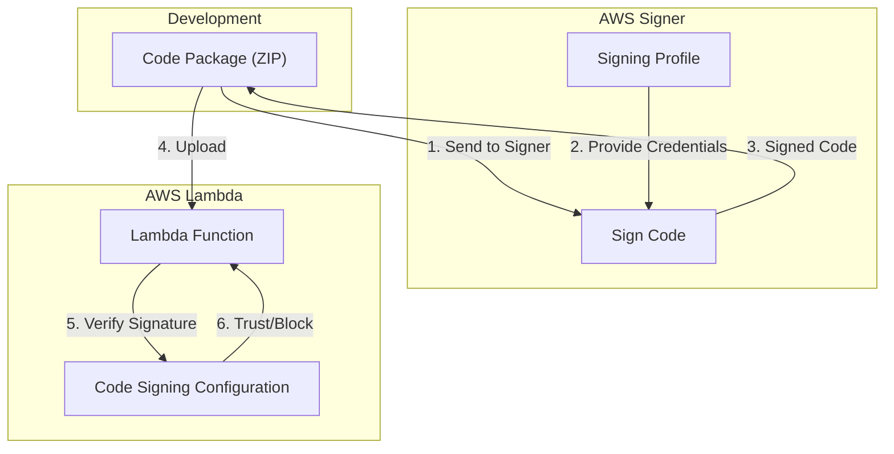

# AWS Signer

## Overview
**AWS Signer** is a fully managed code-signing service that helps you ensure the trust and integrity of your code. By digitally signing your code, you confirm that it comes from a trusted source and has not been altered since it was signed. This is a critical security control for preventing the execution of unauthorized or malicious code in your environment.

## Key Concepts
- **Signing Profile**: A resource that contains information about the signing platform and the certificate used for the signature.
- **Digital Signature**: A cryptographic hash of the code package, encrypted with a private key, used to verify authenticity and integrity.
- **Verification**: The process of checking the digital signature against a public key before executing the code.
- **Revocation**: The process of invalidating a signature or a signing profile, rendering the associated code untrusted.

## Detailed Notes

### 1. Code Signing for AWS Lambda
AWS Signer integrates with AWS Lambda to enforce that only signed code packages are executed.
- **Mechanism**: You sign your deployment package (ZIP file) using a signing profile before uploading it to Lambda.
- **Enforcement**: You configure a **Code Signing Configuration (CSC)** on the Lambda function. This defines which signing profiles are trusted and what action to take (Warn or Block) if the signature is invalid.
- **Restriction**: Currently, code signing is only supported for **ZIP-based** Lambda functions, not for Lambda functions deployed as container images.

### 2. AWS IoT and FreeRTOS Integration
- AWS Signer provides code-signing capabilities for IoT devices running **Amazon FreeRTOS**.
- It integrates with **AWS Certificate Manager (ACM)** to generate or import the signing certificates required for these operations.

### 3. Revocation and Lifecycle
Revocation is used to stop trusting code that was previously signed.
- **Individual Revocation**: Use the `RevokeSignature` API to invalidate a specific signature.
- **Profile Revocation**: Use the `RevokeSigningProfile` API to invalidate all signatures generated by a specific profile.
- **Impact**: Once revoked, the signature check (e.g., in Lambda) will fail, and the code will not execute.
- **Caution**: Revocation is an **irreversible** operation and should only be used in critical scenarios (e.g., certificate compromise).

## Architecture / Flow

### Lambda Code Signing Workflow

## Security Relevance
- **Integrity**: Protects against "Man-in-the-Middle" or "Supply Chain" attacks where code is modified during transit or in the repository.
- **Authenticity**: Ensures that only authorized developers or CI/CD pipelines can deploy code to production.
- **Preventive Control**: When set to "Block," it prevents unauthorized code execution entirely.

## Operational / Real-World Context
- **CI/CD Integration**: AWS Signer is typically integrated into the build phase of a CI/CD pipeline (e.g., AWS CodeBuild) so that every production build is automatically signed.
- **Administrator Role**: Only security administrators should have permissions to `RevokeSignature` or `RevokeSigningProfile`.

## Common Pitfalls / Misconfigurations
- **Expired Certificates**: If the signing certificate expires, new signatures cannot be created, though existing signatures remain valid unless revoked.
- **Wait Times**: Revocation may take a few minutes to propagate across all AWS regions.
- **Container Limitation**: Attempting to use AWS Signer for container-based Lambda functions will fail as it is not supported.

## Exam / Review Notes
- **Lambda Support**: ZIP files only, NO container support.
- **Revocation API**: `RevokeSignature` (one) vs `RevokeSigningProfile` (all).
- **Enforcement**: Configured via Code Signing Configuration on the Lambda resource.
- **Irreversibility**: Revocation cannot be undone.

## Summary
AWS Signer provides a managed way to implement code integrity and authenticity. It is most commonly used to secure Lambda deployment pipelines and IoT device updates, ensuring that only verified, unaltered code runs in production.

## Quick Review Checklist
- [ ] Signing Profile created and associated with a certificate?
- [ ] Lambda Code Signing Configuration (CSC) attached to the function?
- [ ] CSC set to "Block" for strict enforcement?
- [ ] CI/CD pipeline configured to sign artifacts before deployment?
- [ ] Revocation permissions restricted to administrators?
