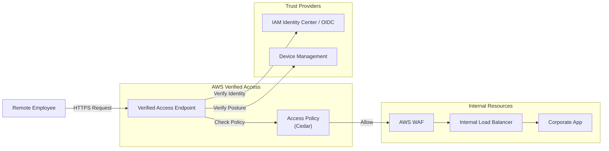

# AWS Verified Access

## Overview
**AWS Verified Access** provides secure access to corporate internal applications without the use of a Virtual Private Network (VPN). It is built on **Zero Trust** principles, verifying each application request in real-time based on the user's identity and the security posture of their device. This simplifies the network architecture while providing fine-grained access control for remote employees.

## Key Concepts
- **Zero Trust**: A security model that assumes no user or device is trusted by default, even if they are within a corporate network.
- **Trust Provider**: An identity or device management service that provides the data used for verification (e.g., IAM Identity Center, OIDC IdP).
- **Verified Access Instance**: The central resource that manages trust providers and access policies.
- **Verified Access Endpoint**: The network interface that represents your application (e.g., Load Balancer or ENI).
- **Cedar Policy Language**: The language used to write fine-grained access policies for Verified Access.

## Detailed Notes

### 1. Authentication and Trust
Verified Access integrates with various providers to validate the "who" and the "what":
- **Identity Trust Providers**: **AWS IAM Identity Center** or any **OIDC-compliant** provider.
- **Device Trust Providers**: Third-party device management services that provide signals about device health (e.g., encryption status, OS version).

### 2. Supported Targets
Verified Access can route traffic to internal applications hosted on:
- **Application Load Balancer (ALB)**: Typically in a private subnet.
- **Elastic Network Interface (ENI)**: For direct access to specific instances or services.

### 3. Logging and Monitoring
Every request processed by Verified Access is logged, providing high visibility for security audits:
- **Destinations**: **Amazon S3**, **CloudWatch Logs**, or **Kinesis Data Firehose**.
- **Data Captured**: Includes user identity, device signals, application requested, and the resulting access decision (Allow/Deny).

## Architecture / Flow

### Zero Trust Access Workflow

## Security Relevance
- **Elimination of VPN**: Removes the risks associated with broad network access provided by traditional VPNs (lateral movement).
- **Continuous Verification**: Unlike a VPN that validates only at login, Verified Access validates **every single request**.
- **WAF Integration**: Provides a layer of defense against web exploits and bots before traffic even reaches the internal application.

## Operational / Real-World Context
- **Remote Work**: Ideal for modern workforces where employees access internal tools (e.g., HR portals, wikis, dev environments) from home or public networks.
- **Centralized Management**: Security teams can manage access to dozens of internal applications from a single Verified Access instance.

## Common Pitfalls / Misconfigurations
- **Policy Over-Permissiveness**: Writing Cedar policies that are too broad, negating the benefits of Zero Trust.
- **Missing WAF**: Neglecting to attach a WAF Web ACL to the Verified Access instance, leaving the endpoint vulnerable to layer 7 attacks.
- **DNS Configuration**: Failing to correctly map the application's CNAME to the Verified Access endpoint.

## Exam / Review Notes
- **Zero Trust = No VPN**.
- **Trust Providers**: IAM Identity Center or OIDC.
- **Targets**: ALB or ENI only.
- **Logging**: S3, CloudWatch, Kinesis Firehose.
- **Policy Language**: Uses Cedar for fine-grained control.

## Summary
AWS Verified Access is the AWS implementation of a "BeyondCorp" style Zero Trust architecture. It allows enterprises to securely expose internal applications to the internet by continuously verifying identity and device health, effectively replacing the need for traditional client-to-site VPNs.

## Quick Review Checklist
- [ ] Identity Trust Provider (IAM Identity Center or OIDC) configured?
- [ ] Cedar policies defined for each application?
- [ ] WAF integrated for edge protection?
- [ ] Logging enabled to S3 or CloudWatch?
- [ ] Application endpoint (ALB/ENI) is in a private subnet?
