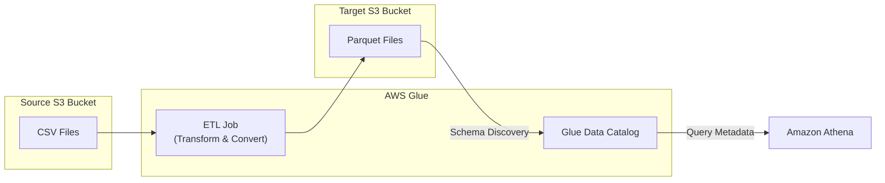
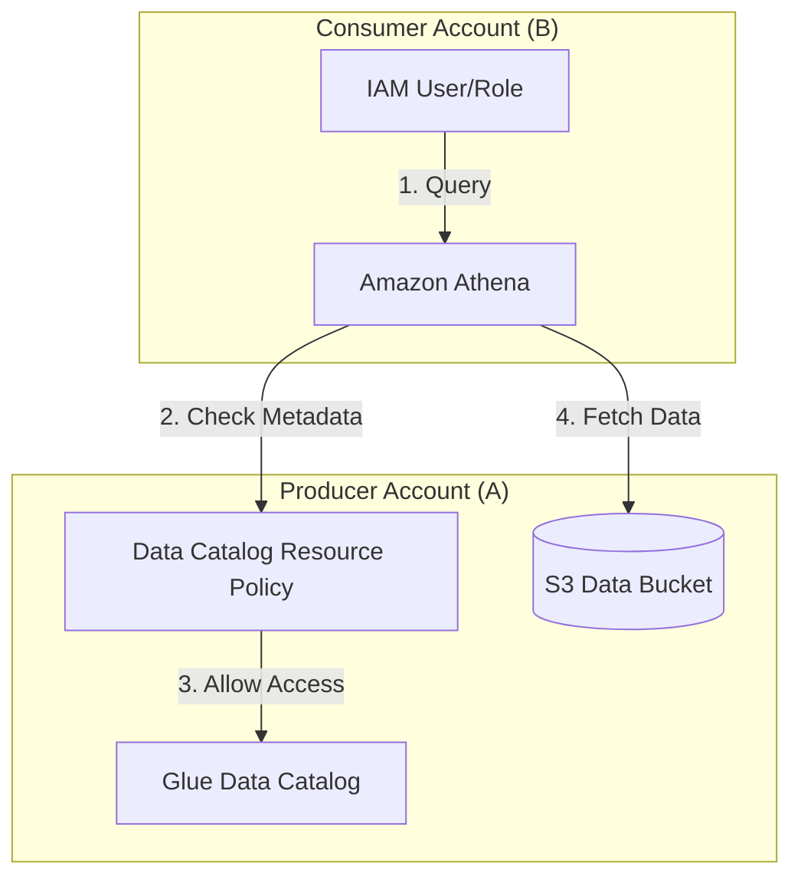

# AWS Glue & Glue Security

## Overview
**AWS Glue** is a fully managed, serverless **Extract, Transform, and Load (ETL)** service that makes it easy to prepare and load data for analytics. It allows you to discover, prepare, and combine data from multiple sources (S3, RDS, DynamoDB, etc.) and move it into data stores like **Amazon Redshift** or **Amazon S3** in optimized formats like **Parquet**.

## Key Concepts
- **ETL Job**: A script (Python/Scala) that performs the extraction, transformation, and loading of data.
- **Glue Data Catalog**: A centralized metadata repository that stores table definitions and schema information.
- **Crawler**: A program that connects to a data store, determines the schema, and creates metadata tables in the Data Catalog.
- **Job Bookmark**: A feature that tracks state information to prevent the reprocessing of old data during subsequent job runs.
- **Glue DataBrew**: A visual data preparation tool to clean and normalize data without writing code.
- **Glue Studio**: A graphical interface to create, run, and monitor ETL jobs.

## Detailed Notes

### 1. Data Transformation & Optimization
- **Parquet Format**: A columnar storage format. Converting data (e.g., from CSV) to Parquet using Glue significantly improves performance and reduces costs for query services like **Amazon Athena**.
- **Streaming ETL**: Built on **Apache Spark Structured Streaming**, allowing real-time ETL from **Kinesis Data Streams** or **Amazon MSK** (Managed Streaming for Apache Kafka).

### 2. Glue Data Catalog & Discovery
- **Centralized Metadata**: The Data Catalog is leveraged by **Athena**, **Redshift Spectrum**, and **Amazon EMR** for schema discovery.
- **Automation**: S3 Event Notifications can trigger **AWS Lambda** or **Amazon EventBridge** to start a Glue ETL job as soon as new data arrives.

## Architecture / Flow

### ETL Optimization Flow (CSV to Parquet)

### Cross-Account Data Catalog Access

## Security Relevance

### 1. Encryption
- **At Rest**: Supports **AWS KMS** encryption for Data Catalog objects, ETL job scripts, and Job Bookmarks.
- **In Transit**: Uses **TLS** for all internal and external communication.

### 2. Access Control
- **IAM Policies**: Attached to users/roles to define what Glue actions they can perform.
- **Resource-Based Policies**: Specifically for the **Glue Data Catalog**. This is the primary mechanism for **Cross-Account Access**, allowing users in a different account to query the catalog metadata.
- **S3 Bucket Policies**: When accessing data across accounts, the source S3 bucket policy must explicitly allow the principal from the consumer account (or the service, e.g., Athena) to perform `s3:GetObject`.

## Operational / Real-World Context
- **Batch vs. Streaming**: Use standard ETL for large, historical datasets and Streaming ETL for real-time dashboards or immediate data processing needs.
- **Job Monitoring**: Use **Glue Studio** or **CloudWatch Metrics** to monitor job success, failure, and execution time.

## Common Pitfalls / Misconfigurations
- **Reprocessing Data**: Forgetting to enable **Job Bookmarks**, leading to increased costs and redundant data processing.
- **Missing S3 Permissions**: The Glue service role must have access to both the source and target S3 buckets.
- **Cross-Account Lockout**: Forgetting that a Data Catalog resource policy is required *in addition* to IAM permissions in the consumer account.

## Exam / Review Notes
- **Glue = ETL + Metadata (Data Catalog)**.
- **Parquet**: Always use for Athena performance optimization.
- **Cross-Account**: Requires a **Resource-Based Policy** on the Data Catalog.
- **Job Bookmarks**: Essential for incremental data processing.
- **Data Catalog**: Shared by Athena, Redshift Spectrum, and EMR.

## Summary
AWS Glue is the backbone of serverless data engineering on AWS. It provides both the compute (ETL) and the organization (Data Catalog) needed for modern data lakes. From a security perspective, centralizing metadata with resource-based policies allows for secure, cross-account data discovery and analytics.

## Quick Review Checklist
- [ ] Glue service role has access to S3 source/target?
- [ ] Job Bookmarks enabled for incremental loads?
- [ ] KMS encryption configured for sensitive metadata?
- [ ] Data Catalog resource policy configured for cross-account access?
- [ ] Data converted to Parquet for Athena performance?
