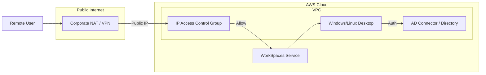

# Amazon WorkSpaces

## Overview
**Amazon WorkSpaces** is a managed, secure **Desktop-as-a-Service (DaaS)** solution. It allows you to provision Windows or Linux desktops in the cloud, eliminating the need for complex on-premises **Virtual Desktop Infrastructure (VDI)**. Users can access their secure cloud desktops from any supported device, providing a consistent experience whether they are at home or in a corporate office.

## Key Concepts
- **WorkSpace**: A persistent, managed cloud desktop for an individual user.
- **Directory**: WorkSpaces must be connected to a directory (AWS Directory Service, Simple AD, or AD Connector) for user authentication.
- **Bundles**: Pre-configured combinations of CPU, GPU, memory, and storage.
- **Streaming Protocols**: Uses PCoIP or WSP (WorkSpaces Streaming Protocol) to deliver the desktop experience.
- **IP Access Control Groups**: A security feature that allows you to control which client IP addresses can access your WorkSpaces.

## Detailed Notes

### 1. Performance & Latency
- **Proximity**: The best practice for minimizing latency is to deploy WorkSpaces in the AWS Region closest to the physical location of the users.
- **Multi-Region Deployment**: For global organizations (e.g., offices in California and Paris), deploy separate WorkSpaces directories in the US and Europe to ensure optimal performance for all users.

### 2. Network Connectivity
- **VPC Integration**: Each WorkSpace is associated with a VPC and a specific subnet.
- **Internet Access**: WorkSpaces do not have public IP addresses by default. Internet access is typically provided via a **NAT Gateway** in the VPC.
- **On-Premises Access**: WorkSpaces can access on-premises resources via a **Site-to-Site VPN** or **Direct Connect**.

## Architecture / Flow

### Secure Remote Access Flow

## Security Relevance

### 1. IP Access Control Groups
- Function similarly to Security Groups but specifically for the WorkSpaces connection endpoint.
- You define a list of authorized CIDR ranges.
- **Caution**: If users connect via a corporate VPN or NAT, the IP Access Control Group must authorize the **public IP** of that VPN/NAT gateway, not the user's private home IP.

### 2. Trusted Devices & Certificates
- **Certificate-Based Authentication**: Limits access to only "trusted" devices that possess a valid digital certificate issued by your organization.
- Supported for Windows, macOS, and Android clients.
- Prevents unauthorized or personal devices from connecting to the corporate desktop environment.

### 3. Data Protection
- **Encryption at Rest**: WorkSpaces supports integration with **AWS KMS** to encrypt the storage volumes (Root and User volumes).
- **Encryption in Transit**: All data (pixel streams) is encrypted using SSL/TLS between the client and the WorkSpace.

## Operational / Real-World Context
- **VDI Replacement**: Organizations use WorkSpaces to avoid the high capital expenditure and maintenance of on-premises VDI hardware.
- **Bring Your Own License (BYOL)**: Organizations can bring their own Windows 10/11 licenses to AWS to reduce costs, provided they meet specific hardware requirements (Dedicated Hosts).

## Common Pitfalls / Misconfigurations
- **High Latency**: Deploying WorkSpaces in a single region for a global workforce.
- **IP ACG Block**: Users being unable to connect because their corporate egress IP changed and wasn't updated in the IP Access Control Group.
- **Directory Sync**: Issues with AD Connector preventing users from logging in even if the WorkSpace is healthy.

## Exam / Review Notes
- **DaaS = WorkSpaces**.
- **Latency**: Always deploy in the region closest to the user.
- **IP Access Control Groups**: Use for network-level restriction.
- **Certificates**: Use for device-level restriction (Trusted Devices).
- **KMS**: Use for volume encryption.

## Summary
Amazon WorkSpaces provides a secure, scalable alternative to traditional VDI. By leveraging IP Access Control Groups and certificate-based authentication, security teams can ensure that only authorized users on trusted devices can access corporate desktops, while KMS ensures data at rest remains protected.

## Quick Review Checklist
- [ ] WorkSpaces deployed in the region closest to the user?
- [ ] IP Access Control Groups configured with correct public IPs?
- [ ] Certificate-based authentication enabled for trusted devices?
- [ ] KMS encryption enabled for both Root and User volumes?
- [ ] NAT Gateway configured in the VPC for internet egress?
