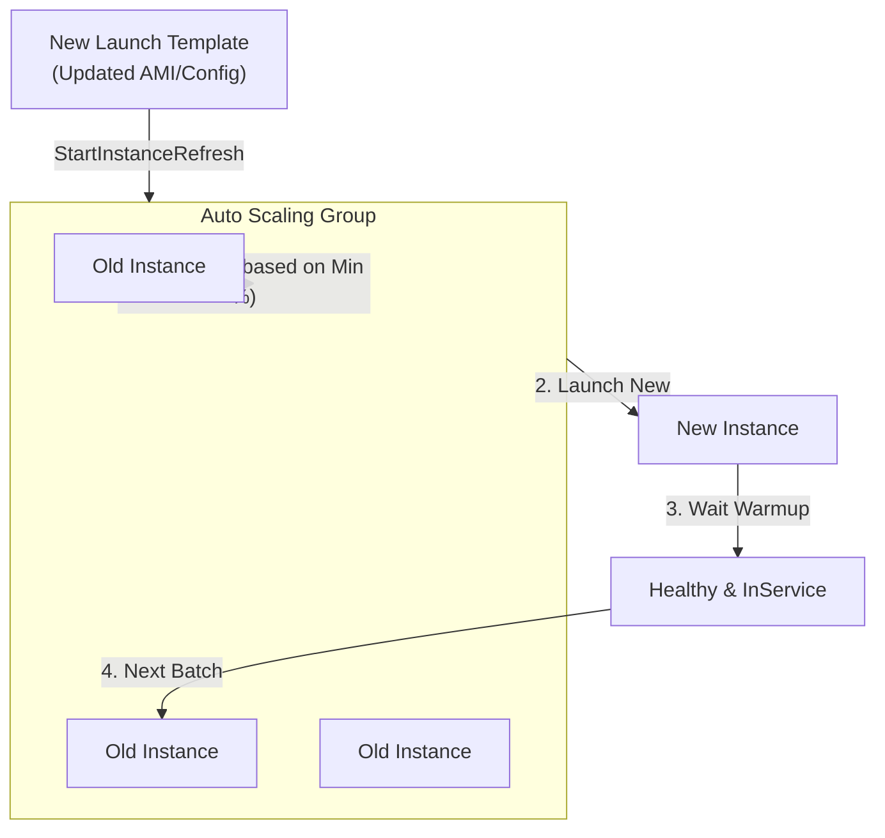

# Amazon EC2 Auto Scaling: Instance Refresh

## Overview
**Amazon EC2 Auto Scaling Instance Refresh** is a feature that allows you to update the EC2 instances in an Auto Scaling Group (ASG) to match a new **Launch Template** or **Launch Configuration**. This is a native mechanism to roll out updates across a fleet of instances without manually terminating them or creating a new ASG.

## Key Concepts
- **Launch Template Update**: The trigger for a refresh, often involving a new AMI (for patching), instance type, or user data.
- **Minimum Healthy Percentage**: The minimum percentage of the ASG's desired capacity that must remain in the `InService` state during the refresh.
- **Warmup Time**: The amount of time (in seconds) to wait after an instance reaches the `InService` state before the refresh continues to the next set of instances.
- **StartInstanceRefresh API**: The command that initiates the rolling update process.

## Detailed Notes

### 1. Rolling Update Mechanism
When an instance refresh is started, ASG follows these steps:
1. Identifies instances using the "old" configuration.
2. Terminate a subset of instances based on the **Minimum Healthy Percentage** (e.g., if set to 50%, it can terminate up to half the instances at once).
3. Launches new instances using the "new" launch template.
4. Waits for the **Warmup Time** for the new instances to be ready.
5. Repeats until all instances are running the new configuration.

### 2. Security Integration
Instance Refresh is frequently used in security workflows for:
- **AMI Patching**: Quickly rolling out a new, patched AMI across the entire fleet.
- **Credential Rotation**: Updating Launch Template user data or metadata to point to new secrets/roles.
- **Compliance**: Ensuring all instances meet a specific security baseline defined in the latest template.

## Architecture / Flow

### ASG Instance Refresh Workflow

## Security Relevance
- **Vulnerability Management**: Allows for rapid, automated remediation of OS-level vulnerabilities by cycling the instances with a hardened AMI.
- **Immutable Infrastructure**: Supports the practice of "replace instead of patch," reducing configuration drift and ensuring a known-good state.

## Operational / Real-World Context
- **Zero Downtime**: By maintaining a high **Minimum Healthy Percentage**, you can ensure the application remains available during the entire update process.
- **Rollbacks**: If the refresh fails (e.g., new instances fail health checks), the process can be stopped, and you can revert the launch template.

## Common Pitfalls / Misconfigurations
- **Minimum Healthy Percentage Too Low**: Setting this too low (e.g., 0%) will take the entire application offline during the refresh.
- **Insufficient Warmup Time**: If the warmup time is too short, the refresh might proceed to kill old instances before the new ones are actually ready to handle traffic, leading to capacity issues.
- **Health Check Failures**: If the new AMI is misconfigured, new instances will fail health checks, causing the refresh to hang or fail.

## Exam / Review Notes
- **Instance Refresh = Native ASG Rolling Update**.
- **Use Case**: Applying new AMIs (patching) or changing instance types across a fleet.
- **Control Parameters**: Minimum Healthy Percentage and Instance Warmup.
- **Integration**: Often triggered by a CI/CD pipeline after a new AMI is baked.

## Summary
Auto Scaling Instance Refresh provides a managed way to keep an EC2 fleet up-to-date with the latest security and configuration standards. By controlling the healthy percentage and warmup times, administrators can achieve automated, secure, and highly available fleet updates.

## Quick Review Checklist
- [ ] New Launch Template version set as default?
- [ ] Minimum Healthy Percentage calculated to handle peak load?
- [ ] Instance Warmup time sufficient for application boot?
- [ ] CloudWatch Alarms monitored during the refresh?
- [ ] Rollback plan documented for failed refreshes?
