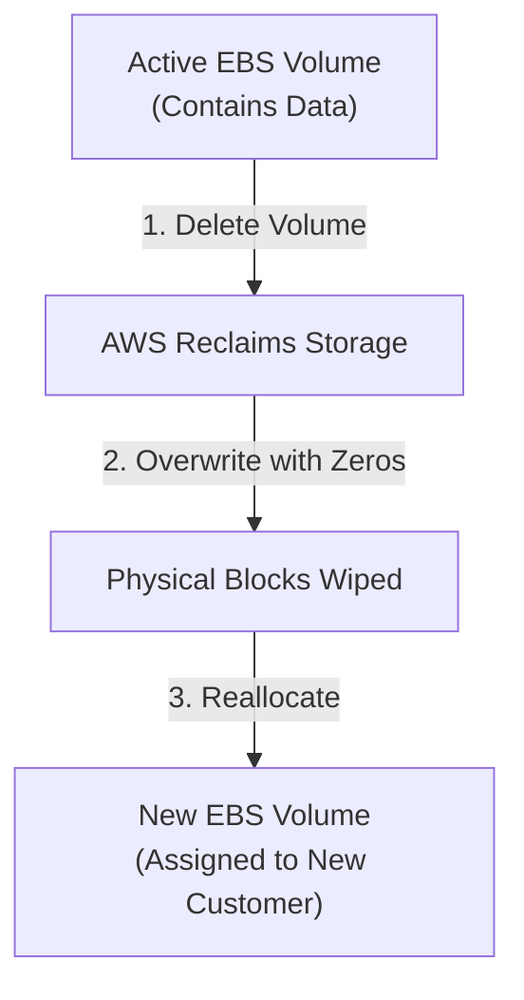

# EBS Volumes - Data Wiping

## Overview
A common security concern when using cloud storage is the risk of data leakage between customers. **Amazon EBS** handles this by automatically wiping the underlying physical block storage of a deleted volume before it is reallocated to another customer. This ensures that no data from a previous volume is accessible to a new one.

## Key Concepts
- **Data Sanitization**: The process of making data irrecoverable.
- **Block Storage Reclamation**: When an EBS volume is deleted, its physical blocks are returned to the pool of available storage.
- **Zeroing Out**: AWS's method of overwriting blocks with zeros before reuse.

## Detailed Notes

### 1. AWS Managed Data Wiping
- When you delete an EBS volume, AWS immediately marks the storage as unavailable.
- Before that same physical storage is assigned to a new volume for another customer, AWS **overwrites the entire block range with zeros**.
- This is a built-in, automated security feature of the EBS service.

### 2. Manual Wiping vs. Automated Wiping
- **No Manual Action Required**: Users do not need to manually wipe or "shred" data before deleting an EBS volume.
- **Efficiency**: Attempting to manually wipe an entire EBS volume before deletion is unnecessary and incurs standard I/O costs.

## Architecture / Flow

### EBS Volume Lifecycle & Data Sanitization

## Security Relevance
- **Multi-Tenancy Isolation**: Ensures strict isolation between different AWS customers sharing the same physical storage hardware.
- **Compliance**: This automated process aligns with many data sanitization standards (e.g., NIST SP 800-88) for clearing media.
- **Zero-Data Leakage**: Guarantees that the first read from a new EBS volume will return only zeros or the specific data the new customer writes.

## Operational / Real-World Context
- For exceptionally sensitive data (e.g., highly classified or regulated), some organizations may still choose to perform software-level encryption (like BitLocker or dm-crypt) on the volume. If the volume is encrypted and then deleted, the "wiped" data was already ciphertext, providing an additional layer of security.

## Common Pitfalls / Misconfigurations
- **Mistaken Belief in Manual Wiping**: Spending operational time and resources to run `dd` or `shred` on a volume before terminating an instance or deleting a volume.
- **Snapshot Retention**: While the *volume's* data is wiped upon deletion, **EBS Snapshots** of that volume remain in S3 until manually deleted. Deleting a volume does NOT automatically delete its snapshots.

## Exam / Review Notes
- **Automatic Wiping**: AWS handles the wiping with zeros upon volume deletion.
- **New Volumes**: Any new EBS volume created is "clean"—it contains no data from previous users.
- **Exam Tip**: If a question asks how to ensure data is not accessible to other customers after deleting a volume, the answer is that **AWS handles this automatically**.

## Summary
Amazon EBS provides built-in data sanitization. When a volume is deleted, AWS ensures the physical blocks are zeroed out before they are ever assigned to a new volume, preventing data leakage between different customers in the multi-tenant cloud environment.

## Quick Review Checklist
- [ ] EBS volumes are zeroed out by AWS upon deletion?
- [ ] Manual data wiping before deletion is unnecessary?
- [ ] First reads from a new EBS volume return only zeros?
- [ ] Snapshots must be managed separately from volume deletion?
