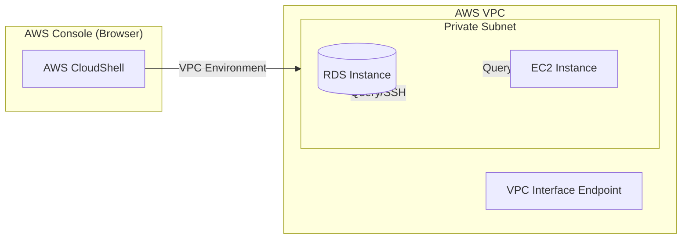

# AWS CloudShell

## Overview
**AWS CloudShell** is a browser-based shell that allows you to manage your AWS resources directly from the AWS Management Console. It provides a pre-configured terminal environment with common CLI tools and SDKs, eliminating the need to install and configure tools on your local machine.

## Key Concepts
- **Browser-Based**: Accessible via the AWS Console without client-side installation.
- **Pre-configured Environment**: Comes with **AWS CLI**, **SAM CLI**, **ECS CLI**, and SDKs for Python and Node.js.
- **Persistent Storage**: Each user gets **1 GB** of persistent storage per AWS Region in their home directory (`$HOME`).
- **Amazon Linux 2**: The underlying operating system for the shell environment.
- **Inherited Permissions**: CloudShell uses the IAM credentials of the user logged into the console.

## Detailed Notes

### 1. Security & Authentication
- **IAM Integration**: Your CloudShell session automatically inherits the permissions of your IAM principal. If you have `AdministratorAccess`, the shell has it too.
- **Pre-signed URLs**: You can upload and download files to/from your CloudShell environment via the browser.
- **No Long-term Keys**: Unlike local CLI setups, CloudShell does not require managing access keys on your local disk.

### 2. VPC Environment
- **Private Access**: You can launch CloudShell within a **VPC** by defining a **VPC Environment**.
- **Use Case**: This allows you to interact with private resources like **Amazon RDS** databases, **Amazon EC2** instances, or internal **Elastic Load Balancers** that are not accessible from the public internet.

## Architecture / Flow

### CloudShell in VPC Workflow

## Security Relevance
- **Reduced Local Risk**: Prevents the need to store AWS Access Keys (`credentials` file) on developer laptops.
- **Network Perimeter**: By using a VPC Environment, you can perform administrative tasks on private resources without needing to set up a Bastion Host or VPN.
- **Auditability**: Commands executed in CloudShell that call AWS APIs are logged in **AWS CloudTrail**.

## Operational / Real-World Context
- **Quick Fixes**: Ideal for running one-off CLI commands, scripts, or SAM deployments without a local dev environment.
- **File Persistence**: Files stored in the `$HOME` directory persist between sessions in the same region, but are deleted after 120 days of inactivity.

## Common Pitfalls / Misconfigurations
- **Permission Errors**: If the logged-in IAM user lacks a specific permission (e.g., `s3:ListBucket`), the CloudShell session will also fail that operation.
- **Storage Limits**: Exceeding the 1 GB limit will prevent new files from being saved.
- **Region Specificity**: Storage is **region-specific**; files saved in `us-east-1` will not appear in `eu-west-1`.

## Exam / Review Notes
- **Inherited IAM**: CloudShell = Console User Permissions.
- **1 GB Storage**: Persistent in `$HOME` per region.
- **VPC Support**: Can access private RDS/EC2 via VPC Environment.
- **OS**: Amazon Linux 2.

## Summary
AWS CloudShell is a powerful, secure tool for infrastructure management. It simplifies the developer experience by providing a pre-configured, authenticated terminal while maintaining security through IAM integration and VPC connectivity.

## Quick Review Checklist
- [ ] 1 GB storage limit monitored?
- [ ] IAM permissions verified for the logged-in user?
- [ ] VPC Environment configured for private resource access?
- [ ] Important scripts saved in `$HOME` for persistence?
