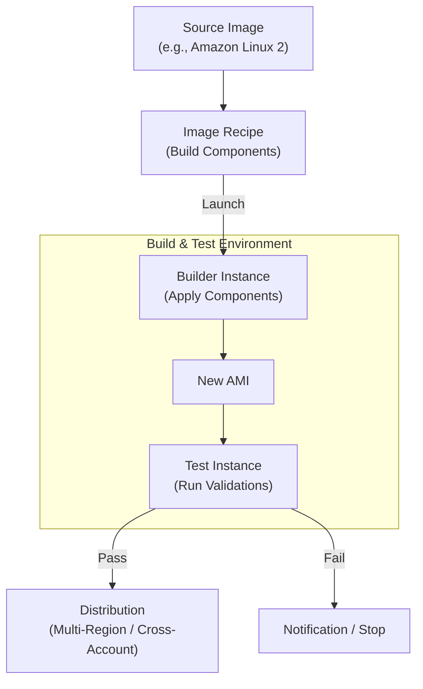

# EC2 Image Builder

## Overview
**EC2 Image Builder** is a fully managed AWS service that automates the creation, maintenance, validation, and testing of virtual machine (AMI) and container images. It provides a structured pipeline for building "Golden Images" that are pre-hardened, updated, and tested according to organizational security standards, significantly reducing the manual effort of managing custom AMIs.

## Key Concepts
- **Image Pipeline**: The end-to-end automation that coordinates the build, test, and distribution of images.
- **Recipe**: A document (JSON/YAML) that defines the source image and the components to be applied during the build process.
- **Component**: An orchestration document that defines the steps to install software, configure settings, or run tests (e.g., installing Java, updating the CLI).
- **Infrastructure Configuration**: Defines the EC2 infrastructure used for the build and test phases (Instance Type, IAM Role, VPC/Subnets).
- **Distribution Settings**: Specifies the target regions and accounts where the final AMI or container image should be shared.

## Detailed Notes

### 1. Build and Test Process
EC2 Image Builder follows a specific lifecycle:
1.  **Build Phase**: Launches a **Builder EC2 instance** from a source image and applies build components (e.g., security hardening, software installation).
2.  **Snapshot/AMI Creation**: Captures an AMI from the configured builder instance.
3.  **Test Phase**: Launches a **Test EC2 instance** from the new AMI and runs validation tests (e.g., checking if the application starts, scanning for vulnerabilities).
4.  **Distribution**: Shares the validated AMI to multiple AWS Regions or specific AWS Accounts.
5.  **Cleanup**: Automatically terminates the builder and test instances to minimize costs.

### 2. IAM Requirements
The EC2 instances used by Image Builder require specific managed policies attached to their **Instance Profile**:
- `EC2InstanceProfileForImageBuilder`: Core permissions for the build process.
- `AmazonSSMManagedInstanceCore`: Required for AWS Systems Manager (SSM) to manage and run commands on the build/test instances.
- `ECRContainerBuilds`: Necessary if you are building Docker container images.

## Architecture / Flow

### EC2 Image Builder Pipeline

## Security Relevance
- **Golden Images**: Ensures that every instance in your organization starts from a verified, patched, and hardened baseline.
- **Compliance**: Automated testing can include checks for CIS benchmarks or internal compliance standards before an image is approved for production.
- **Automated Patching**: Pipelines can be scheduled to run weekly or when dependency updates occur, ensuring AMIs are never out-of-date.

## Operational / Real-World Context
- **Cost**: The service itself is free; you only pay for the underlying EC2 instances, EBS volumes, and AMI storage (S3) during the build and test process.
- **Multi-Region Strategy**: Use distribution settings to automatically sync your latest Golden AMI to every region where your application is deployed, ensuring consistency.

## Common Pitfalls / Troubleshooting
- **403 Access Denied (S3)**: Occurs if the Instance Profile lacks `s3:PutObject` permissions to write logs to the designated S3 bucket.
- **SSM Connection Failures**: If the `AmazonSSMManagedInstanceCore` policy is missing or the VPC lacks an internet gateway/SSM VPC endpoints, Image Builder cannot communicate with the instances.
- **Architecture Mismatch**: Attempting to build an x86 recipe on an ARM64 (Graviton) instance type or vice-versa.

## Exam / Review Notes
- **Automation**: Automates AMI creation, testing, and distribution.
- **Managed Policies**: Remember `EC2InstanceProfileForImageBuilder` and `AmazonSSMManagedInstanceCore`.
- **Infrastructure**: You control the instance type (e.g., `t3.micro` for cost savings).
- **Container Support**: Can build both AMIs and Docker images.

## Summary
EC2 Image Builder is the standard tool for maintaining "Golden Images" in AWS. By automating the build-test-distribute cycle and integrating with IAM and SSM, it provides a secure and repeatable way to ensure all infrastructure starts from a known-good, hardened state.

## Quick Review Checklist
- [ ] Instance Profile has required SSM and Image Builder managed policies?
- [ ] `s3:PutObject` permission granted for logging?
- [ ] Infrastructure configuration uses cost-effective instance types?
- [ ] Recipe includes both build and validation test components?
- [ ] Distribution settings cover all required regions and accounts?
