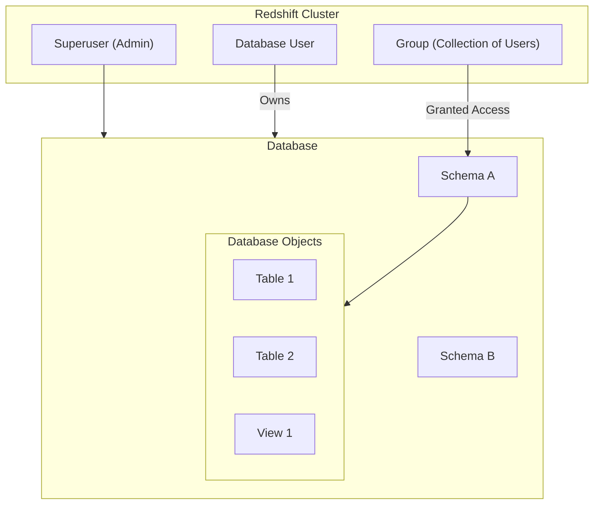
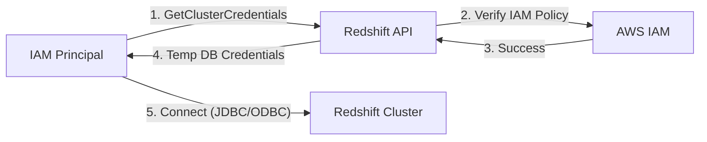

# Amazon Redshift Security

## Overview
**Amazon Redshift** is a fully managed, petabyte-scale data warehouse service. Security in Redshift is handled at multiple levels, including network isolation, encryption, and a specific database-level hierarchy for access control. This documentation focuses on the database permissions and authorization mechanisms, including integration with IAM.

## Key Concepts
- **Superuser**: An administrator account (created during cluster launch) with full permissions over all databases and objects.
- **Database User**: An individual account that can own databases and objects.
- **Group**: A collection of users used to streamline permission management.
- **Schema**: A logical grouping of database objects (tables, views, etc.) within a database.
- **GetClusterCredentials**: An AWS API used to generate temporary database credentials based on IAM permissions.

## Detailed Notes

### 1. Database Hierarchy & Permissions
Redshift follows a structured hierarchy for managing data access:
1. **Cluster**: The highest level; managed via AWS IAM.
2. **Database**: A user who creates a database becomes its owner. Superusers have access to all databases.
3. **Schema**: Users can be granted access to specific schemas. This is the primary way to partition data access within a single database.
4. **Tables/Views**: The actual data objects where fine-grained permissions (SELECT, INSERT, etc.) are applied.

### 2. Authorization Mechanisms
- **Standard Authentication**: Traditional database username and password stored within the Redshift cluster.
- **IAM Authentication**: 
    - Uses the `GetClusterCredentials` API.
    - Allows users to log in without a permanent database password.
    - **Auto-create**: Can be configured to automatically create a database user if one does not exist during the login attempt.
    - **Group Join**: Can automatically add the user to specific database groups based on the IAM policy.

## Architecture / Flow

### Redshift Object Hierarchy

### IAM-Based Authorization Flow

## Security Relevance
- **Principle of Least Privilege**: Use groups and schemas to ensure users can only access the specific datasets required for their role (e.g., a "finance_read_only" group for the "finance" schema).
- **Credential Management**: IAM-based authentication eliminates the need for hardcoded database passwords in applications or on developer machines.
- **Auditability**: IAM-based logins are recorded in **AWS CloudTrail**, providing an audit trail of who accessed the cluster and when.

## Operational / Real-World Context
- **Read-Only Users**: To create a read-only user, create a group with `SELECT` permissions on the target schema and add the user to that group.
- **Superuser Caution**: Only a superuser can create or drop other users. Limit the number of superusers to prevent accidental data deletion or broad unauthorized access.

## Common Pitfalls / Misconfigurations
- **Password Hardcoding**: Storing permanent Redshift passwords in plaintext scripts instead of using IAM authentication or Secrets Manager.
- **Over-Privileged Users**: Granting users `ALL` permissions on a schema when they only need `SELECT`.
- **Public Accessibility**: Launching a Redshift cluster in a public subnet without restrictive Security Group rules.

## Exam / Review Notes
- **Superuser**: Always has full access; created at launch.
- **IAM Integration**: Use `GetClusterCredentials` for temporary access.
- **Auto-create User**: Supported via the IAM auth flow.
- **Hierarchy**: Cluster -> Database -> Schema -> Table.
- **Cross-Account**: Redshift itself does not have resource-based policies for the Data Catalog (that's Glue), but you can use IAM for cross-account cluster access.

## Summary
Amazon Redshift security combines traditional SQL-based permissioning (Users, Groups, Schemas) with modern AWS identity management (IAM). By leveraging IAM authentication and a well-defined schema hierarchy, organizations can maintain a secure and auditable data warehouse environment.

## Quick Review Checklist
- [ ] Superuser access restricted to authorized admins?
- [ ] IAM authentication used for user logins?
- [ ] "Auto-create user" enabled for seamless onboarding?
- [ ] Users grouped logically for simplified permission management?
- [ ] Least privilege applied at the schema and table level?
