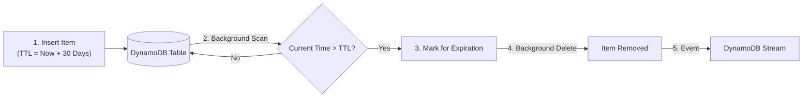

# Amazon DynamoDB - Time to Live (TTL)

## Overview
**Amazon DynamoDB Time to Live (TTL)** is a feature that allows you to automatically delete items from your tables once they reach a specified expiration time. This helps manage storage costs and adhere to data retention policies by ensuring that stale or temporary data (like session information or short-lived tokens) is removed without manual intervention or additional write throughput costs.

## Key Concepts
- **TTL Attribute**: A specific attribute in each item (e.g., `exp_timestamp`) that stores the expiration time.
- **Unix Epoch Format**: The timestamp must be stored as a **Number** representing the seconds elapsed since January 1, 1970 (Unix Epoch).
- **Expiration Process**: DynamoDB periodically scans the table and identifies items where the TTL attribute value is less than the current time.
- **Deletion Delay**: Items are typically deleted within 48 hours after they expire, though they may remain in the table for a short period after the timestamp has passed.

## Detailed Notes

### 1. How TTL Works
1.  **Define Attribute**: You choose an attribute name to serve as the TTL field.
2.  **Populate Data**: When inserting or updating an item, you calculate the expiration time (e.g., `current_time + 3600` for 1 hour) and store it in the TTL attribute.
3.  **Automatic Cleanup**: DynamoDB's background process identifies expired items and deletes them. These deletions do not consume **Write Capacity Units (WCU)**.

### 2. Monitoring Deletions
- **DynamoDB Streams**: Deletions triggered by TTL are captured in DynamoDB Streams with a specific "userIdentity" field (`type: "Service"`, `principalId: "dynamodb.amazonaws.com"`) to distinguish them from manual deletions.
- **CloudWatch Metrics**: You can monitor the `TimeToLiveDeletedItemCount` metric to track how many items are being removed by TTL.

## Architecture / Flow

### TTL Expiration Cycle

## Security Relevance
- **Data Retention Compliance**: Automatically enforces regulatory requirements (e.g., GDPR) by ensuring personal data is not kept longer than necessary.
- **Credential/Token Management**: Ensures that temporary security tokens or session IDs are invalidated and physically removed from the database after a set duration.
- **Minimized Attack Surface**: By regularly purging old data, you reduce the "blast radius" in the event of a database compromise.

## Operational / Real-World Context
- **Session Management**: Storing web session data and letting TTL handle the cleanup when a user logs out or the session expires.
- **Cost Optimization**: Removing historical logs or telemetry data that is no longer needed for real-time analysis, keeping the table size (and storage costs) manageable.
- **No Performance Impact**: TTL deletions happen in the background and do not affect the performance of your application's reads or writes.

## Common Pitfalls / Misconfigurations
- **Incorrect Format**: Storing the timestamp in milliseconds instead of seconds (Unix Epoch is in seconds).
- **Wrong Data Type**: Storing the TTL as a String instead of a **Number**.
- **Deletion Latency**: Assuming items are deleted *exactly* at the timestamp. They can persist for up to 48 hours after expiration.
- **Missing attribute**: Items without the designated TTL attribute will never expire.

## Exam / Review Notes
- **TTL = Auto-delete**.
- **Format**: Number (Unix Epoch in seconds).
- **Cost**: No WCU cost for TTL deletions.
- **Streams**: TTL deletions are visible in DynamoDB Streams.
- **Use Case**: Session data, temporary tokens, data retention compliance.

## Summary
Amazon DynamoDB TTL is a "set-and-forget" feature for managing the lifecycle of your data. By using a simple numeric attribute, you can ensure that your tables stay clean, compliant, and cost-effective without impacting your application's throughput.

## Quick Review Checklist
- [ ] TTL attribute is defined as a Number?
- [ ] Timestamps are in Unix Epoch seconds?
- [ ] DynamoDB Streams enabled to audit TTL deletions?
- [ ] Application logic accounts for up to 48 hours of deletion latency?
- [ ] TTL enabled on the table via the AWS Console or CLI?
