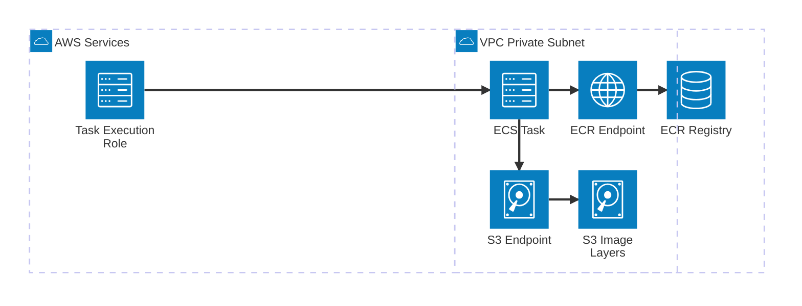
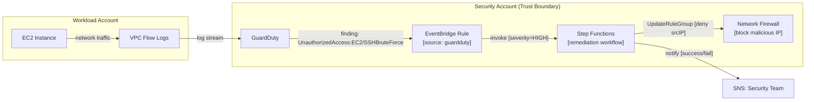
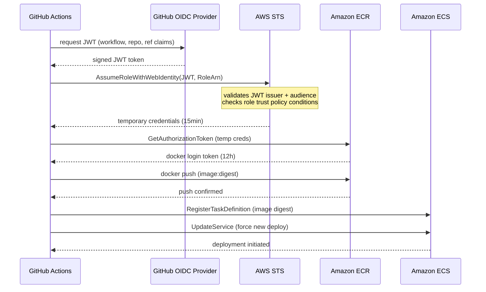
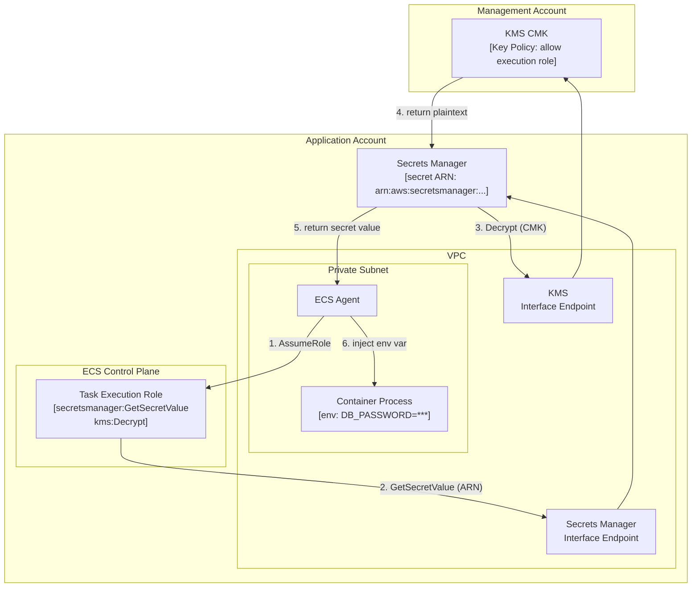

# Mermaid Diagram Style Test

## 1. architecture-beta — ECS Private Image Pull (Full Path)

---

## 2. flowchart — Request/Data Path with Trust Boundaries (GuardDuty Remediation)

---

## 3. sequenceDiagram — Auth Flow (GitHub OIDC → AWS STS → ECR Deploy)

---

## 4. flowchart with subgraph account/VPC/subnet blocks — KMS Decrypt Trust Chain (ECS + Secrets Manager + CMK)

